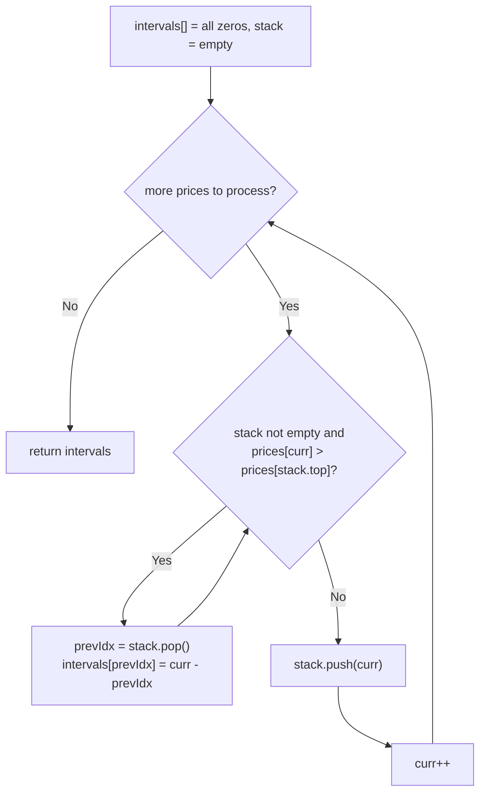

# Feature #8: Find Intervals

## The problem

We're given price predictions for a stock across `n` future time intervals of equal length, `prices[i]` being the predicted price in interval `i`. We want to make a profit by selling at a higher price than some earlier interval's price.

For every interval `i`, we need to know the minimum number of intervals that must pass before the price is *higher* than `prices[i]`. If no later interval ever beats it, `intervals[i]` stays `0`.

For example, with predictions `{73, 74, 75, 71, 69, 72, 76, 73}`, the answer is `{1, 1, 4, 2, 1, 1, 0, 0}` — interval `0` (price `73`) only has to wait 1 step to see `74`; interval `2` (price `75`) has to wait 4 steps to see `76`; the last two intervals never see a higher price, so they stay `0`.

## Solution

This is the classic **monotonic stack** pattern. We keep a stack of *indices* whose prices are still waiting for something higher to show up — and we maintain the invariant that the prices at those indices are in decreasing order from bottom to top.

Walk through the prices left to right. For the current interval:

- While the stack isn't empty and the current price is *higher* than the price at the index on top of the stack, that top index has just found its answer: pop it, and set `intervals[poppedIndex] = currentIndex - poppedIndex`.
- Once nothing left on the stack is beaten by the current price (or the stack is empty), push the current index.

The key insight for why we don't stop after checking just the top of the stack: since the stack is kept in decreasing order, if the current price beats the top, it might *also* beat the one below it, and the one below that, and so on — so we keep popping and resolving indices as long as the current price keeps winning. Every index is pushed exactly once and popped at most once, which is what keeps this linear instead of quadratic.



## Code

```java
import java.util.*;

class Solution {
    // For each interval, returns the minimum number of intervals until a
    // strictly higher price appears (0 if it never does).
    public static int[] findIntervals(int[] prices) {
        int[] intervals = new int[prices.length];
        Deque<Integer> stack = new ArrayDeque<>(); // Indices, decreasing prices.

        for (int currInter = 0; currInter < prices.length; currInter++) {
            while (!stack.isEmpty() && prices[currInter] > prices[stack.peek()]) {
                int prevInter = stack.pop();
                intervals[prevInter] = currInter - prevInter;
            }
            stack.push(currInter);
        }
        return intervals;
    }

    public static void main(String[] args) {
        int[] prices = {73, 74, 75, 71, 69, 72, 76, 73};
        System.out.println(Arrays.toString(findIntervals(prices)));
        // [1, 1, 4, 2, 1, 1, 0, 0]
    }
}
```

## Complexity measures

Let **n** be the number of intervals in the time window.

### Time Complexity

`O(n)` — every index is pushed onto the stack exactly once and popped at most once, so total stack work across the whole scan is `O(n)`.

### Space Complexity

`O(n)` — in the worst case (strictly decreasing prices), no index ever gets popped, and the stack grows to hold all `n` indices.
