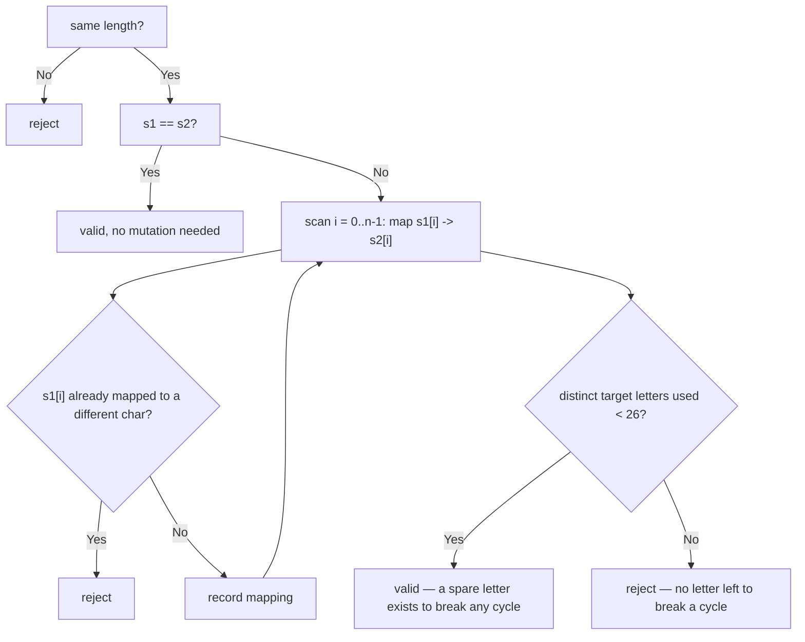

# Feature #1: Mutate DNA

## The problem

Every DNA strand contains multiple chromosomes, and the type of gene at each position is represented by a lowercase letter (`a`, `b`, `c`, ...). We can mutate one DNA sample into another by replacing genes — but only one gene *type* at a time: a single replacement swaps out **every** occurrence of one letter for another letter, chosen from the 26-letter lexicon. Replacements happen one after another, not all at once. For example, `garlano` becomes `gorlono` by replacing every `a` with `o`; a second replacement of every `o` with `t` then gives `gtrltnt`.

Given two same-length chromosome samples as strings, we need to say whether the first can be mutated into the second under these rules. A couple of examples:

```
mutateDNA("aabcc", "ccdee") -> true   // replace a->c, b->d, c->e
mutateDNA("aabaa", "aadac") -> false  // no valid sequence of replacements works
mutateDNA("ac", "ca")       -> true   // a->c, c->a is a cycle, but breakable
```

## Solution

Converting `sample1` to `sample2` means every character of `sample1` must end up mapped to a fixed corresponding character in `sample2`. We can model this as a graph: each distinct character in `sample1` is a node, and it has exactly one outgoing edge to whatever character it must become in `sample2`. Since *every* occurrence of a gene is replaced in one step, a single source character can only ever map to one target character — if the same source character needs to map to two different targets at different positions, the mutation is impossible outright.

That gives us the first rule: build a `sample1[i] -> sample2[i]` mapping while scanning both strings, and bail out the moment the same source character would need two different targets.

The second rule is subtler. Picture `str1 = "abc"` and `str2 = "bcd"`. The mapping chain is `a -> b -> c -> d`. If we apply replacements starting from the front (`a -> b` first), we'd immediately create a second `b` in the string, which collides with the *existing* `b` that still needs to become `c` — we can't tell them apart anymore. Applying the chain from the back (`c -> d`, then `b -> c`, then `a -> b`) avoids the collision, because each replacement's target has already been moved out of the way.

That back-to-front trick breaks down if the mapping chain has a **cycle** — for example `str1 = "ac"`, `str2 = "ca"` gives the chain `a -> c -> a`. There's no "back" to start from; replacing `c` with `a` first collides with the existing `a` that still needs to become `c`. The way out is to borrow a completely unused letter from the 26-letter lexicon as a stepping stone: replace `c -> y` (`y` unused so far), then `a -> c`, then `y -> a`. As long as at least one letter outside the target alphabet of `sample2` is free to use as scratch space, cycles are tolerable. If `sample2` already uses all 26 letters, there's no spare letter left to break a cycle with, and the mutation fails.

So a mutation is possible if and only if:

- Every source character maps to exactly one target character (no character needs two different replacements).
- Either there's no cycle in the mapping, or — if there is one — at least one letter is left unused in `sample2` to serve as a temporary substitute.



## Code

```java
import java.util.*;

class Solution {
    // Returns true if sample1 can be mutated into sample2 by replacing one
    // gene type at a time, borrowing spare letters from the 26-letter
    // lexicon to break any cyclic mappings.
    public static boolean mutateDNA(String sample1, String sample2) {
        if (sample1.length() != sample2.length()) {
            return false;
        }
        if (sample1.equals(sample2)) {
            return true; // No replacement needed at all.
        }

        Map<Character, Character> edges = new HashMap<>();
        for (int i = 0; i < sample1.length(); i++) {
            char from = sample1.charAt(i);
            char to = sample2.charAt(i);
            Character existing = edges.get(from);
            if (existing != null && existing != to) {
                return false; // Same source gene would need two different targets.
            }
            edges.put(from, to);
        }

        // A cycle can always be broken as long as sample2 doesn't already
        // use all 26 letters — one spare letter is enough as a stepping stone.
        Set<Character> targets = new HashSet<>(edges.values());
        return targets.size() < 26;
    }

    public static void main(String[] args) {
        System.out.println(mutateDNA("aabcc", "ccdee")); // true
        System.out.println(mutateDNA("aabaa", "aadac")); // false
        System.out.println(mutateDNA("ac", "ca"));       // true
        System.out.println(mutateDNA("garlano", "gorlono")); // true
    }
}
```

## Complexity measures

Let **n** be the length of the DNA samples.

### Time Complexity

`O(n)` — both strings are scanned once to build the character mapping.

### Space Complexity

`O(1)` — the mapping holds at most 26 entries (one per letter of the alphabet), regardless of `n`.
