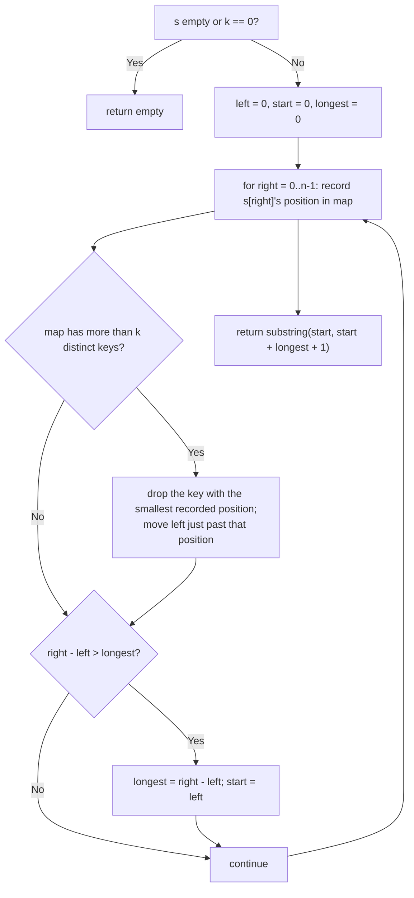

# Feature #2: Detect Virus

## The problem

While studying DNA samples, we've observed that a certain virus consists of a long sequence made up of, at most, `k` distinct nucleotides — it embeds itself into a species' DNA by inserting one of these repetitive-but-limited-variety stretches. To test for infection, we need to find the longest substring of a chromosome that contains at most `k` distinct nucleotides; if that stretch is long enough, it's flagged as the virus.

Given a chromosome string and a value `k`, find the longest substring that has at most `k` distinct nucleotides.

```
detectVirus("cdaba", 3) -> "daba"   // "daba" has exactly 3 distinct nucleotides: d, a, b
```

## Solution

Since we're after the longest window over a string, a sliding window is the natural fit. We keep two pointers, `left` and `right`, marking the current window's boundaries, and grow `right` one step at a time.

A `HashMap` tracks, for every nucleotide currently in the window, the **rightmost position** it was last seen at. As long as the map holds at most `k` distinct keys, the window is valid and we keep growing it. The moment a new nucleotide would push the map to `k + 1` distinct keys, the window has too much variety — we shrink it from the left, removing whichever nucleotide's last-seen position is smallest (it's the one furthest from the current `right`, so it's the correct one to drop first), and move `left` to just past that position.

Two extra variables, `start` and `longest`, remember the best window seen so far; whenever the current window (`right - left`) beats the best recorded one, we update them. At the end, the substring from `start` to `start + longest` is the answer.



## Code

```java
import java.util.*;

class Solution {
    // Returns the longest substring of `s` that contains at most `k`
    // distinct nucleotides — the suspected virus signature.
    public static String detectVirus(String s, int k) {
        if (s.length() == 0 || k == 0) {
            return "";
        }

        Map<Character, Integer> lastPos = new HashMap<>();
        int left = 0, start = 0, longest = 0;

        for (int right = 0; right < s.length(); right++) {
            lastPos.put(s.charAt(right), right);

            if (lastPos.size() > k) {
                int minPos = Collections.min(lastPos.values());
                // Remove whichever nucleotide was last seen at minPos.
                lastPos.values().remove(minPos);
                left = minPos + 1;
            }

            if (right - left > longest) {
                longest = right - left;
                start = left;
            }
        }
        return s.substring(start, start + longest + 1);
    }

    public static void main(String[] args) {
        System.out.println(detectVirus("cdaba", 3)); // daba
    }
}
```

## Complexity measures

Let **n** be the length of the chromosome string and **k** the number of allowed distinct nucleotides.

### Time Complexity

`O(n)` best case (only `k` or fewer distinct characters ever appear), `O(nk)` worst case — each shrink of the window can scan up to `k` map entries to find the minimum position. In practice, treat it as `O(n·k)`.

### Space Complexity

`O(k)` — the map holds at most `k + 1` entries at any point.
