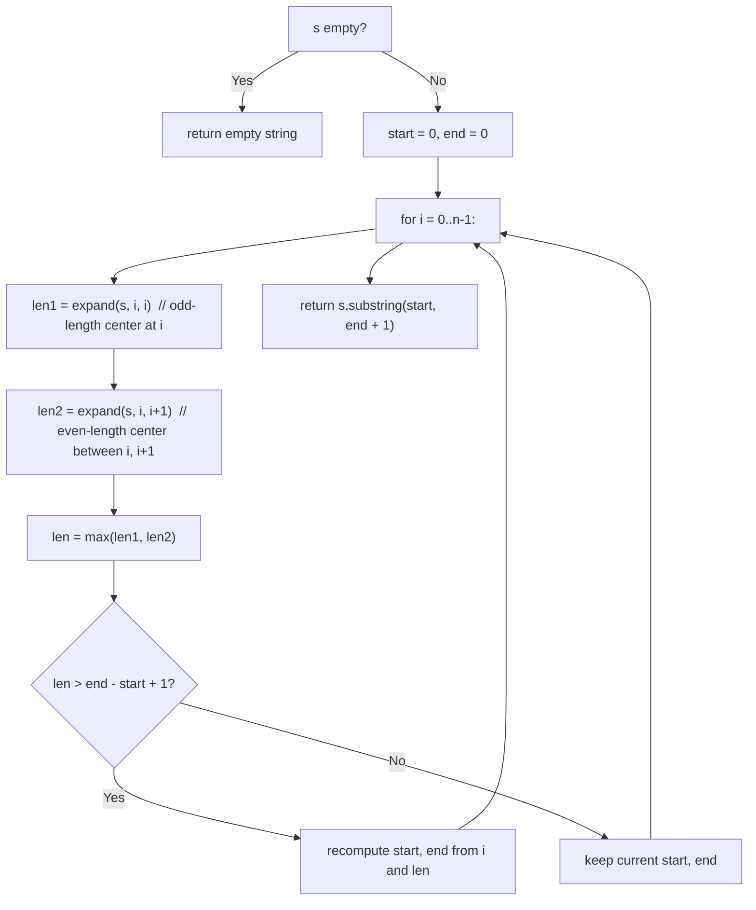

# Feature #3: Locate Protein

## The problem

Experiments have shown that a certain protein grants immunity against a specific virus, but its presence can't be confirmed with an exact match — instead, we only know that, like proteins in general, it shows up as a long palindromic stretch of nucleotides. To detect it, we need to find the longest palindromic portion of an unknown DNA sample.

Given a DNA sequence as a string, find its longest palindromic substring.

```
locateProtein("bccd")  -> "cc"
locateProtein("babad") -> "bab"   // "aba" would also be a valid answer
```

## Solution

A palindrome reads the same forwards and backwards (`abba` is one, `abcd` isn't). There can be many palindromic substrings inside our DNA sequence — we need the longest.

Rather than checking every substring from its two ends inward, it's more efficient to work outward from a center: pick a position, and expand left and right from it as long as the characters on both sides keep matching. Every palindrome has such a center, so trying every possible center and expanding from each one is guaranteed to find the longest palindrome.

There's a subtlety: a palindrome's center can be a single character (odd length, like `aba`, centered on `b`) or the gap between two characters (even length, like `abba`, centered between the two `b`s). So for a string of length `n`, there are `2n - 1` candidate centers to try — `n` single-character centers, and `n - 1` between-character centers.

For each candidate center, we expand outward and measure how far the palindrome reaches; the widest one we ever see, across all `2n - 1` centers, is the answer.



## Code

```java
class Solution {
    // Expands outward from the center defined by (left, right) as long as
    // the characters match, and returns the resulting palindrome's length.
    // Pass (i, i) for an odd-length center, (i, i + 1) for an even-length one.
    private static int expand(String s, int left, int right) {
        while (left >= 0 && right < s.length() && s.charAt(left) == s.charAt(right)) {
            left--;
            right++;
        }
        return right - left - 1;
    }

    // Returns the longest palindromic substring of `s` — the suspected
    // protein signature.
    public static String locateProtein(String s) {
        if (s == null || s.length() < 1) {
            return "";
        }
        int start = 0, end = 0;
        for (int i = 0; i < s.length(); i++) {
            int len1 = expand(s, i, i);     // odd length
            int len2 = expand(s, i, i + 1); // even length
            int len = Math.max(len1, len2);
            if (len > end - start + 1) {
                start = i - (len - 1) / 2;
                end = i + len / 2;
            }
        }
        return s.substring(start, end + 1);
    }

    public static void main(String[] args) {
        System.out.println(locateProtein("bccd"));  // cc
        System.out.println(locateProtein("babad")); // bab
    }
}
```

## Complexity measures

Let **n** be the length of the DNA sequence.

### Time Complexity

`O(n²)` — there are `O(n)` candidate centers, and each expansion can take `O(n)` steps in the worst case (e.g., a string that's entirely one repeated character).

### Space Complexity

`O(1)` — only a few index variables are used; no extra data structure grows with the input.
