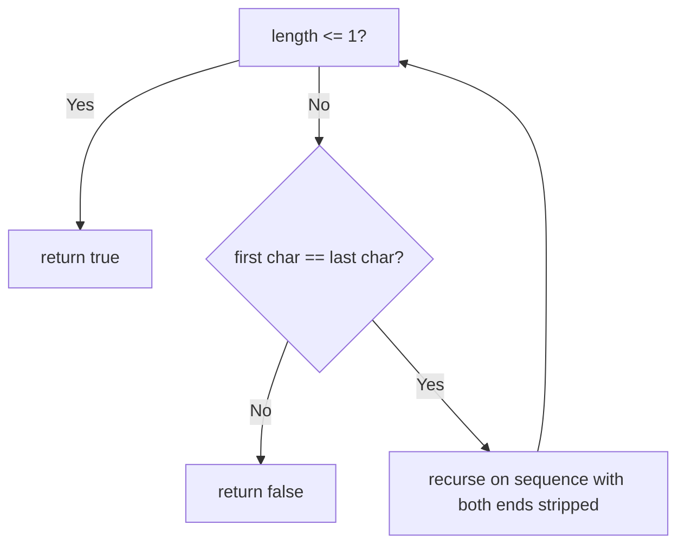

# Feature #4: Identifying Proteins

## The problem

We have an unknown sequence of genomes that's suspected to be a new protein. One way to confirm this is to check whether the sequence itself is a palindrome — a string that reads the same from the start as it does from the end.

Given a sequence of genomes as a string, determine whether it's a palindrome.

```
isProtein("bccd")    -> false
isProtein("racecar") -> true
```

## Solution

A recursive approach fits this naturally: compare the first and last characters of the string. If they match, the middle portion (with both matched ends stripped off) has to be a palindrome too for the whole string to be one — so we recurse on that shrunken string. If they don't match, the string can't possibly be a palindrome, and we stop immediately.

The base case: once the (shrinking) string's length drops to 0 or 1, it's trivially a palindrome — there's nothing left to mismatch.

So the recursion is:

1. If the sequence has length 0 or 1, return `true`.
2. Otherwise, if the first and last characters match, recurse on the sequence with both ends stripped off.
3. If they don't match, return `false` right away — no recursive call is needed once a mismatch is found.



## Code

```java
class Solution {
    // Returns true if `sequence` reads the same forwards and backwards.
    public static boolean isProtein(String sequence) {
        if (sequence.length() <= 1) {
            return true; // 0 or 1 characters is trivially a palindrome.
        }
        if (sequence.charAt(0) == sequence.charAt(sequence.length() - 1)) {
            return isProtein(sequence.substring(1, sequence.length() - 1));
        }
        return false; // Mismatch at the current ends — no palindrome is possible.
    }

    public static void main(String[] args) {
        System.out.println(isProtein("bccd"));    // false
        System.out.println(isProtein("racecar")); // true
    }
}
```

## Complexity measures

Let **n** be the number of characters in the sequence.

### Time Complexity

`O(n)` — each recursive call strips two characters and does constant work, so at most `n/2` calls are made.

### Space Complexity

`O(n)` — each recursive call allocates a new (shorter) substring, and the call stack itself grows to about `n/2` frames deep.
