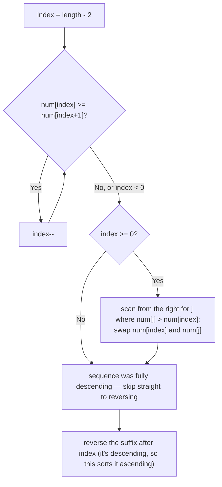

# Feature #5: Mutating a Virus

## The problem

Suppose the DNA of a virus from an alien species consists of 10 different nucleotides, represented by the digits `0` through `9`. It mutates by rearranging itself into a different permutation of the same nucleotides, and the mutant with the next lexicographically greater permutation is the one most likely to survive — its "most potent" next form. Once the virus has mutated all the way up to the lexicographically highest possible arrangement, it wraps back around to the lowest one.

Given the virus's current sequence of nucleotides, find its next lexicographically greater permutation. If none exists (the sequence is already the highest possible), rearrange it into the lowest possible permutation instead — and do it in place, using only constant extra memory.

```
nextMutation([1,5,8,4,7,5,1]) -> [1,5,8,5,1,4,7]
nextMutation([3,2,1])         -> [1,2,3]   // already highest, wraps to lowest
```

## Solution

If the sequence of nucleotides is entirely in descending order, no higher permutation exists at all — `[3,2,1]` is a case in point. This tells us where to start looking: scan from the right for the first position `i - 1` where `num[i - 1] < num[i]`. Everything to the right of `i - 1` is guaranteed to be in descending order (that's exactly why the scan stopped there), so no rearrangement of that suffix alone can produce something bigger — the digit at `i - 1` itself has to change.

To get the *next* greater permutation (not some arbitrarily larger one), we replace `num[i - 1]` with the smallest value in the suffix that's still bigger than it — scanning the descending suffix from the right, that's the first value we hit that exceeds `num[i - 1]`. Swapping these two puts the correct, smallest-possible value in position `i - 1`.

That swap alone doesn't finish the job, though: the suffix after `i - 1` is still in descending order, which is the *largest* possible arrangement of those digits — but we want the *smallest* one, to make the overall result the smallest permutation that's still bigger than the original. Since the suffix is already sorted descending, reversing it in place sorts it ascending, which is exactly what we need.



## Code

```java
class Solution {
    // Rearranges `num` in place into its next lexicographically greater
    // permutation, or into the lowest permutation if none is greater.
    public static int[] nextMutation(int[] num) {
        int index = num.length - 2;

        // Find the rightmost position where the sequence stops descending.
        while (index >= 0 && num[index] >= num[index + 1]) {
            index--;
        }

        if (index >= 0) {
            // Find the smallest value in the (descending) suffix that's
            // still greater than num[index], scanning from the right.
            int j = num.length - 1;
            while (num[j] <= num[index]) {
                j--;
            }
            int tmp = num[index];
            num[index] = num[j];
            num[j] = tmp;
        }
        // If index < 0, the whole sequence was descending (the highest
        // permutation) — we skip the swap and just reverse everything below.

        reverse(num, index + 1, num.length - 1);
        return num;
    }

    private static void reverse(int[] num, int left, int right) {
        while (left < right) {
            int tmp = num[left];
            num[left] = num[right];
            num[right] = tmp;
            left++;
            right--;
        }
    }

    public static void main(String[] args) {
        int[] result = nextMutation(new int[]{1, 5, 8, 4, 7, 5, 1});
        for (int n : result) System.out.print(n);
        System.out.println(); // 1585147

        int[] wrapped = nextMutation(new int[]{3, 2, 1});
        for (int n : wrapped) System.out.print(n);
        System.out.println(); // 123
    }
}
```

## Complexity measures

Let **n** be the number of nucleotides in the sequence.

### Time Complexity

`O(n)` — the two scans (finding the pivot, finding the swap target) and the final reversal each touch each position at most a constant number of times.

### Space Complexity

`O(1)` — the rearrangement happens in place with a fixed number of index variables.
