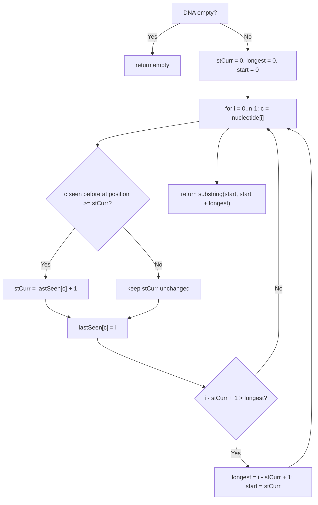

# Feature #6: Identify a Species

## The problem

The DNA of an alien species consists of a sequence of nucleotides, each represented by a letter. We can uniquely identify a species by finding the longest substring of nucleotides in its DNA where no nucleotide repeats — this is known as the species marker.

Given a species' DNA as a string, find its species marker.

```
findSpeciesMarker("abcabcbb") -> "abc"
findSpeciesMarker("pwwkew")   -> "wke"
```

## Solution

We traverse the sequence looking for the longest run with no repeated nucleotide, tracking each nucleotide's most recent position in a hash map (nucleotide -> last-seen index).

We keep two markers as we scan with an index `i`: `stCurr`, the start of the current candidate substring, and `start`/`longest`, which remember the best substring found so far. For each nucleotide at position `i`:

- If it hasn't been seen before, or its last recorded occurrence is *before* `stCurr` (i.e., outside the current window), it's safe — the current substring simply grows.
- If it *has* been seen at or after `stCurr` (i.e., inside the current window), then keeping it would create a repeat. The current substring's start has to jump forward, past that earlier occurrence: `stCurr` becomes `lastSeen[c] + 1`.

Either way, we then record the nucleotide's position as its new last-seen value, and compare the current substring's length (`i - stCurr + 1`) against the best recorded so far, updating `longest`/`start` if it's bigger.

Once the whole sequence has been scanned, the species marker is the substring starting at `start` with length `longest`.



## Code

```java
import java.util.*;

class Solution {
    // Returns the longest substring of `nucleotide` with no repeated
    // character — the species marker.
    public static String findSpeciesMarker(String nucleotide) {
        if (nucleotide.length() == 0) {
            return "";
        }

        Map<Character, Integer> lastSeen = new HashMap<>();
        int stCurr = 0, longest = 0, start = 0;

        for (int i = 0; i < nucleotide.length(); i++) {
            char c = nucleotide.charAt(i);
            if (lastSeen.containsKey(c) && lastSeen.get(c) >= stCurr) {
                stCurr = lastSeen.get(c) + 1; // Repeat found — jump past it.
            }
            lastSeen.put(c, i);

            int currLen = i - stCurr + 1;
            if (currLen > longest) {
                longest = currLen;
                start = stCurr;
            }
        }
        return nucleotide.substring(start, start + longest);
    }

    public static void main(String[] args) {
        System.out.println(findSpeciesMarker("abcabcbb")); // abc
        System.out.println(findSpeciesMarker("pwwkew"));   // wke
    }
}
```

## Complexity measures

Let **n** be the number of nucleotides in the DNA sequence.

### Time Complexity

`O(n)` — each nucleotide is visited exactly once.

### Space Complexity

`O(min(n, k))` where `k` is the size of the nucleotide alphabet — in the worst case, every nucleotide is distinct and the map stores up to `n` entries, but it can never exceed the alphabet size.
