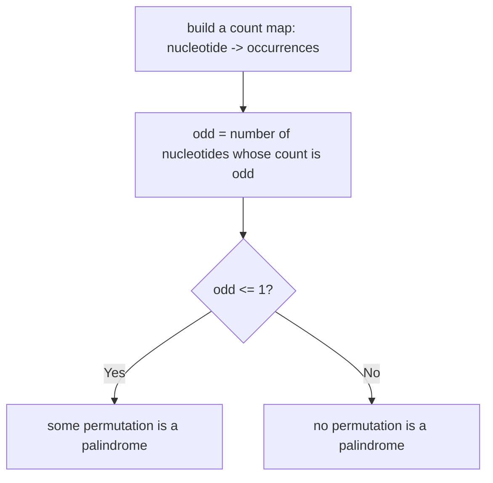

# Feature #7: Detecting a Protein

## The problem

Proteins are characterized by long palindromic sequences of nucleotides. We've received a sample that might be a protein, but a mutation may have rearranged its nucleotides — so the sample itself doesn't have to be a palindrome, just *some rearrangement* of it.

Given a sequence of nucleotides, determine whether any permutation of it could be a palindrome.

```
isProtein("peas") -> false
isProtein("abab") -> true   // "abba" or "baab" are palindromic rearrangements
```

## Solution

For any permutation of a sequence to be a palindrome, its characters have to pair up symmetrically around the center. If the sequence has even length, that means *every* nucleotide must occur an even number of times (each occurrence pairs with a mirrored partner). If the sequence has odd length, every nucleotide except possibly one must occur an even number of times — the one odd-count nucleotide sits alone in the exact middle.

Either way, the rule collapses to a single check: **at most one nucleotide type is allowed to occur an odd number of times.** If two or more nucleotide types have odd counts, there's no way to arrange them symmetrically, and no permutation can be a palindrome.

To check this, we count occurrences of each nucleotide with a hash map (nucleotide -> count), then count how many of those counts are odd. If that count of odd-occurrence nucleotides is 0 or 1, some permutation is a palindrome; if it's 2 or more, none is.



## Code

```java
import java.util.*;

class Solution {
    // Returns true if some permutation of `s` could be a palindrome —
    // i.e., at most one character occurs an odd number of times.
    public static boolean isProtein(String s) {
        Map<Character, Integer> counts = new HashMap<>();
        for (char c : s.toCharArray()) {
            counts.merge(c, 1, Integer::sum);
        }

        int oddCounts = 0;
        for (int count : counts.values()) {
            if (count % 2 != 0) {
                oddCounts++;
            }
        }
        return oddCounts <= 1;
    }

    public static void main(String[] args) {
        System.out.println(isProtein("peas")); // false
        System.out.println(isProtein("abab")); // true
    }
}
```

## Complexity measures

Let **n** be the number of nucleotides in the sequence and **k** the size of the (fixed) nucleotide alphabet.

### Time Complexity

`O(n + k)`, i.e., `O(n)` — we scan the sequence once to build the counts (`O(n)`), then scan the count map once (`O(k)`, a constant).

### Space Complexity

`O(k)`, i.e., `O(1)` — the map holds at most one entry per distinct nucleotide type, which is bounded by the fixed alphabet size.
