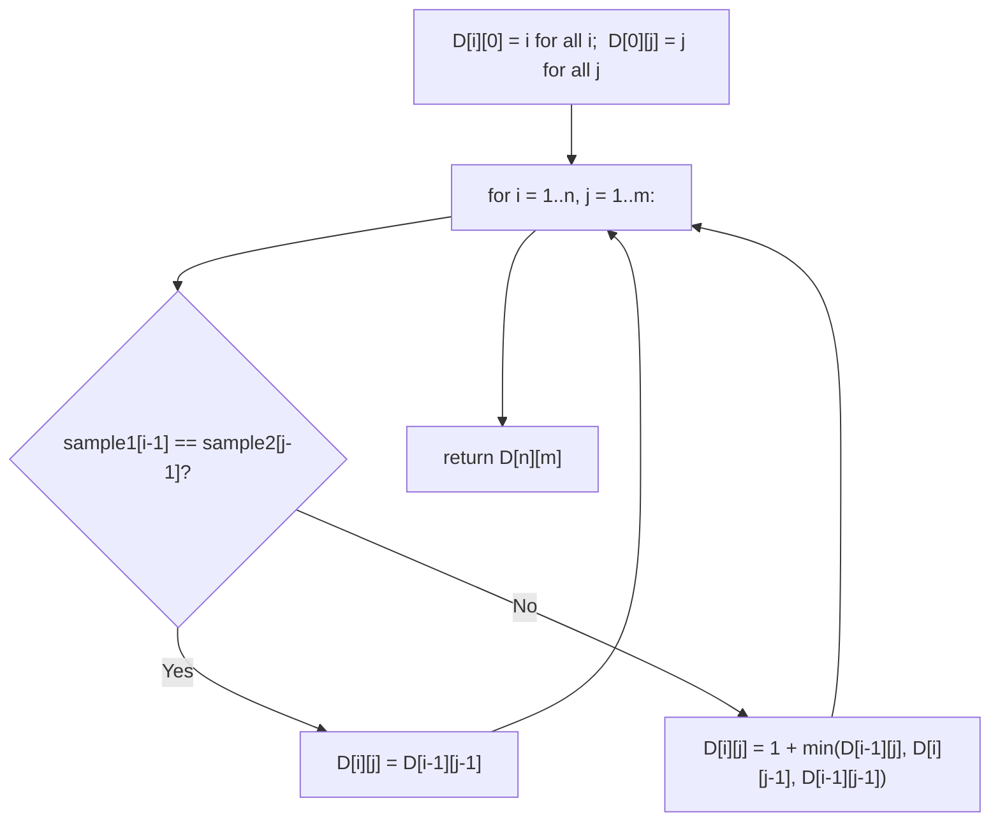

# Feature #8: Similarity Measure Between DNA Samples

## The problem

The DNA of an alien species is a sequence of nucleotides. Given two such samples, we need to measure how similar they are — the standard measure of similarity here is the **edit distance**: the minimum number of edits needed to convert one sample into the other. We're allowed three kinds of edit: insert a nucleotide, delete a nucleotide, or replace one nucleotide with another.

Given two DNA samples as strings `sample1` and `sample2`, return the minimum number of operations needed to convert `sample1` into `sample2`.

```
similarityExtent("abcdef", "azced") -> 3
similarityExtent("intention", "execution") -> 5
```

## Solution

Compare `sample1` and `sample2` one character at a time. If the characters at the current position already match, no edit is needed there. If they don't match, we have three choices — insert, delete, or replace — and each choice reduces the problem to a smaller version of itself:

- **Insert** a character into `sample1` to match `sample2`'s current character: now we need the edit distance between the *rest* of `sample1` and the rest of `sample2` (after this position).
- **Delete** the current character of `sample1`: now we need the edit distance between the rest of `sample1` and the *whole remaining* `sample2`.
- **Replace** the current character: now we need the edit distance between the rest of both strings.

None of these three choices is obviously best in isolation — the right one depends on how cheaply the *rest* of the strings can be matched up, so this is a textbook dynamic-programming setup: overlapping subproblems, optimal substructure.

We build a 2D table `D` of size `(n + 1) x (m + 1)`, where `n` and `m` are the lengths of `sample1` and `sample2`. `D[i][j]` holds the edit distance between the first `i` characters of `sample1` and the first `j` characters of `sample2`.

- **Base cases:** `D[i][0] = i` (deleting all of `sample1`'s first `i` characters to reach an empty string) and `D[0][j] = j` (inserting all of `sample2`'s first `j` characters into an empty string).
- **Transition:** if `sample1[i-1] == sample2[j-1]`, the characters already match, so `D[i][j] = D[i-1][j-1]` — no new edit needed. Otherwise, `D[i][j] = 1 + min(D[i-1][j], D[i][j-1], D[i-1][j-1])`, covering delete, insert, and replace respectively.

The answer is `D[n][m]`.



## Code

```java
class Solution {
    // Returns the edit distance (minimum insert/delete/replace operations)
    // needed to turn sample1 into sample2.
    public static int similarityExtent(String sample1, String sample2) {
        int n = sample1.length();
        int m = sample2.length();
        int[][] d = new int[n + 1][m + 1];

        for (int i = 0; i <= n; i++) {
            d[i][0] = i; // Delete all i characters of sample1.
        }
        for (int j = 0; j <= m; j++) {
            d[0][j] = j; // Insert all j characters of sample2.
        }

        for (int i = 1; i <= n; i++) {
            for (int j = 1; j <= m; j++) {
                if (sample1.charAt(i - 1) == sample2.charAt(j - 1)) {
                    d[i][j] = d[i - 1][j - 1];
                } else {
                    int delete = d[i - 1][j];
                    int insert = d[i][j - 1];
                    int replace = d[i - 1][j - 1];
                    d[i][j] = 1 + Math.min(delete, Math.min(insert, replace));
                }
            }
        }
        return d[n][m];
    }

    public static void main(String[] args) {
        System.out.println(similarityExtent("abcdef", "azced"));       // 3
        System.out.println(similarityExtent("intention", "execution")); // 5
    }
}
```

## Complexity measures

Let **n** and **m** be the number of nucleotides in `sample1` and `sample2`, respectively.

### Time Complexity

`O(n * m)` — every cell of the `(n + 1) x (m + 1)` table is filled exactly once with constant work.

### Space Complexity

`O(n * m)` — the full table is kept in memory.
