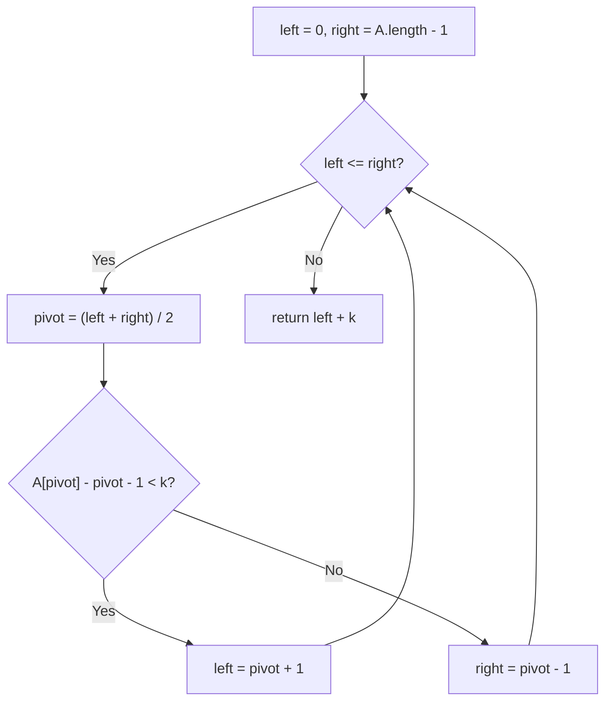

# Feature #9: Kth Missing Gene

## The problem

A planet has `n` genes, numbered `1` to `n`. Every species' DNA contains a subset of these genes, given to us as a strictly increasing sorted array `A` of the gene numbers it *does* have. We need to find the `k`th gene *missing* from that DNA, in sorted order.

**Constraints:** `1 <= A[i] <= 1000`, `1 <= k <= 1000`, and `A` is sorted strictly increasing.

```
findKthMissingGene([2,3,4,7,11], 1) -> 1   // genes 1,5,6,8,9,10 are missing; the 1st is 1
findKthMissingGene([1,2,3,4], 2)    -> 6   // no genes missing before 5; the 2nd missing gene is 6
```

## Solution

Since `A` is already sorted, binary search is a natural fit — we just need a way to count, for any position in `A`, how many genes are missing *before* it.

Compare `A` against what it would look like with *no* genes missing at all: `[1, 2, 3, ..., n]`. If `A = [2, 3, 4, 7, 11]`, the "complete" array up to that length would be `[1, 2, 3, 4, 5]`. The number of genes missing before `A[i]` is exactly the gap between what `A[i]` should be (`i + 1`, if nothing were missing) and what it actually is: `A[i] - i - 1`. For example, `A[3] = 7`, and the count of missing genes before it is `7 - 3 - 1 = 3` (genes 1, 5, 6 are missing before it).

That gives us a monotonically non-decreasing function of position — perfect for binary search. We look for the boundary where "missing genes before `A[pivot]`" first reaches `k`:

- Initialize `left = 0`, `right = A.length - 1`.
- While `left <= right`: compute `pivot = (left + right) / 2`. If `A[pivot] - pivot - 1 < k` (not enough genes missing yet), search the right half (`left = pivot + 1`); otherwise search the left half (`right = pivot - 1`).
- The loop ends when `left == right + 1`. At that point, the `k`th missing gene lies strictly between `A[right]` and `A[left]` (or before `A[left]` if `right` fell off the start). The number of genes missing before `A[right]` is `A[right] - right - 1`; we still need `k - (A[right] - right - 1)` more missing genes after `A[right]`, which — since genes increase strictly by 1 — land at `A[right] + (k - (A[right] - right - 1))`. That expression simplifies to `left + k` (using `right = left - 1` at loop end).



## Code

```java
class Solution {
    // Returns the kth gene missing from A, where A is a sorted array of
    // genes a species' DNA actually has.
    public static int findKthMissingGene(int[] A, int k) {
        int left = 0;
        int right = A.length - 1;

        while (left <= right) {
            int pivot = (left + right) / 2;
            // A[pivot] - pivot - 1 is how many genes are missing before A[pivot].
            if (A[pivot] - pivot - 1 < k) {
                left = pivot + 1;
            } else {
                right = pivot - 1;
            }
        }
        return left + k;
    }

    public static void main(String[] args) {
        System.out.println(findKthMissingGene(new int[]{2, 3, 4, 7, 11}, 1)); // 1
        System.out.println(findKthMissingGene(new int[]{1, 2, 3, 4}, 2));     // 6
    }
}
```

## Complexity measures

Let **n** be the number of genes in the given DNA sample `A`.

### Time Complexity

`O(log n)` — the binary search halves the search space at each step.

### Space Complexity

`O(1)` — only a constant number of index variables are used.
