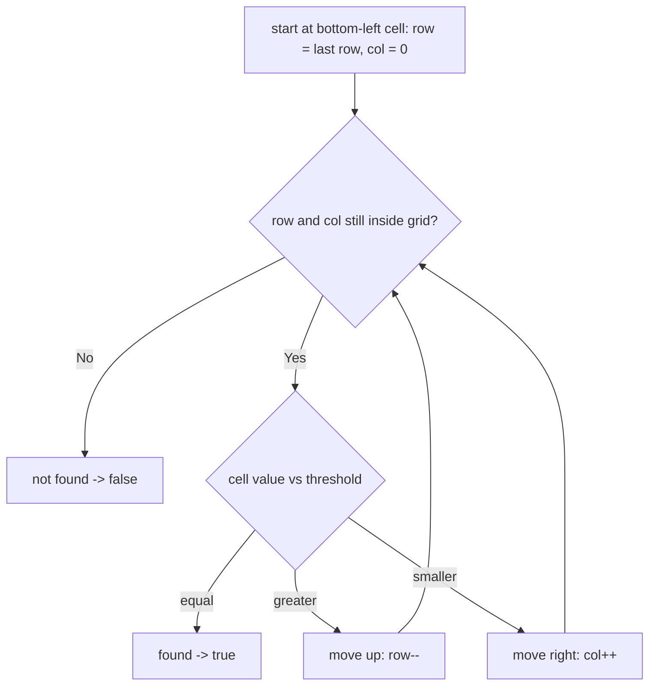

# Feature #1: Determine Location

## The problem

A cellular operator serves a rectangular region from a base station located in the top-left corner. During a road test, the team measured signal loss at every point of the region and recorded it as a grid of numbers. Signal loss only grows as you move right across a row, and it only grows as you move down a column — so each row is sorted left-to-right, and each column is sorted top-to-bottom.

A particular handset keeps working as long as the signal loss it experiences doesn't cross a given threshold. We need to say whether some location in the grid experiences signal loss *exactly* at that threshold — the boundary beyond which the handset stops working.

Given the grid and the threshold, decide whether that threshold value actually appears somewhere in the grid:

```
signalLoss = {{1,4,7,11,15},
              {2,5,8,12,19},
              {3,6,9,16,22},
              {10,13,14,17,24},
              {18,21,23,26,30}}

determineLocation(signalLoss, 5)  -> true   // (row 1, col 1) has loss 5
determineLocation(signalLoss, 20) -> false  // no cell has loss exactly 20
```

## Solution

The trick is to start the search from a corner where one direction increases and the other decreases — the **bottom-left** cell (or, symmetrically, the top-right one). From there:

- Moving **right** always increases the value (rows are sorted ascending left-to-right).
- Moving **up** always decreases the value (columns are sorted ascending top-to-bottom, so going up means going smaller).

That gives us a clean elimination rule at every step, similar in spirit to a binary search: look at the current cell's value.

- If it equals the threshold, we're done.
- If it's **greater** than the threshold, every cell to the *right* in this row is also greater (row is sorted ascending), so the whole row from here rightward is useless — move up one row.
- If it's **smaller** than the threshold, every cell *above* in this column is also smaller (column is sorted ascending going down, so smaller values are further up), so the whole column from here upward is useless — move one column to the right.

We can't start this elimination from the top-left or bottom-right corners — at those corners, both directions move the value the *same* way (both increasing, or both decreasing), so a value being too big or too small doesn't tell us which direction to eliminate.



## Code

```java
class Solution {
    // Returns true if some cell in signalLoss has a value exactly equal to
    // threshold, using the staircase search enabled by the grid's sort order.
    public static boolean determineLocation(int[][] signalLoss, int threshold) {
        if (signalLoss == null || signalLoss.length == 0) {
            return false;
        }
        int row = signalLoss.length - 1; // start bottom-left
        int col = 0;
        int maxCol = signalLoss[0].length - 1;

        while (row >= 0 && col <= maxCol) {
            int cur = signalLoss[row][col];
            if (cur == threshold) {
                return true;
            } else if (cur > threshold) {
                row--; // eliminate this row, move up
            } else {
                col++; // eliminate this column, move right
            }
        }
        return false;
    }

    public static void main(String[] args) {
        int[][] signalLoss = {
            {1, 4, 7, 11, 15},
            {2, 5, 8, 12, 19},
            {3, 6, 9, 16, 22},
            {10, 13, 14, 17, 24},
            {18, 21, 23, 26, 30}
        };
        System.out.println(determineLocation(signalLoss, 5));  // true
        System.out.println(determineLocation(signalLoss, 20)); // false
    }
}
```

## Complexity measures

Let **m** be the number of rows and **n** be the number of columns.

### Time Complexity

`O(m + n)` — every step either decrements the row or increments the column, and each can only happen at most once per its own dimension, so the walk terminates after at most `m + n` steps.

### Space Complexity

`O(1)` — only a row and column pointer are kept, regardless of grid size.
