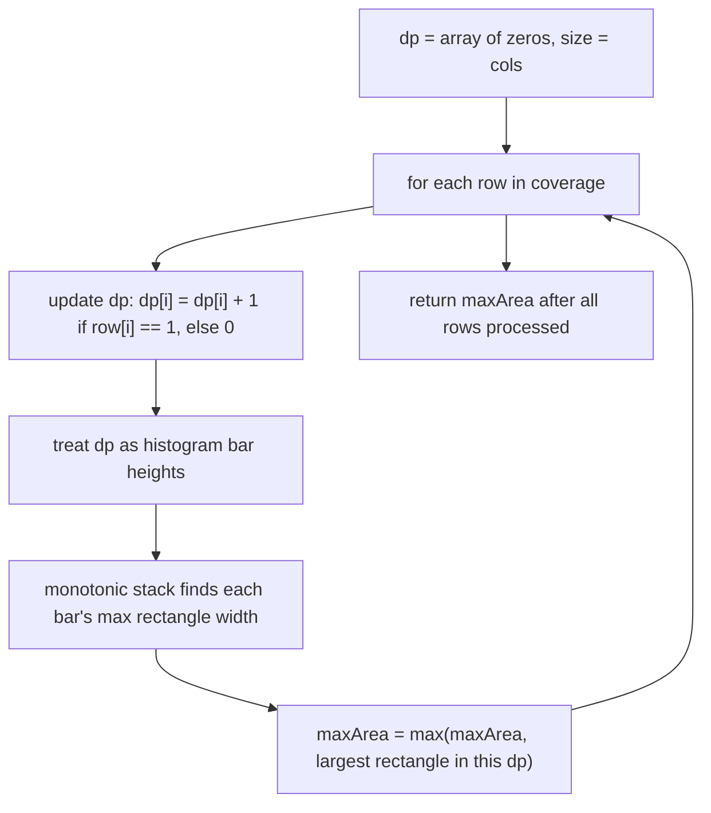

# Feature #2: Low Coverage Area

## The problem

In a busy city center, our cellular operator surveyed a rectangular mall and recorded, for every unit area, whether the cellular signal there is unacceptably low. The result is a grid of `0`s and `1`s — a `1` means "poor coverage here."

The operator is considering deploying small radio sites that use beamforming technology to cover a *rectangular* region. We need to find the rectangle of unbroken `1`s with the largest area — that's the biggest contiguous low-coverage zone worth targeting.

```
coverage = {{0,1,1},
            {1,1,1},
            {0,1,0}}

lowCoverageArea(coverage) -> 4   // the middle two rows, right two columns: a 2x2 block of 1s
```

## Solution

We solve this by growing the answer row by row, turning a 2D problem into a series of 1D ones.

Keep a running array `dp` with one entry per column. After processing row `k`, `dp[i]` holds the number of consecutive `1`s stacked in column `i`, ending at row `k` (and reset to `0` the moment a `0` breaks the streak). For example, after row 0 of `{0,1,1}`, `dp = [0,1,1]`; after row 1, since every column got a fresh `1`, `dp = [1,2,2]`; after row 2, the `0`s in columns 0 and 2 reset those columns, so `dp = [0,3,0]`.

Viewed sideways, `dp` at any point *is* a histogram — bar heights are "how many 1s are stacked here so far." Finding the largest all-`1`s rectangle ending at the current row is exactly the classic **largest rectangle in a histogram** problem on `dp`.

For that sub-problem: for every bar, its height is fixed, but how wide a rectangle can it anchor? Look left for the nearest bar shorter than it (call that index `L`), and look right for the nearest bar shorter than it (call that index `R`) — the bar can stretch as a rectangle across `width = (R - L) - 1`, giving `area = height * width`. If no shorter bar exists on a side, treat `L` as `-1` or `R` as the histogram's length.

We compute this efficiently with a **monotonic stack** of indices with increasing bar heights: push indices while heights keep climbing; the moment we see a bar shorter than the one on top of the stack, that new bar is `R` for the popped index, and the (new) top of the stack is `L`. Sweeping the histogram once with this stack finds every bar's max rectangle in linear time.

Running this row by row — updating `dp`, then finding its histogram max — and keeping a running maximum across all rows gives the overall largest low-coverage rectangle.



## Code

```java
import java.util.*;

class Solution {
    // Returns the area of the largest all-1s rectangle in the coverage grid.
    public static int lowCoverageArea(int[][] coverage) {
        if (coverage == null || coverage.length == 0) {
            return 0;
        }
        int cols = coverage[0].length;
        int[] dp = new int[cols];
        int maxArea = 0;

        for (int[] row : coverage) {
            for (int i = 0; i < cols; i++) {
                dp[i] = row[i] == 1 ? dp[i] + 1 : 0;
            }
            maxArea = Math.max(maxArea, largestRectangleArea(dp));
        }
        return maxArea;
    }

    // Classic "largest rectangle in a histogram," via a monotonic stack of
    // indices with strictly increasing bar heights.
    private static int largestRectangleArea(int[] heights) {
        Deque<Integer> stack = new ArrayDeque<>();
        int maxArea = 0;
        int n = heights.length;

        for (int i = 0; i <= n; i++) {
            int h = (i == n) ? 0 : heights[i]; // sentinel 0 flushes the stack at the end
            while (!stack.isEmpty() && heights[stack.peek()] >= h) {
                int height = heights[stack.pop()];
                int left = stack.isEmpty() ? -1 : stack.peek();
                int width = i - left - 1;
                maxArea = Math.max(maxArea, height * width);
            }
            stack.push(i);
        }
        return maxArea;
    }

    public static void main(String[] args) {
        int[][] coverage = {
            {0, 1, 1},
            {1, 1, 1},
            {0, 1, 0}
        };
        System.out.println(lowCoverageArea(coverage)); // 4
    }
}
```

## Complexity measures

Let **m** be the number of rows and **n** be the number of columns.

### Time Complexity

`O(m * n)` — every row updates `dp` in `O(n)` and then runs the histogram scan in `O(n)` (each column index is pushed and popped from the stack at most once), so the whole matrix costs `O(m * n)`.

### Space Complexity

`O(n)` — `dp` and the stack each hold at most one entry per column.
