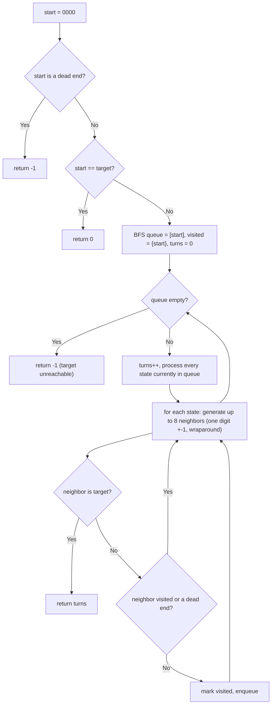

# Feature #3: Power Up the Station

## The problem

AT&T just acquired a cellular company in a small town that owns four base stations. The equipment they acquired is vintage: four circular dials, each showing a digit from `0` to `9`, must be rotated by hand — clockwise or counterclockwise, one dial at a time — to power up the station. The dials wrap around: turning clockwise past `9` lands on `0`, and turning counterclockwise past `0` lands on `9`.

Each combination of the four dials is a 4-digit state. Starting from `"0000"`, we need to reach a target state, one single-dial turn at a time. Certain states are "dead" — if the dials ever land on one, the system locks up permanently, so those states must never be visited (not even as a stepping stone). We want the *minimum* number of turns to reach the target while avoiding every dead state.

```
deadends = {"2110","0202","1222","2221","1010"}
target   = "2010"

powerUpStation(deadends, target) -> 3   // "0000" -> "1000" -> "2000" -> "2010"
```

## Solution

There are exactly 10,000 possible 4-digit states, from `"0000"` to `"9999"`. Think of each state as a node in a graph: an edge connects two states if they differ by turning exactly one dial one notch (with wraparound), and neither state is a dead end. We want the shortest path from `"0000"` to the target — and **shortest path in an unweighted graph is exactly what breadth-first search (BFS) is for**.

We run BFS level by level, starting from `"0000"` (unless it's itself a dead end, in which case the system is permanently stuck). At each state we generate its neighbors: each of the 4 dials can turn forward or backward, giving up to 8 neighboring states per node. A neighbor is worth exploring only if it isn't a dead end and hasn't been visited yet.

Generating a neighbor is just "add or subtract 1 from one digit, with wraparound": subtracting from `'0'` wraps to `'9'`, and adding to `'9'` wraps to `'0'`.

We track how many BFS "layers" (turns) we've expanded through; the layer at which we first reach the target is the answer. If BFS exhausts the reachable states without ever reaching the target, it's unreachable — return `-1`.



## Code

```java
import java.util.*;

class Solution {
    // Returns the minimum number of single-dial turns from "0000" to target,
    // avoiding every state in deadendsArr, or -1 if the target is unreachable.
    public static int powerUpStation(String[] deadendsArr, String target) {
        Set<String> deadends = new HashSet<>(Arrays.asList(deadendsArr));
        String start = "0000";
        if (deadends.contains(start)) {
            return -1;
        }
        if (start.equals(target)) {
            return 0;
        }

        Set<String> visited = new HashSet<>();
        visited.add(start);
        Queue<String> queue = new LinkedList<>();
        queue.add(start);
        int turns = 0;

        while (!queue.isEmpty()) {
            turns++;
            int levelSize = queue.size();
            for (int s = 0; s < levelSize; s++) {
                String cur = queue.poll();
                for (String next : neighbors(cur)) {
                    if (visited.contains(next) || deadends.contains(next)) {
                        continue;
                    }
                    if (next.equals(target)) {
                        return turns;
                    }
                    visited.add(next);
                    queue.add(next);
                }
            }
        }
        return -1;
    }

    // Up to 8 neighbors: each of the 4 digits turned +1 or -1, with wraparound.
    private static List<String> neighbors(String state) {
        List<String> result = new ArrayList<>();
        char[] chars = state.toCharArray();
        for (int i = 0; i < 4; i++) {
            char original = chars[i];

            chars[i] = turnUp(original);
            result.add(new String(chars));

            chars[i] = turnDown(original);
            result.add(new String(chars));

            chars[i] = original; // restore before moving to the next digit
        }
        return result;
    }

    private static char turnUp(char c) {
        return c == '9' ? '0' : (char) (c + 1);
    }

    private static char turnDown(char c) {
        return c == '0' ? '9' : (char) (c - 1);
    }

    public static void main(String[] args) {
        String[] deadends = {"2110", "0202", "1222", "2221", "1010"};
        System.out.println(powerUpStation(deadends, "2010")); // 3
    }
}
```

## Complexity measures

Let **n** be the number of dials (4), **a** be the number of digits per dial (10), and **d** be the number of dead-end states.

### Time Complexity

There are at most `a^n` reachable states, and each one generates `2n` neighbors in `O(n)` time apiece, so BFS costs `O(n^2 * a^n)`. Building the dead-end hash set up front costs an additional `O(d)`, giving a total of `O(n^2 * a^n + d)`.

### Space Complexity

`O(a^n + d)` — in the worst case, the visited set holds every reachable state, alongside the dead-end set.
