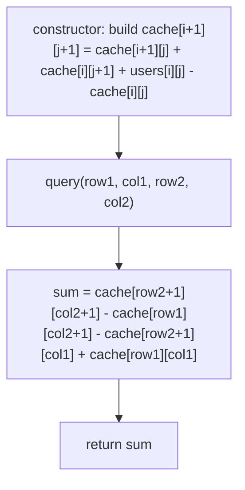

# Feature #4: Query Peak Users

## The problem

The cellular operator serves a rectangular region, modeled as a 2D grid with one base station per cell. Each base station has a limited capacity, and the operator has recorded the peak number of users connected to each station during busy hours. Leadership wants to query this data repeatedly: given the top-left and bottom-right coordinates of a rectangular sub-region, what's the total peak-user count across every base station in that rectangle?

Since these queries happen many times over the same underlying grid, we want a structure that answers each one fast, even if it means doing some work up front.

```
users = {{1,3,5},
         {2,4,6},
         {7,8,2},
         {9,3,6}}

sumRegion(0,0, 2,2) -> 38
sumRegion(0,1, 3,2) -> 37
sumRegion(2,1, 3,1) -> 11
```

## Solution

### Brute force

The simplest approach: for every query, loop over every cell in the rectangle `(row1, col1)` to `(row2, col2)` and add it up. No pre-processing, but every single query re-walks the whole rectangle.

### Caching rows

Since queries repeat, it's worth pre-computing something once. Build a `cache` grid where `cache[i][j]` is the running sum of row `i`, up to (but not including) column `j`:

```
cache[i][j + 1] = users[i][j] + cache[i][j],   with cache[i][0] = 0
```

Now the sum of a *single row* between two columns is just a subtraction: `cache[i][col2 + 1] - cache[i][col1]`. To answer a full rectangular query, we add this up over every row from `row1` to `row2`:

```
sum = Σ (cache[i][col2 + 1] - cache[i][col1])   for i in [row1, row2]
```

This turns each query into a loop over rows only, instead of rows *and* columns.

### Smart caching

We can go one step further and eliminate the per-query loop entirely, by caching a **2D prefix sum** — the total of everything from the origin `(0, 0)` up to `(row, col)` inclusive:

```
cache[i+1][j+1] = cache[i+1][j] + cache[i][j+1] + users[i][j] - cache[i][j]
```

(We size `cache` as `(rows+1) x (cols+1)` with a zero border, so the formula never needs bounds checks.) Each cell's cached sum is built from three neighboring cached sums that are already known, plus the current cell's own value — the `- cache[i][j]` term corrects for the overlap between the "everything above" and "everything to the left" regions, which both double-count the top-left rectangle.

To answer a query for rectangle `(row1, col1)`–`(row2, col2)`, we use **inclusion-exclusion**: take the sum of everything up to the bottom-right corner, subtract everything above the top edge and everything left of the left edge, then add back the top-left corner region (since it got subtracted twice):

```
sum = cache[row2+1][col2+1] - cache[row1][col2+1] - cache[row2+1][col1] + cache[row1][col1]
```

This answers every query in constant time, after a one-time `O(rows * cols)` setup.



## Code

```java
class Solution {
    // O(m*n) per query, O(1) setup — recomputes the region every time.
    static int bruteForce(int[][] users, int row1, int col1, int row2, int col2) {
        int sum = 0;
        for (int i = row1; i <= row2; i++) {
            for (int j = col1; j <= col2; j++) {
                sum += users[i][j];
            }
        }
        return sum;
    }

    // O(m) per query, O(m*n) setup — caches per-row prefix sums.
    static class CacheRows {
        private final int[][] cache;

        CacheRows(int[][] users) {
            int rows = users.length;
            int cols = users[0].length;
            cache = new int[rows][cols + 1];
            for (int i = 0; i < rows; i++) {
                for (int j = 0; j < cols; j++) {
                    cache[i][j + 1] = cache[i][j] + users[i][j];
                }
            }
        }

        int query(int row1, int col1, int row2, int col2) {
            int sum = 0;
            for (int i = row1; i <= row2; i++) {
                sum += cache[i][col2 + 1] - cache[i][col1];
            }
            return sum;
        }
    }

    // O(1) per query, O(m*n) setup — caches a full 2D prefix sum.
    static class CacheSmart {
        private final int[][] cache;

        CacheSmart(int[][] users) {
            int rows = users.length;
            int cols = users[0].length;
            cache = new int[rows + 1][cols + 1];
            for (int i = 0; i < rows; i++) {
                for (int j = 0; j < cols; j++) {
                    cache[i + 1][j + 1] = cache[i + 1][j] + cache[i][j + 1] + users[i][j] - cache[i][j];
                }
            }
        }

        int query(int row1, int col1, int row2, int col2) {
            return cache[row2 + 1][col2 + 1] - cache[row1][col2 + 1] - cache[row2 + 1][col1] + cache[row1][col1];
        }
    }

    public static void main(String[] args) {
        int[][] users = {
            {1, 3, 5},
            {2, 4, 6},
            {7, 8, 2},
            {9, 3, 6}
        };

        CacheSmart cacheSmart = new CacheSmart(users);
        System.out.println(cacheSmart.query(0, 0, 2, 2)); // 38
        System.out.println(cacheSmart.query(0, 1, 3, 2)); // 37
        System.out.println(cacheSmart.query(2, 1, 3, 1)); // 11
    }
}
```

## Complexity measures

Let **m** and **n** be the number of rows and columns.

| Method | Time per query | Pre-computation |
|---|---|---|
| `bruteForce` | `O(m * n)` | `O(1)` |
| `CacheRows` | `O(m)` | `O(m * n)` |
| `CacheSmart` | `O(1)` | `O(m * n)` |

### Time Complexity

`bruteForce` re-walks the whole rectangle every query. `CacheRows` builds row prefix sums once in `O(m * n)`, then answers each query in `O(m)` by summing one subtraction per row. `CacheSmart` builds a full 2D prefix sum once in `O(m * n)`, then answers every query in constant time via inclusion-exclusion.

### Space Complexity

`bruteForce` uses `O(1)` extra space. Both caching approaches use `O(m * n)` space to store their respective prefix-sum grids.
