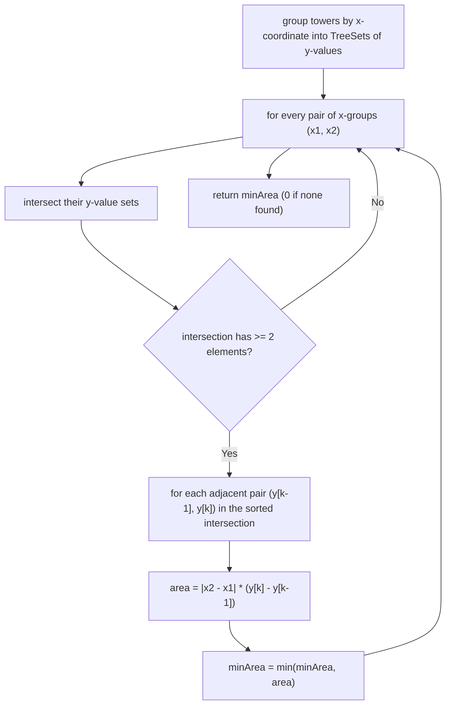

# Feature #5: Densest Deployment

## The problem

Our cellular operator serves a rectangular region and has deployed base stations (towers) at various `(x, y)` coordinates within it. We want to find the **densest deployment region** — a rectangle, with sides parallel to the axes, that has a base station on each of its four corners, covering the *smallest possible area* among all such rectangles. If no four towers can form a rectangle at all, the answer is `0`.

Tower locations are always unique.

```
towers = {(1,1), (1,3), (3,1), (3,3)}
densestDeployment(towers) -> 4   // the only rectangle: width 2, height 2

towers = {(1,1), (1,2), (1,3), (1,4)}
densestDeployment(towers) -> 0   // all towers share the same x, no rectangle possible
```

## Solution

Checking every possible group of 4 towers directly would be expensive. Instead, we use a geometric shortcut: **any two towers that share an x-coordinate can only be the left or right edge of a rectangle** — so if we group towers by their x-coordinate, a rectangle is fully determined by picking two x-groups and finding a y-value that appears in *both* groups (twice, actually — those two shared y-values become the top and bottom edges).

Concretely: if towers `A = (x1, y1)` and `B = (x1, y2)` sit on the same vertical line `x1`, and towers `C = (x2, y2)` and `D = (x2, y1)` sit on another vertical line `x2` at the *same two* y-values, then `A, B, C, D` form a rectangle of width `|x2 - x1|` and height `|y2 - y1|`.

So the algorithm becomes:

1. Group all tower coordinates by x-coordinate into a hash map, where each value is a *sorted* set of y-coordinates at that x (a `TreeSet` keeps them sorted automatically).
2. For every pair of x-groups that each have at least 2 towers, compute the set intersection of their y-coordinates — these are the y-values that appear on *both* vertical lines, i.e., candidate rectangle heights.
3. Since the intersection is sorted, only *adjacent* pairs of shared y-values can form the smallest rectangle for that pair of x-groups (any non-adjacent pair would just enclose a smaller, already-considered rectangle). For each adjacent pair `(y[k-1], y[k])`, compute `area = (x2 - x1) * (y[k] - y[k-1])` and keep the running minimum.



## Code

```java
import java.util.*;

class Solution {
    // Returns the area of the smallest axis-aligned rectangle whose 4 corners
    // are all towers, or 0 if no such rectangle exists.
    public static int densestDeployment(int[][] towers) {
        Map<Integer, TreeSet<Integer>> xToYs = new HashMap<>();
        for (int[] tower : towers) {
            xToYs.computeIfAbsent(tower[0], k -> new TreeSet<>()).add(tower[1]);
        }

        List<Integer> xs = new ArrayList<>(xToYs.keySet());
        int minArea = 0;

        for (int i = 0; i < xs.size(); i++) {
            for (int j = i + 1; j < xs.size(); j++) {
                int x1 = xs.get(i);
                int x2 = xs.get(j);
                TreeSet<Integer> ys1 = xToYs.get(x1);
                TreeSet<Integer> ys2 = xToYs.get(x2);

                List<Integer> commonYs = new ArrayList<>();
                for (int y : ys1) {
                    if (ys2.contains(y)) {
                        commonYs.add(y);
                    }
                }

                for (int k = 1; k < commonYs.size(); k++) {
                    int height = commonYs.get(k) - commonYs.get(k - 1);
                    int width = Math.abs(x2 - x1);
                    int area = height * width;
                    if (minArea == 0 || area < minArea) {
                        minArea = area;
                    }
                }
            }
        }
        return minArea;
    }

    public static void main(String[] args) {
        int[][] towers1 = {{1, 1}, {1, 3}, {3, 1}, {3, 3}};
        System.out.println(densestDeployment(towers1)); // 4

        int[][] towers2 = {{1, 1}, {1, 2}, {1, 3}, {1, 4}};
        System.out.println(densestDeployment(towers2)); // 0
    }
}
```

## Complexity measures

Let **n** be the number of towers.

### Time Complexity

`O(n^2)` — we compare every pair of x-groups, and across all pairs the total work spent walking and intersecting y-sets is bounded by `n` per group; in the worst case (few towers per x-coordinate) this totals `O(n^2)`.

### Space Complexity

`O(n)` — every tower's coordinate is stored exactly once across the `TreeSet`s in the hash map.
