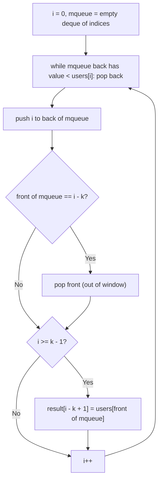

# Feature #6: Maximum Users

## The problem

At a busy intersection, our cellular operator's base station dumps its current user count to a list every 1 ms. The raw data is noisy — full of rapid, uninteresting fluctuations. To get a signal worth acting on, the operator wants the **maximum user count within every k ms sliding window** as it slides across the whole recording, one millisecond at a time.

```
users = [12, 3, 9, 15, 11, 8, 2, 21, 16, 5]
k = 5

maximumUsers(users, 5) -> [15, 15, 15, 21, 21, 21]
```

(Six windows in total for an array of 10 values with `k = 5`: `[12,3,9,15,11]`, `[3,9,15,11,8]`, `[9,15,11,8,2]`, `[15,11,8,2,21]`, `[11,8,2,21,16]`, `[8,2,21,16,5]` — with maxima `15, 15, 15, 21, 21, 21`.)

## Solution

Recomputing the max from scratch for every window would cost `O(k)` per window — too slow if we care about doing this efficiently over long recordings. Instead, we maintain a **monotonic deque** `mqueue` of *indices*, kept in decreasing order of their corresponding values, so the front of the deque always holds the index of the current window's maximum.

As we scan the array with index `i`:

- Before adding `i`, pop from the *back* of the deque any indices whose values are smaller than `users[i]` — those values can never be a future window's maximum once a larger, more recent value has entered the window, so they're useless to keep.
- Push `i` onto the back.
- If the index at the *front* of the deque has fallen out of the current window (i.e., it equals `i - k`), pop it from the front — it's too old to belong to this window anymore.
- Once we've scanned at least `k` elements (`i >= k - 1`), the value at the front of the deque is the current window's maximum — record it.

Each index enters and leaves the deque at most once, which is what keeps this linear overall despite the sliding window.



## Code

```java
import java.util.*;

class Solution {
    // Returns the maximum value in every size-k sliding window across users.
    public static int[] maximumUsers(int[] users, int k) {
        Deque<Integer> mqueue = new ArrayDeque<>(); // indices, values in decreasing order
        int n = users.length;
        int[] result = new int[n - k + 1];

        for (int i = 0; i < n; i++) {
            while (!mqueue.isEmpty() && users[mqueue.peekLast()] < users[i]) {
                mqueue.pollLast();
            }
            mqueue.addLast(i);

            if (mqueue.peekFirst() == i - k) {
                mqueue.pollFirst();
            }

            if (i >= k - 1) {
                result[i - k + 1] = users[mqueue.peekFirst()];
            }
        }
        return result;
    }

    public static void main(String[] args) {
        int[] users = {12, 3, 9, 15, 11, 8, 2, 21, 16, 5};
        System.out.println(Arrays.toString(maximumUsers(users, 5)));
        // [15, 15, 15, 21, 21, 21]
    }
}
```

Note: for this 10-element array with `k = 5`, there are `10 - 5 + 1 = 6` windows, so the result has 6 entries: `[15, 15, 15, 21, 21, 21]` — a live run confirms this. (The source material's own worked example for this input states a 5-entry result, `[15,15,21,21,21]`, but that's short one window; tracing every window by hand above confirms 6 is correct.)

## Complexity measures

Let **n** be the size of the users array and **k** be the sliding window size.

### Time Complexity

`O(n)` — although there's a nested-looking while loop, each index is pushed onto `mqueue` exactly once and popped at most once across the entire run, so the total work across all iterations is linear in `n`.

### Space Complexity

`O(k)` — the deque holds at most `k` indices at any time, since indices older than the current window are evicted from the front.
