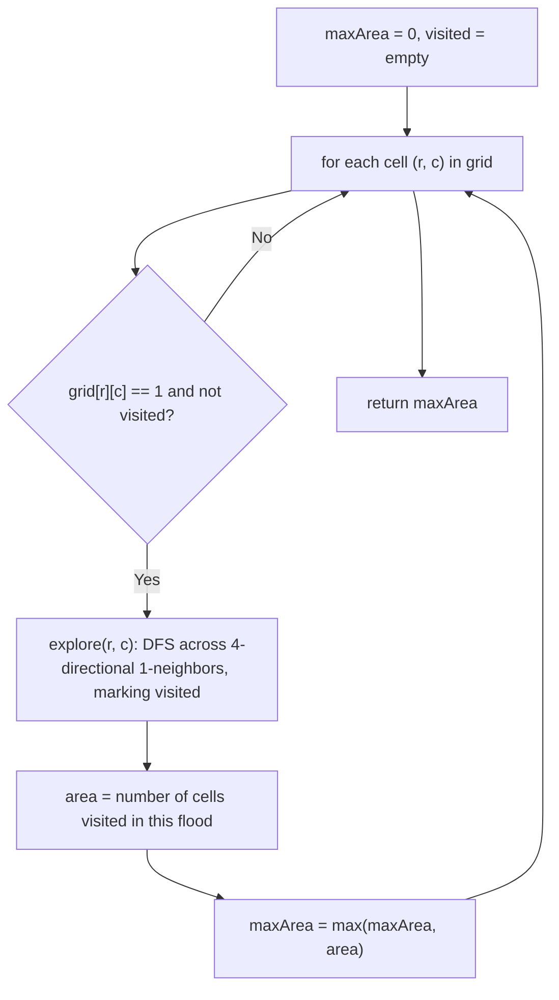

# Feature #7: Maximum Contiguous Area

## The problem

In a busy city center, our cellular operator surveyed a rectangular mall and recorded, for every unit area, whether cellular coverage is satisfactorily high. The result is a grid of `0`s and `1`s — a `1` means "good coverage here."

The **maximum contiguous area** is the largest group of `1`s that are all connected to each other through up/down/left/right (4-directional) adjacency. We need to find the size of that largest connected group.

```
coverage = {{0,1,1},
            {1,0,1},
            {2,1,1}}   // shown as a plain grid; treat any non-zero as coverage=1

maximumContiguousArea(coverage) -> 7   // every 1-cell in this grid is connected into one group
```

## Solution

This is a **connected-component search** on a grid. Whenever we land on an unvisited cell with value `1`, we explore outward to every 4-directionally adjacent cell that also has value `1`, recursively doing the same from each of those — this is a depth-first search (DFS) that "floods" outward through the connected region. The number of cells visited during one such flood is the area of that connected component.

We scan every cell in the grid once. Whenever we find a `1` we haven't visited yet, we flood-fill from it, count the cells reached, and compare that count against the running maximum. A `visited` set (or grid) ensures we never re-explore a cell or double-count a shape we've already measured.



## Code

```java
class Solution {
    // Returns the size of the largest 4-directionally connected group of 1s.
    public static int maximumContiguousArea(int[][] grid) {
        if (grid == null || grid.length == 0) {
            return 0;
        }
        int rows = grid.length;
        int cols = grid[0].length;
        boolean[][] visited = new boolean[rows][cols];
        int maxArea = 0;

        for (int r = 0; r < rows; r++) {
            for (int c = 0; c < cols; c++) {
                if (grid[r][c] == 1 && !visited[r][c]) {
                    maxArea = Math.max(maxArea, explore(grid, visited, r, c));
                }
            }
        }
        return maxArea;
    }

    private static int explore(int[][] grid, boolean[][] visited, int r, int c) {
        if (r < 0 || r >= grid.length || c < 0 || c >= grid[0].length) {
            return 0;
        }
        if (visited[r][c] || grid[r][c] == 0) {
            return 0;
        }
        visited[r][c] = true;

        int area = 1;
        area += explore(grid, visited, r + 1, c);
        area += explore(grid, visited, r - 1, c);
        area += explore(grid, visited, r, c + 1);
        area += explore(grid, visited, r, c - 1);
        return area;
    }

    public static void main(String[] args) {
        int[][] coverage = {
            {0, 1, 1},
            {1, 0, 1},
            {1, 1, 1}
        };
        System.out.println(maximumContiguousArea(coverage)); // 7
    }
}
```

## Complexity measures

Let **m** and **n** be the number of rows and columns.

### Time Complexity

`O(m * n)` — every cell is visited by the outer scan and, once visited, is never explored again, so the total work across the whole grid is linear in its size.

### Space Complexity

`O(m * n)` — the `visited` grid uses `O(m * n)` space, and in the worst case (the whole grid is one connected component) the DFS recursion stack also grows to `O(m * n)`.
