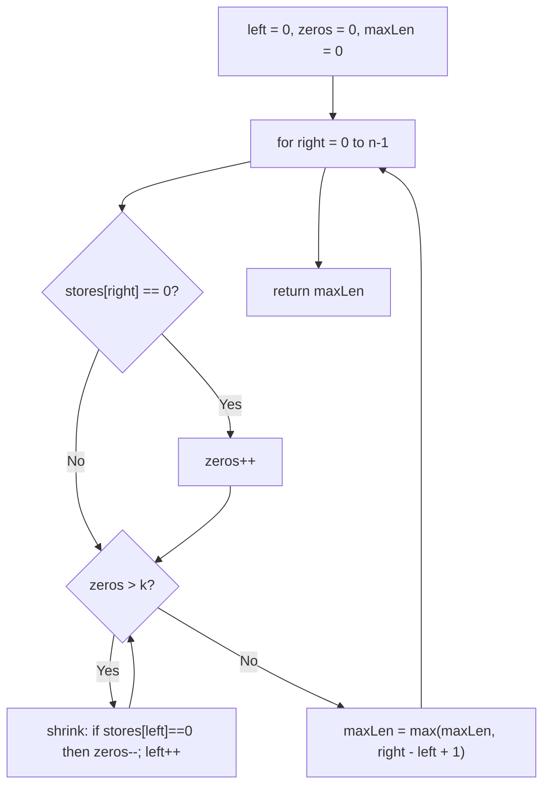

# Feature #8: Maximum Signal Strength

## The problem

Our cellular operator surveys an aisle in a mall lined with stores, recording for each store whether cellular signal there is satisfactory (`1`) or not (`0`). The operator has a budget for exactly `k` signal repeaters, and each repeater can boost exactly one store from unsatisfactory to satisfactory.

We want to choose which `k` stores to boost so that the **longest continuous stretch of stores with acceptable signal** (after boosting) is as large as possible.

```
stores = [0,0,1,1,0,0,1,1,1,0,1,1,0,0,0,1,1,1,1]
k = 3

maximumSignalStrength(stores, 3) -> 10
```

## Solution

This is "find the longest contiguous stretch with at most `k` zeros" — and rather than examining every possible subarray (which would recompute a lot of redundant work), we can grow and shrink a window over the array in a single left-to-right pass: a classic **sliding window**.

We maintain two pointers, `left` and `right`, marking the current candidate window, plus a running count of zeros currently inside it:

- Expand the window by moving `right` forward one store at a time. Each time we include a `0`, increment the zero counter.
- If the zero counter ever exceeds `k` (we've used up more repeaters than we have), shrink the window from the left — advance `left` one store at a time, decrementing the zero counter whenever the store leaving the window was itself a `0` — until we're back down to at most `k` zeros inside the window.
- After adjusting for each `right`, the window `[left, right]` is a valid candidate (at most `k` zeros); track its length against the running maximum.

Because `left` only ever moves forward and never resets backward, each store is only ever added to (by `right`) and removed from (by `left`) the window once across the whole scan.



## Code

```java
class Solution {
    // Returns the longest stretch of stores achievable with at most k repeaters
    // (i.e., flipping at most k zeros to ones).
    public static int maximumSignalStrength(int[] stores, int k) {
        int left = 0;
        int zeros = 0;
        int maxLen = 0;

        for (int right = 0; right < stores.length; right++) {
            if (stores[right] == 0) {
                zeros++;
            }
            while (zeros > k) {
                if (stores[left] == 0) {
                    zeros--;
                }
                left++;
            }
            maxLen = Math.max(maxLen, right - left + 1);
        }
        return maxLen;
    }

    public static void main(String[] args) {
        int[] stores = {0, 0, 1, 1, 0, 0, 1, 1, 1, 0, 1, 1, 0, 0, 0, 1, 1, 1, 1};
        System.out.println(maximumSignalStrength(stores, 3)); // 10
    }
}
```

## Complexity measures

Let **n** be the number of stores in the aisle.

### Time Complexity

`O(n)` — `right` sweeps forward across the array once, and `left` also only ever moves forward, so between them each store is touched a constant number of times.

### Space Complexity

`O(1)` — only a constant number of pointers and counters are used, regardless of the aisle's length.
