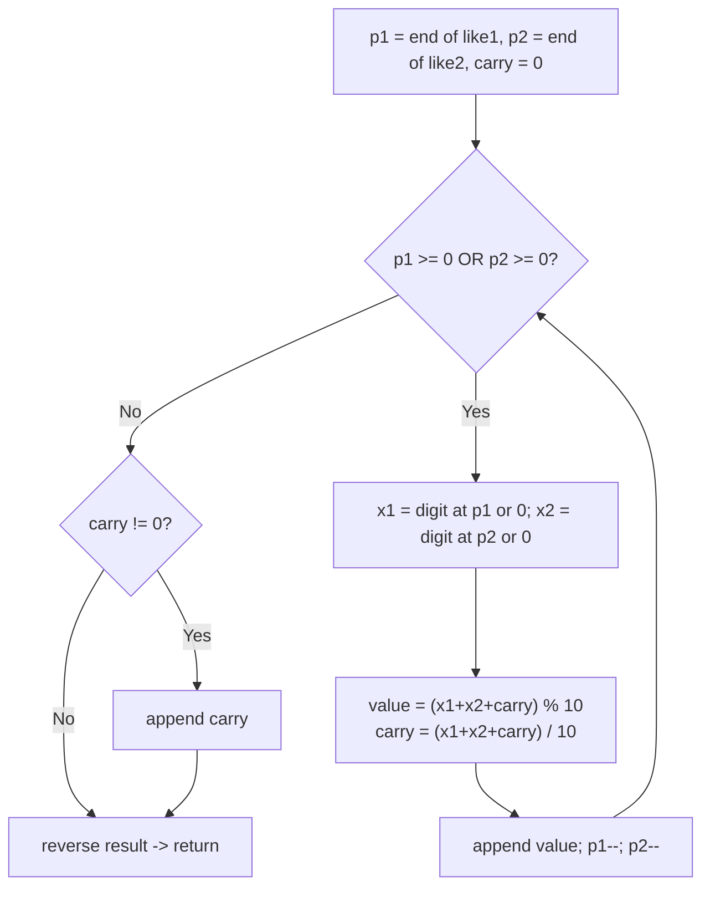

# Feature #1: Add Likes

## The problem

For the first feature of the Twitter application, we're creating an API that calculates the total number of likes on a person's Tweets. A teammate has already extracted the like counts from two data sources and stored each one as a text file, so both counts arrive as **strings**, not numbers. The API has one hard constraint: the values must stay strings the entire time — we're not allowed to convert either string to an integer, even temporarily (the counts can be far larger than what fits comfortably in a normal numeric type, so the API is designed to never assume a size limit).

Given two numeric strings, add them digit by digit and return the sum, also as a string:

```
addLikes("1545", "67") -> "1612"
```

## Solution

Since we can't convert to integers, we do the addition the way we did it by hand in grade school: digit by digit, from the rightmost digit backward, carrying over into the next column whenever a column's sum reaches 10 or more.

- Start with an empty result and `carry = 0`.
- Point `p1` at the last character of `like1` and `p2` at the last character of `like2`.
- Walk both pointers leftward at the same time, stopping only once both strings are exhausted.
- At each step, read digit `x1` from `like1` at `p1` (or `0` if `p1` has already run off the front of the string), and likewise `x2` from `like2` at `p2`.
- Compute `value = (x1 + x2 + carry) % 10` for this column's digit, and update `carry = (x1 + x2 + carry) / 10` for the next column.
- Append `value` to the result.
- Once both strings are exhausted, if `carry` is still non-zero, append it too — that's the extra leading digit produced by a final overflow (e.g., `"5" + "5" = "10"`).
- Reverse the accumulated result (since we built it from least-significant to most-significant digit) and return it as a string.

This is exactly the digit-by-digit column addition you'd do on paper — it just runs right-to-left because that's where a number's least significant digit lives.



## Code

```java
class Solution {
    // Adds two non-negative integers given as strings, without ever
    // converting either one to a numeric type, and returns the sum as a string.
    public static String addLikes(String like1, String like2) {
        StringBuilder res = new StringBuilder();
        int carry = 0;
        int p1 = like1.length() - 1;
        int p2 = like2.length() - 1;

        while (p1 >= 0 || p2 >= 0) {
            int x1 = (p1 >= 0) ? like1.charAt(p1) - '0' : 0;
            int x2 = (p2 >= 0) ? like2.charAt(p2) - '0' : 0;

            int value = (x1 + x2 + carry) % 10;
            carry = (x1 + x2 + carry) / 10;

            res.append(value);
            p1--;
            p2--;
        }

        if (carry != 0) {
            res.append(carry);
        }

        return res.reverse().toString();
    }

    public static void main(String[] args) {
        System.out.println(addLikes("1545", "67")); // 1612
    }
}
```

## Complexity measures

Let **n1** and **n2** be the lengths of the two input strings.

### Time Complexity

`O(max(n1, n2))` — the loop runs once per digit position up to the length of the longer string, doing constant work each time.

### Space Complexity

`O(max(n1, n2))` — the result string can be at most one digit longer than the longer input, to hold a final carry-out.
