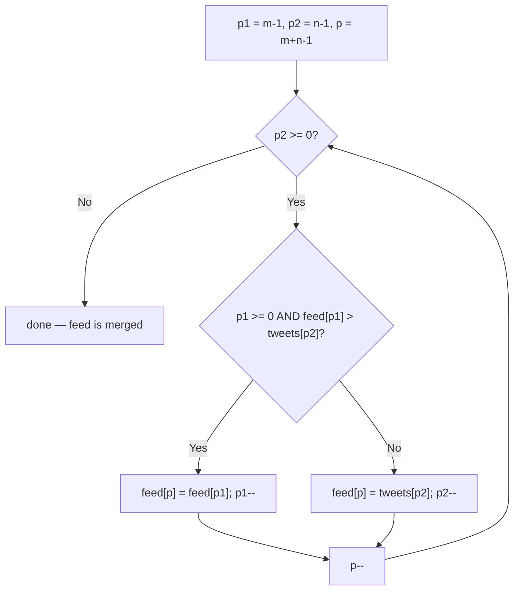

# Feature #2: Merge Tweets In Twitter Feed

## The problem

For the next feature, we need a module that adds a user's Tweets into an already populated Twitter feed, keeping everything in chronological order. Say `userA` just started following `userB`. From now on, `userB`'s Tweets should show up in `userA`'s feed. We already have a chronologically sorted list of Tweets for `userA`'s feed, and we have `userB`'s Tweets, also chronologically sorted — the job is to merge the two into one sorted list.

The input is two sorted integer arrays, `feed` and `tweets`, where each integer represents a Tweet's posting time. We're also given `m` and `n`, the number of real elements currently populated in `feed` and `tweets` respectively. `feed`'s underlying array has size `m + n` — the last `n` slots are just reserved empty space (zeros) to be overwritten with the merged result, so the merge can happen in place without allocating a second array.

```
feed   = [1, 3, 5, 0, 0, 0], m = 3
tweets = [2, 4, 6],          n = 3

mergeTweetsIntoFeed(feed, 3, tweets, 3)
feed -> [1, 2, 3, 4, 5, 6]
```

## Solution

The naive approach — shifting `feed`'s elements right every time we insert one of `tweets`'s elements in the middle — costs `O(m)` per insertion. We can do better by filling `feed` from the **back**, since that's exactly where the reserved empty space already is.

- Set `p1` to the last real element of `feed` (index `m - 1`) and `p2` to the last element of `tweets` (index `n - 1`).
- Set `p` to the very last index of the full `feed` array, `m + n - 1` — this is where we write the next (largest remaining) value.
- Repeat while there's still an element of `tweets` left to place: compare `feed[p1]` and `tweets[p2]`, and copy whichever one is **larger** into `feed[p]`, then decrement that source pointer and `p`. If `p1` has already run past the front of `feed` (nothing left on that side), just take from `tweets`.
- Once every element of `tweets` has been placed, we're done — any elements still left at the front of `feed` are already smaller than everything we've placed and are already sitting in their correct spot, so there's nothing left to move.

Filling from the back means we're always placing the current largest remaining value into the current largest remaining empty slot, so nothing ever needs to be shifted out of the way.



## Code

```java
import java.util.Arrays;

class Solution {
    // Merges `tweets`' first n elements into `feed`'s first m elements,
    // in place, using feed's trailing m+n-1..m reserved slots as scratch space.
    public static void mergeTweetsIntoFeed(int[] feed, int m, int[] tweets, int n) {
        int p1 = m - 1;
        int p2 = n - 1;
        int p = m + n - 1;

        while (p2 >= 0) {
            if (p1 >= 0 && feed[p1] > tweets[p2]) {
                feed[p] = feed[p1];
                p1--;
            } else {
                feed[p] = tweets[p2];
                p2--;
            }
            p--;
        }
    }

    public static void main(String[] args) {
        int[] feed = {1, 3, 5, 0, 0, 0};
        int[] tweets = {2, 4, 6};
        mergeTweetsIntoFeed(feed, 3, tweets, 3);
        System.out.println(Arrays.toString(feed)); // [1, 2, 3, 4, 5, 6]
    }
}
```

## Complexity measures

Let **m** and **n** be the number of real elements in `feed` and `tweets`.

### Time Complexity

`O(m + n)` — every element of both arrays is read and written exactly once.

### Space Complexity

`O(1)` — the merge happens directly inside `feed`'s existing storage, no extra array is allocated.
