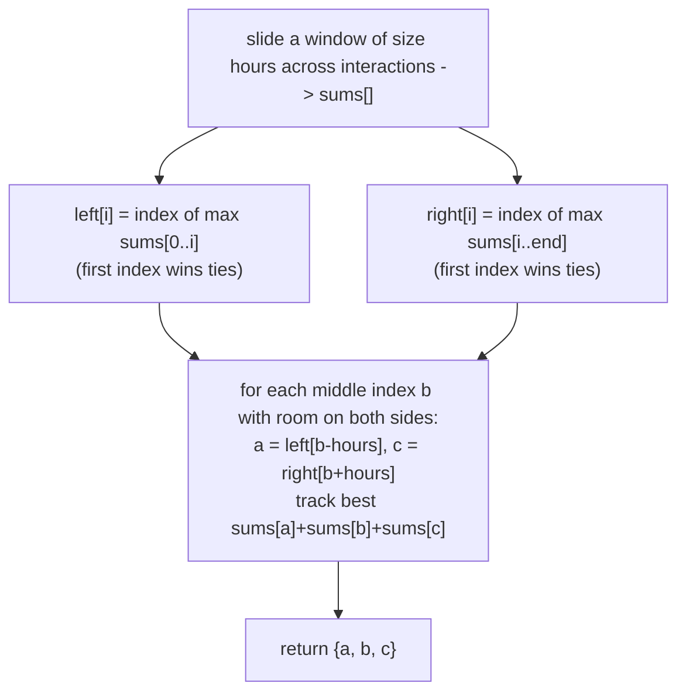

# Feature #3: Identify Peak Interaction Times

## The problem

For this Twitter feature, the company wants an API for business accounts that identifies three disjoint time intervals in which the most users followed or interacted with that business's Tweets. We're given the historical per-hour interaction counts for a business account, and a parameter `hours`. The goal is to find three intervals, each `hours` hours long, that don't overlap with each other, such that the sum of all interactions covered across all three intervals is as large as possible.

Consider a Twitter profile with this history of interactions: `{0, 2, 1, 3, 1, 7, 11, 5, 5}`, with `hours = 2`. The array says the account got 0 interactions in the first hour, 2 in the second hour, and so on. We want three intervals of size 2 with the maximum combined sum. Those turn out to be `{1, 3}`, `{7, 11}`, and `{5, 5}` — starting at indices 2, 5, and 7. The function returns the **starting indices** of the three intervals:

```
identifyPeakTimes({0, 2, 1, 3, 1, 7, 11, 5, 5}, 2) -> {2, 5, 7}
```

If more than one trio of intervals ties for the maximum sum, we return the chronologically earliest one — i.e., the lexicographically smallest triple of starting indices.

## Solution

First, collapse the problem from "raw hourly interactions" down to "sum of every possible `hours`-long window." Slide a window of size `hours` across the array and compute `sums[i]` = the sum of the window starting at index `i`, for every valid starting index. This can be done in one linear pass with a running sum (add the incoming element, subtract the one that just fell out of the window).

Once we have `sums`, the problem becomes: pick three indices `a < b` with `b - a >= hours` (so windows `a` and `b` don't overlap) and `c - b >= hours`, maximizing `sums[a] + sums[b] + sums[c]`, preferring the smallest indices on ties.

The trick is to fix the **middle** window `b` and, for each possible `b`, independently find the best non-overlapping choice on its left and on its right:

- Build `left[i]` = the index in `sums[0..i]` holding the maximum value seen so far (ties broken toward the earlier index, since we scan left to right and only overwrite on a strict improvement).
- Build `right[i]` = the index in `sums[i..end]` holding the maximum value from `i` onward (scanning right to left; here ties are broken toward the earlier index too — when scanning backward, that means overwriting on ties, `>=`, so an equally good earlier index wins over a later one).
- Now sweep `b` across every index that leaves room for both a left window (`b >= hours`) and a right window (`b + hours < sums.length`). For each `b`, the best left partner is `a = left[b - hours]` and the best right partner is `c = right[b + hours]`. Track the trio `(a, b, c)` that produces the largest `sums[a] + sums[b] + sums[c]`.

Because `left` and `right` are precomputed once, each value of `b` is checked in constant time, so the whole search is linear.



## Code

```java
import java.util.Arrays;

class Solution {
    // Finds the starting indices of three non-overlapping windows of length
    // `hours` whose combined interaction sum is maximal, preferring the
    // chronologically earliest trio on ties.
    public static int[] identifyPeakTimes(int[] interactions, int hours) {
        int n = hours;
        int len = interactions.length;
        int sumsLen = len - n + 1;
        int[] sums = new int[sumsLen];

        int windowSum = 0;
        for (int i = 0; i < len; i++) {
            windowSum += interactions[i];
            if (i >= n) {
                windowSum -= interactions[i - n];
            }
            if (i >= n - 1) {
                sums[i - n + 1] = windowSum;
            }
        }

        // left[i]: index of the largest sums value in sums[0..i], earliest wins ties.
        int[] left = new int[sumsLen];
        int best = 0;
        for (int i = 0; i < sumsLen; i++) {
            if (sums[i] > sums[best]) {
                best = i;
            }
            left[i] = best;
        }

        // right[i]: index of the largest sums value in sums[i..end], earliest wins ties.
        int[] right = new int[sumsLen];
        best = sumsLen - 1;
        for (int i = sumsLen - 1; i >= 0; i--) {
            if (sums[i] >= sums[best]) {
                best = i;
            }
            right[i] = best;
        }

        int[] result = {-1, -1, -1};
        int maxTotal = -1;
        for (int b = n; b + n < sumsLen; b++) {
            int a = left[b - n];
            int c = right[b + n];
            int total = sums[a] + sums[b] + sums[c];
            if (total > maxTotal) {
                maxTotal = total;
                result = new int[]{a, b, c};
            }
        }
        return result;
    }

    public static void main(String[] args) {
        int[] interactions = {0, 2, 1, 3, 1, 7, 11, 5, 5};
        System.out.println(Arrays.toString(identifyPeakTimes(interactions, 2))); // [2, 5, 7]
    }
}
```

## Complexity measures

Let **n** be the length of the interaction array.

### Time Complexity

`O(n)` — computing `sums` is a single linear sliding-window pass, building `left` and `right` is linear, and the final sweep over candidate middle windows is also linear.

### Space Complexity

`O(n)` — the `sums`, `left`, and `right` arrays are each proportional in size to the input.
