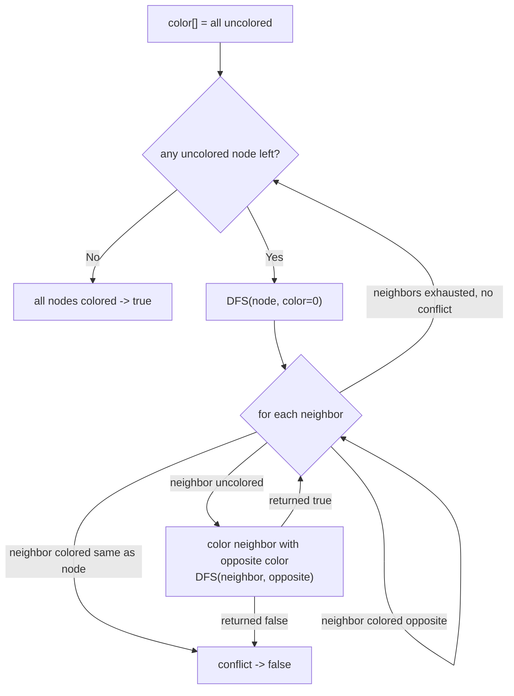

# Feature #4: Split Users into Two Groups

## The problem

For this feature, the company wants to show people "follow" recommendations. We're given the "following" relationship for a group of users as a graph, and we want to check whether these people can be split into exactly two groups such that **no one in a group follows, or is followed by, anyone else in that same group**. If that split is possible, we'll recommend people from the same group to each other (since within a group, nobody already knows anybody).

The "following" relationship is given as an **undirected** graph — if `userA` follows `userB` or vice versa, we just record an edge between them, direction doesn't matter here. The input is a 2D array `graph`, where `graph[i]` lists every index `j` that node `i` has an edge to. Each node is a person, identified by an integer from `0` to `graph.length - 1`.

For example: `graph = {{3}, {2, 4}, {1}, {0, 4}, {1, 3}}`. Node 0 connects to 3, node 1 connects to 2 and 4, node 2 connects to 1, node 3 connects to 0 and 4, and node 4 connects to 1 and 3. This graph can indeed be split into two groups (`{0, 2, 4}` and `{1, 3}`, for instance) where no edge stays inside a group:

```
splitUsersIntoTwoGroups({{3}, {2, 4}, {1}, {0, 4}, {1, 3}}) -> true
```

## Solution

A graph that can be split this way is called a **bipartite** graph. The standard way to check bipartiteness is to try to 2-color the graph: color a node blue if it belongs to the first group, red if it belongs to the second. A valid bipartite coloring exists exactly when every edge connects a blue node to a red node — never blue-to-blue or red-to-red. We can find such a coloring greedily, and it succeeds if and only if the graph really is bipartite.

- Keep a `color` array, one entry per node, initialized to "uncolored" (`-1`).
- The graph may have disconnected pieces, so we loop over every node; for each node that's still uncolored, we start a fresh DFS from it (coloring it, say, blue).
- Inside the DFS at some node: look at every neighbor. If a neighbor already has a color, it must be the **opposite** color of the current node — if it's the *same* color, we've found two same-group people who follow each other, so the split is impossible and we return `false`.
- If a neighbor is uncolored, color it with the opposite color and recurse into it. If that recursive call itself returns `false`, propagate `false` upward immediately — no valid coloring is possible below this point.
- If we finish coloring every node without ever hitting a conflict, the graph is bipartite — return `true`.

Because we always assign the *opposite* color across an edge, this is really a breadth-first "distance parity" check in disguise: nodes an even number of hops from the start get one color, nodes an odd number of hops get the other, and a conflict only ever arises from an odd-length cycle (an edge that closes a loop back to a node of the same color).



## Code

```java
import java.util.Arrays;

class Solution {
    // Returns true if the "following" graph is bipartite — i.e., its people
    // can be 2-colored so that every edge crosses between the two colors.
    public static boolean splitUsersIntoTwoGroups(int[][] graph) {
        int n = graph.length;
        int[] color = new int[n];
        Arrays.fill(color, -1);

        for (int i = 0; i < n; i++) {
            if (color[i] == -1) {
                if (!dfs(graph, color, i, 0)) {
                    return false;
                }
            }
        }
        return true;
    }

    private static boolean dfs(int[][] graph, int[] color, int node, int c) {
        color[node] = c;
        for (int neighbor : graph[node]) {
            if (color[neighbor] == color[node]) {
                return false;
            }
            if (color[neighbor] == -1) {
                if (!dfs(graph, color, neighbor, 1 - c)) {
                    return false;
                }
            }
        }
        return true;
    }

    public static void main(String[] args) {
        int[][] graph = {{3}, {2, 4}, {1}, {0, 4}, {1, 3}};
        System.out.println(splitUsersIntoTwoGroups(graph)); // true

        int[][] oddCycle = {{1, 2, 3}, {0, 2}, {0, 1, 3}, {0, 2}};
        System.out.println(splitUsersIntoTwoGroups(oddCycle)); // false (0-1-2 is an odd cycle)
    }
}
```

## Complexity measures

Let **n** be the number of nodes (users) and **m** be the number of edges (follow relationships).

### Time Complexity

`O(n + m)` — the DFS visits every node once and, across the whole traversal, examines every edge once from each endpoint.

### Space Complexity

`O(n)` — the `color` array holds one entry per node, and the recursion stack can go as deep as `n` in the worst case.
