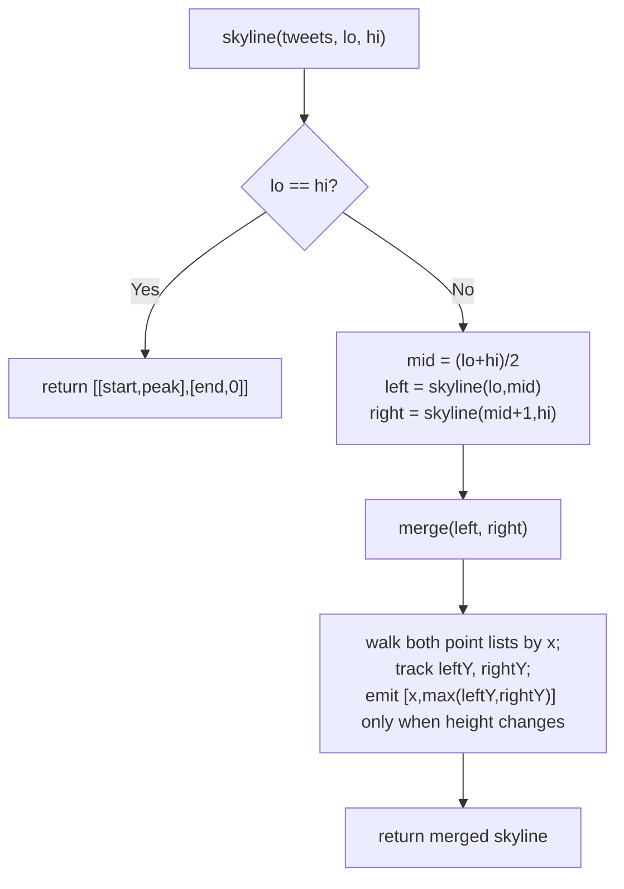

# Feature #5: Drawing a Global Profile of Viral Tweets

## The problem

For this feature, we want to track globally viral tweets on a given day. We have a list of trending hashtags, and for each one we know the interval during which it trended and its peak number of mentions during that interval. Each entry `tweets[i]` is `[start_i, end_i, peak_mentions_i]`: the hashtag started trending at `start_i`, stopped trending at `end_i`, and peaked at `peak_mentions_i` mentions somewhere in between.

We need to draw a **global profile**: at every moment, what's the highest peak-mentions value among all hashtags currently trending? If you picture each hashtag as a rectangle (from `start_i` to `end_i`, at height `peak_mentions_i`), the global profile is the outline you'd see if every rectangle were the same color and overlapping ones just merged — exactly the classic "skyline" of a city's silhouette. At any hour where nothing is trending (a gap between intervals), the profile drops to height 0.

The output is a list of `[x, y]` points, sorted by `x`, where each point marks the **left edge** of a new height on the skyline — the height holds constant until the next point. The very last point always has `y = 0`, marking where the skyline ends. No two consecutive points may share the same `y` (adjacent equal heights must be merged into one point).

```
tweets = [[2,9,10], [3,7,15], [5,12,12], [15,20,10], [19,24,8]]

drawGlobalProfile(tweets)
  -> [[2,10], [3,15], [7,12], [12,0], [15,10], [20,8], [24,0]]
```

Reading that off: from time 2 to 3, the tallest trending hashtag peaks at 10. From 3 to 7, a taller one (15) has taken over. From 7 to 12, the tallest remaining one peaks at 12. From 12 to 15, nothing is trending (height drops to 0 — a gap, since the next hashtag doesn't start until 15). From 15 to 20, height is 10, then 20 to 24 it's 8, then it ends.

## Solution

This is the skyline problem, and the clean way to build it is **divide and conquer**, following the shape of merge sort:

- **Base case:** a single tweet `[start, end, peak]` has an obvious 2-point skyline of its own: `[[start, peak], [end, 0]]`.
- **Recursive case:** split the tweets into a left half and a right half, recursively compute each half's skyline, then **merge** the two skylines into one — just like merging two sorted halves in merge sort, except instead of merging by "smallest value first," we're merging by "x-coordinate order," and instead of just concatenating we track the *current height contributed by each half* so we always emit the max of the two.

The merge step is the heart of it. Walk through both skylines' point lists with two pointers, always advancing whichever one has the smaller upcoming x-coordinate (advancing both together if they tie):

- Keep `leftY` and `rightY`, initialized to 0 — these track "what height is the left skyline currently at" and "what height is the right skyline currently at," updated every time we consume a point from that side.
- At each step, look at whichever side has the smaller next x-coordinate (call it `x`), consume that point, and update that side's current height.
- The merged skyline's height at `x` is `max(leftY, rightY)`.
- Only emit a new point `[x, max(leftY, rightY)]` if that height actually differs from the last point we emitted — this is what keeps consecutive equal heights from producing duplicate points.
- Once one side runs out, just copy over the rest of the other side's remaining points (each one is already a valid transition, since the exhausted side no longer contributes to the max).

Because both halves' skylines are already sorted by x-coordinate (they were built the same recursive way), the merge only ever needs a single linear scan — exactly the same shape as merging two sorted arrays.



## Code

```java
import java.util.*;

class Solution {
    // Builds the global profile (skyline) of trending hashtags: a list of
    // [x, y] points where y holds until the next point, ending at y = 0.
    public static List<int[]> drawGlobalProfile(int[][] tweets) {
        if (tweets.length == 0) {
            return new ArrayList<>();
        }
        return skyline(tweets, 0, tweets.length - 1);
    }

    private static List<int[]> skyline(int[][] tweets, int lo, int hi) {
        if (lo == hi) {
            List<int[]> single = new ArrayList<>();
            single.add(new int[]{tweets[lo][0], tweets[lo][2]});
            single.add(new int[]{tweets[lo][1], 0});
            return single;
        }
        int mid = (lo + hi) / 2;
        List<int[]> left = skyline(tweets, lo, mid);
        List<int[]> right = skyline(tweets, mid + 1, hi);
        return merge(left, right);
    }

    private static List<int[]> merge(List<int[]> left, List<int[]> right) {
        List<int[]> result = new ArrayList<>();
        int i = 0, j = 0;
        int leftY = 0, rightY = 0;

        while (i < left.size() && j < right.size()) {
            int x;
            if (left.get(i)[0] < right.get(j)[0]) {
                x = left.get(i)[0];
                leftY = left.get(i)[1];
                i++;
            } else if (right.get(j)[0] < left.get(i)[0]) {
                x = right.get(j)[0];
                rightY = right.get(j)[1];
                j++;
            } else {
                x = left.get(i)[0];
                leftY = left.get(i)[1];
                rightY = right.get(j)[1];
                i++;
                j++;
            }
            appendIfNew(result, x, Math.max(leftY, rightY));
        }

        while (i < left.size()) {
            appendIfNew(result, left.get(i)[0], left.get(i)[1]);
            i++;
        }
        while (j < right.size()) {
            appendIfNew(result, right.get(j)[0], right.get(j)[1]);
            j++;
        }
        return result;
    }

    private static void appendIfNew(List<int[]> result, int x, int y) {
        if (result.isEmpty() || result.get(result.size() - 1)[1] != y) {
            result.add(new int[]{x, y});
        }
    }

    public static void main(String[] args) {
        int[][] tweets = {{2, 9, 10}, {3, 7, 15}, {5, 12, 12}, {15, 20, 10}, {19, 24, 8}};
        List<int[]> profile = drawGlobalProfile(tweets);

        StringBuilder sb = new StringBuilder("[");
        for (int[] p : profile) {
            sb.append("[").append(p[0]).append(",").append(p[1]).append("],");
        }
        sb.setLength(sb.length() - 1);
        sb.append("]");
        System.out.println(sb);
        // [[2,10],[3,15],[7,12],[12,0],[15,10],[20,8],[24,0]]
    }
}
```

## Complexity measures

Let **n** be the number of tweets (hashtag intervals).

### Time Complexity

`O(n log n)` — the recursion halves the input at each level (log n levels), and merging two skylines at any level takes time proportional to their combined size, so each level costs `O(n)` total across all merges — the same shape as merge sort.

### Space Complexity

`O(n)` — in the worst case every interval is disjoint, contributing two points each to the final profile, and the recursion itself uses `O(log n)` stack depth on top of that.
