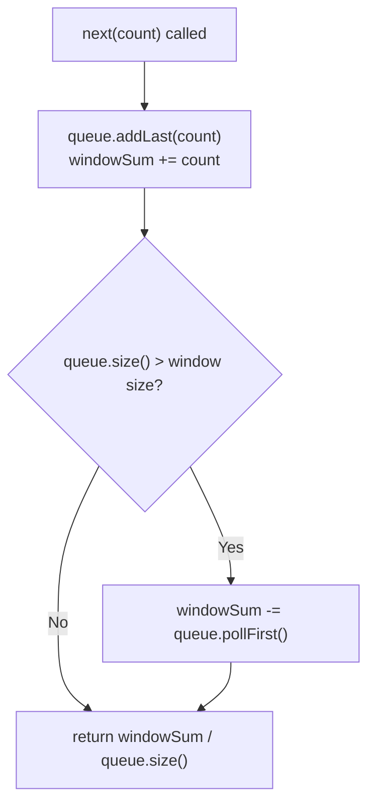

# Feature #6: Incoming Tweets Predictor

## The problem

Twitter wants to adjust the number of servers deployed in a cluster based on user traffic, re-evaluating every 15 minutes. A metering service collects traffic statistics every 5 minutes and streams them to us one number at a time — for example, `5, 7, 15, 8, 10`. A single 5-minute reading is too jumpy on its own to safely drive server scaling decisions, so we want the **moving average over the trailing 15-minute window** (three 5-minute readings) every time a new reading arrives.

The first two readings are a special case: since there isn't a full 15-minute window yet, the average is just computed over however many readings have arrived so far — the first reading's "average" is itself, and the second reading's average is the average of the first two.

```
predictor = new TweetsPredictor(3)   // window = 3 readings = 15 minutes
predictor.next(5)  -> 5.0
predictor.next(7)  -> 6.0
predictor.next(15) -> 9.0
predictor.next(8)  -> 10.0   // window is now full: {7, 15, 8}
predictor.next(10) -> 11.0   // window slides to {15, 8, 10}
```

## Solution

Keep a deque (double-ended queue) holding exactly the readings currently inside the window, plus a running `windowSum` of everything in it — that way we never have to re-sum the whole window from scratch on every call.

- On each new reading: push it onto the back of the deque and add it to `windowSum`.
- If the deque has now grown past the target window size, pop the oldest reading off the front and subtract it from `windowSum` — that's what makes the window "slide" instead of just growing forever.
- The average returned is always `windowSum / (current deque size)` — during the first couple of calls the deque hasn't filled up yet, so this naturally divides by however many readings have arrived so far, matching the "first reading is its own average, second is the average of the first two" rule without needing any special-case code.

This is exactly the same sliding-window bookkeeping trick as the monotonic-deque maximum problems elsewhere in this course, minus the monotonicity — here we don't need to know the max or min inside the window, just its sum, so a plain running total does the job.



## Code

```java
import java.util.*;

class Solution {
    static class TweetsPredictor {
        private final Deque<Integer> queue = new ArrayDeque<>();
        private final int size;
        private int windowSum = 0;

        TweetsPredictor(int size) {
            this.size = size;
        }

        // Feeds in the next 5-minute traffic reading and returns the moving
        // average over the trailing window (or over however many readings
        // have arrived so far, if the window isn't full yet).
        double next(int count) {
            queue.addLast(count);
            windowSum += count;
            if (queue.size() > size) {
                windowSum -= queue.pollFirst();
            }
            return (double) windowSum / queue.size();
        }
    }

    public static void main(String[] args) {
        TweetsPredictor predictor = new TweetsPredictor(3);
        int[] traffic = {5, 7, 15, 8, 10};
        for (int count : traffic) {
            System.out.println(predictor.next(count));
        }
        // 5.0
        // 6.0
        // 9.0
        // 10.0
        // 11.0
    }
}
```

## Complexity measures

Let **m** be the size of the sliding window.

### Time Complexity

`O(1)` per call to `next` — each reading does one push, at most one pop, and constant arithmetic.

### Space Complexity

`O(m)` — the deque holds at most `m` readings at any time, regardless of how many total readings have streamed through.
