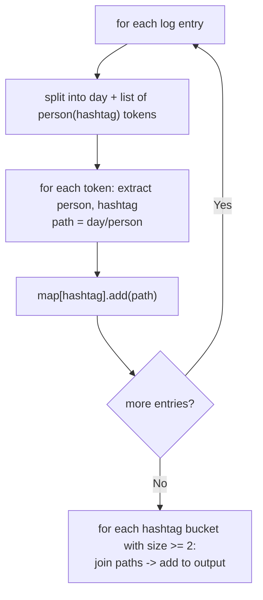

# Feature #7: Trending Hashtags

## The problem

We're given `tweetsInfo`, a daily log of hashtags used by people in their tweets. Each entry in the log has this format:

```
"day_m p1(p1_hashtag) p2(p2_hashtag) ... pn(pn_hashtag)"
```

That means: on day `day_m`, `n` different people posted, and `p1_hashtag` is the hashtag `p1` used, `p2_hashtag` is the one `p2` used, and so on (`n >= 1`, `m >= 0`, where `m = 0` is Monday, `m = 1` is Tuesday, and so on).

We want to find every hashtag that was used by at least two people (possibly on different days) and group those people together. Each `day/person` combination is called a **hashtag path**. The output is a list of strings, each one space-separating all the hashtag paths that share a common hashtag — one output string per hashtag that had two or more mentions. Hashtags used by only one person don't appear in the output at all. Order doesn't matter.

```
tweetsInfo = [
  "0 alice(#lld) bob(#java)",
  "1 charlie(#java) david(#python)",
  "2 elle(#lld)"
]

trendingHashtags(tweetsInfo) -> ["0/alice 2/elle", "0/bob 1/charlie"]
// #lld  was used by alice (day 0) and elle (day 2)
// #java was used by bob (day 0) and charlie (day 1)
// #python was used only by david -> not included, only one mention
```

## Solution

The core idea is a grouping pass: build one bucket per hashtag, and drop into it every "day/person" path that used that hashtag. At the end, any bucket with two or more entries is a group worth reporting.

- Parse each log entry by splitting on spaces. The first token is the day; every subsequent token has the shape `person(hashtag)`.
- For each `person(hashtag)` token, pull out the person's name (everything before `(`) and the hashtag (everything between `(` and the closing `)`), then build the hashtag path string `day/person`.
- Keep a `Map<String, List<String>>` called `map`, keyed by hashtag, whose value is the growing list of hashtag paths seen for that hashtag so far. For each parsed path, look up its hashtag in the map — if it's already a key, append the path to the existing list; otherwise create a new list containing just this path.
- Once every entry has been parsed, scan the map's values: for each hashtag whose path list has at least two entries, join that list into a single space-separated string and add it to the output. Hashtags with only one path are simply skipped.

This is the same "bucket by a derived key, then report only the buckets with two or more members" shape as grouping duplicate files by content hash — here the "content" is the hashtag text, and the "file path" is the day/person combination.



## Code

```java
import java.util.*;

class Solution {
    // Groups day/person hashtag paths by the hashtag they share, returning
    // one joined string per hashtag that was used by two or more people.
    public static List<String> trendingHashtags(List<String> tweetsInfo) {
        Map<String, List<String>> map = new HashMap<>();

        for (String entry : tweetsInfo) {
            String[] tokens = entry.split(" ");
            String day = tokens[0];

            for (int i = 1; i < tokens.length; i++) {
                int open = tokens[i].indexOf('(');
                String person = tokens[i].substring(0, open);
                String hashtag = tokens[i].substring(open + 1, tokens[i].length() - 1);
                String path = day + "/" + person;

                map.computeIfAbsent(hashtag, k -> new ArrayList<>()).add(path);
            }
        }

        List<String> output = new ArrayList<>();
        for (List<String> paths : map.values()) {
            if (paths.size() >= 2) {
                output.add(String.join(" ", paths));
            }
        }
        return output;
    }

    public static void main(String[] args) {
        List<String> tweetsInfo = Arrays.asList(
            "0 alice(#lld) bob(#java)",
            "1 charlie(#java) david(#python)",
            "2 elle(#lld)"
        );
        List<String> result = trendingHashtags(tweetsInfo);
        Collections.sort(result);
        System.out.println(result);
        // [0/alice 2/elle, 0/bob 1/charlie]
    }
}
```

## Complexity measures

Let **n** be the number of entries in `tweetsInfo` and **x** be the average length of an entry string.

### Time Complexity

`O(n * x)` — every one of the `n` entries is parsed character by character, and its length averages `x`.

### Space Complexity

`O(n * x)` — in the worst case (no hashtag repeated), the map ends up holding every parsed path, whose total size is proportional to the total input size.
