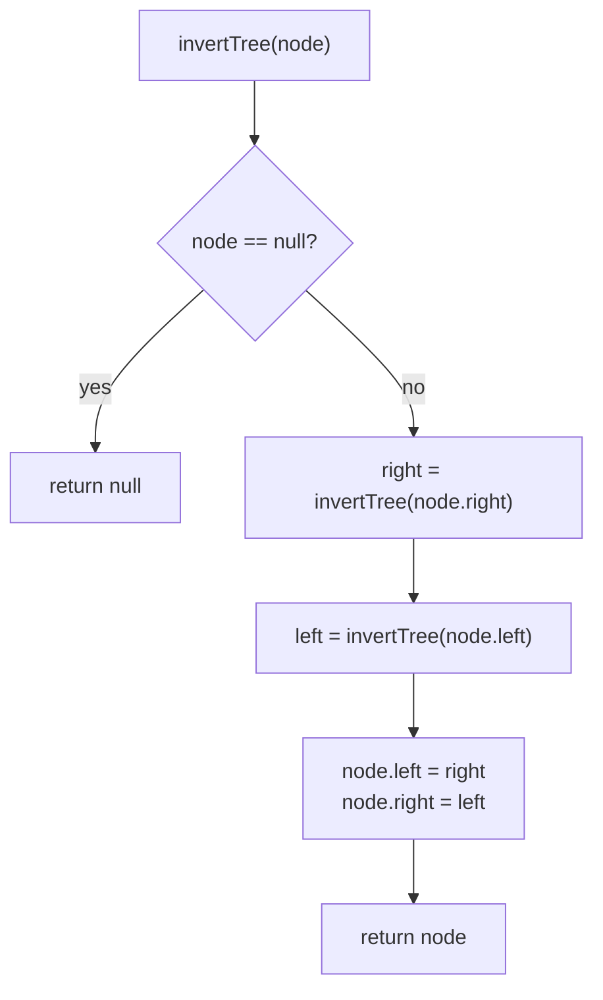

# Invert Binary Tree

## The problem

Given the root of a binary tree, invert it: every node's left and right children swap places, all the way down the tree. The values stay the same; only the left/right pointers flip.

Take this tree:

```
        4
       / \
      2   7
     / \ / \
    1  3 6  9
```

Level order: `[4, 2, 7, 1, 3, 6, 9]`. After inverting, every pair of children swaps:

```
        4
       / \
      7   2
     / \ / \
    9  6 3  1
```

Level order: `[4, 7, 2, 9, 6, 3, 1]`.

## Solution

The inverse of an empty tree is just the empty tree — so `null` maps to `null`. For a non-empty tree, the inverse of the whole tree is: keep the root's value, but the root's new left subtree is the *inverse of its old right subtree*, and its new right subtree is the *inverse of its old left subtree*.

That recursive definition is the entire algorithm — a post-order depth-first search that inverts the two subtrees first, then swaps them onto the current node:

1. If the node is `null`, return `null` (base case).
2. Recursively invert the left subtree.
3. Recursively invert the right subtree.
4. Attach the inverted right subtree as the new left child, and the inverted left subtree as the new right child.
5. Return the node.

Because every node is visited exactly once and the swap is O(1) work, this is linear in the number of nodes.



## Code

```java
import java.util.*;

class TreeNode {
    int val;
    TreeNode left;
    TreeNode right;
    TreeNode(int val) { this.val = val; }
}

class Solution {
    public static TreeNode invertTree(TreeNode root) {
        if (root == null) {
            return root;
        }
        TreeNode right = invertTree(root.right);
        TreeNode left = invertTree(root.left);
        root.left = right;
        root.right = left;
        return root;
    }

    private static TreeNode buildExampleTree() {
        //         4
        //        / \
        //       2   7
        //      / \ / \
        //     1  3 6  9
        TreeNode root = new TreeNode(4);
        root.left = new TreeNode(2);
        root.right = new TreeNode(7);
        root.left.left = new TreeNode(1);
        root.left.right = new TreeNode(3);
        root.right.left = new TreeNode(6);
        root.right.right = new TreeNode(9);
        return root;
    }

    private static List<Integer> levelOrder(TreeNode root) {
        List<Integer> result = new ArrayList<>();
        Queue<TreeNode> queue = new LinkedList<>();
        if (root != null) queue.add(root);
        while (!queue.isEmpty()) {
            TreeNode node = queue.poll();
            result.add(node.val);
            if (node.left != null) queue.add(node.left);
            if (node.right != null) queue.add(node.right);
        }
        return result;
    }

    public static void main(String[] args) {
        TreeNode root = buildExampleTree();
        System.out.println("Before: " + levelOrder(root));
        // Before: [4, 2, 7, 1, 3, 6, 9]
        TreeNode inverted = invertTree(root);
        System.out.println("After:  " + levelOrder(inverted));
        // After:  [4, 7, 2, 9, 6, 3, 1]
    }
}
```

## Complexity measures

Let **n** be the number of nodes in the tree.

### Time Complexity

`O(n)` — every node is visited exactly once, and the swap at each node is constant-time work.

### Space Complexity

`O(n)` — dominated by the recursion call stack, which in the worst case (a completely skewed tree) holds all `n` nodes at once; for a balanced tree this drops to `O(log n)`.
