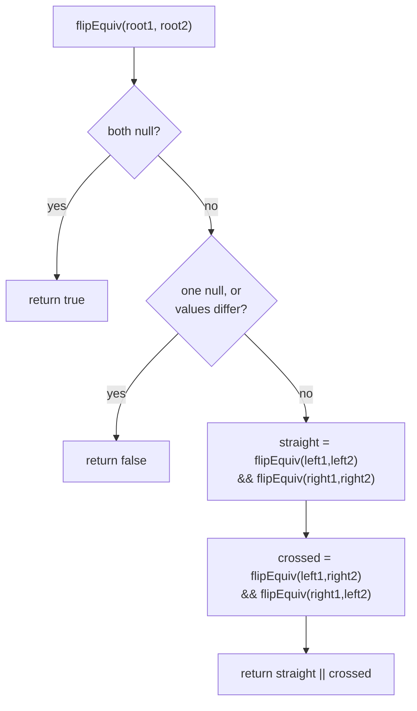

# Flip Equivalent Binary Trees

## The problem

Define a "flip" as picking any node in a binary tree and swapping its left and right child subtrees. A tree `root1` is **flip equivalent** to another tree `root2` if some sequence of flips (applied anywhere, at any nodes) can turn `root1` into `root2`.

Given the roots of two binary trees, decide whether they're flip equivalent.

Example — these two trees are flip equivalent, even though they look structurally different at first glance:

```
root1:        1                    root2:        1
            /   \                                /   \
           2     3                              3     2
          / \   / \                            / \   / \
         4   5 6   7                          7   6 5   4
```

`root2` is exactly `root1` with the root's children swapped, and then each of those children's own children swapped too. Flipping node `1`, then node `2`, then node `3` in `root1` produces `root2` — so `flipEquiv(root1, root2)` should return `true`.

If instead one of the leaves in `root2` had a different value (say `9` instead of `6`), no sequence of flips could fix that mismatched value, so the trees would not be flip equivalent.

## Solution

Flips only ever swap a node's *own* two children — they never move a value to a different level or a different parent. That means two trees are flip equivalent exactly when, at every pair of corresponding nodes, either:

- both are `null` (matching empty subtrees), or
- both have the same value, and their children match up **in some order** — either straight across (left-with-left, right-with-right) or crossed (left-with-right, right-with-left).

That gives a clean recursive check, `flipEquiv(root1, root2)`:

1. **Base case — both null:** two empty trees are trivially equivalent → `true`.
2. **Base case — mismatch:** if exactly one of them is `null`, or their values differ, they can never be made equal → `false`.
3. **Recursive case:** the trees are equivalent if *either* pairing works:
   - unflipped: `flipEquiv(root1.left, root2.left) && flipEquiv(root1.right, root2.right)`, **or**
   - flipped: `flipEquiv(root1.left, root2.right) && flipEquiv(root1.right, root2.left)`

Each node is compared once (the `min` of the two trees' sizes bounds the work, since recursion stops the moment one side runs out or mismatches), so this is efficient despite trying two pairings at every level.



## Code

```java
class TreeNode {
    int val;
    TreeNode left;
    TreeNode right;
    TreeNode(int val) { this.val = val; }
}

class Solution {
    public static boolean flipEquiv(TreeNode root1, TreeNode root2) {
        if (root1 == null && root2 == null)
            return true;
        if (root1 == null || root2 == null || root1.val != root2.val)
            return false;

        return (flipEquiv(root1.left, root2.left) && flipEquiv(root1.right, root2.right) ||
                flipEquiv(root1.left, root2.right) && flipEquiv(root1.right, root2.left));
    }

    public static void main(String[] args) {
        // root1:        1
        //             /   \
        //            2     3
        //           / \   / \
        //          4   5 6   7
        TreeNode root1 = new TreeNode(1);
        root1.left = new TreeNode(2);
        root1.right = new TreeNode(3);
        root1.left.left = new TreeNode(4);
        root1.left.right = new TreeNode(5);
        root1.right.left = new TreeNode(6);
        root1.right.right = new TreeNode(7);

        // root2:        1
        //             /   \
        //            3     2
        //           / \   / \
        //          7   6 5   4
        // (root's children flipped, then each subtree's children flipped too)
        TreeNode root2 = new TreeNode(1);
        root2.left = new TreeNode(3);
        root2.right = new TreeNode(2);
        root2.left.left = new TreeNode(7);
        root2.left.right = new TreeNode(6);
        root2.right.left = new TreeNode(5);
        root2.right.right = new TreeNode(4);

        System.out.println(flipEquiv(root1, root2));
        // true

        // root3: same shape as root2, but one leaf value changed (6 -> 9)
        TreeNode root3 = new TreeNode(1);
        root3.left = new TreeNode(3);
        root3.right = new TreeNode(2);
        root3.left.left = new TreeNode(7);
        root3.left.right = new TreeNode(9);
        root3.right.left = new TreeNode(5);
        root3.right.right = new TreeNode(4);

        System.out.println(flipEquiv(root1, root3));
        // false
    }
}
```

## Complexity measures

Let **n1** and **n2** be the number of nodes in `root1` and `root2`.

### Time Complexity

`O(min(n1, n2))` — recursion stops as soon as it hits a `null`/`null` match or a mismatch on one side, so it never explores more nodes than the smaller tree has.

### Space Complexity

`O(min(n1, n2))` — bounded by the recursion call stack, whose depth tracks the height of the smaller tree.
