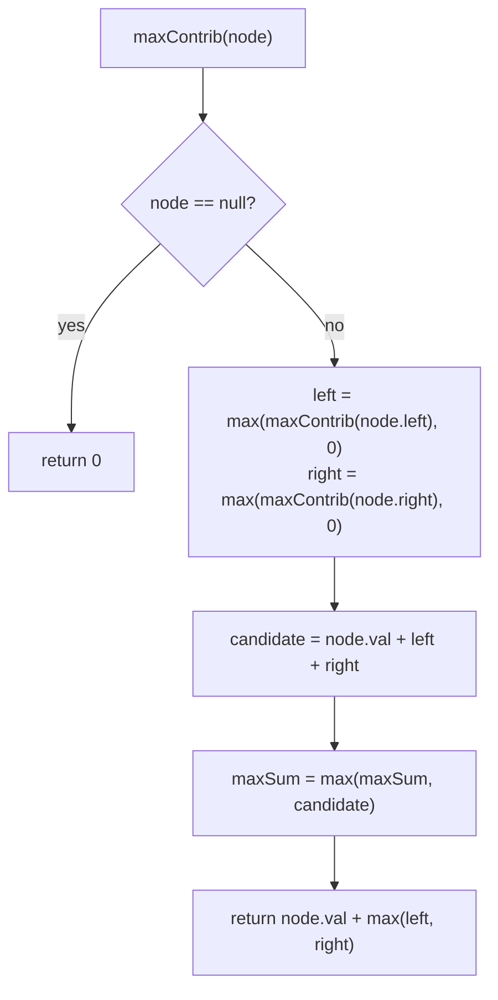

# Binary Tree Maximum Path Sum

## The problem

A **path** in a binary tree is any sequence of nodes where each adjacent pair is connected by an edge — you can go down through a parent-child link, and a path can bend at most once at its highest node (going up one side and down the other). Each node appears in the path at most once, and the path does **not** have to pass through the root or end at a leaf.

The path sum is the total of all the node values on the path. Given the root of a binary tree, find the maximum possible path sum over all paths in the tree.

Example:

```
       -10
       /  \
      9    20
          /  \
         15    7
```

The best path here doesn't touch the root at all — it's `15 -> 20 -> 7`, giving `15 + 20 + 7 = 42`. Including the root (`-10`) would only make things worse, since it's negative.

## Solution

The trick is to separate two different questions that look similar but aren't:

- **"What's the best path sum in the whole tree?"** — this is what we actually want to return, and the winning path can bend at any node, not just the root.
- **"What's the most a single node can contribute if a path is passing *through* it upward to its parent?"** — a path handed up to a parent can only continue through *one* of the node's two children (it can't fork), so this value is a "one-sided" contribution: `node.val + max(0, best of left child, right child)`.

We compute a helper, `maxContrib(node)`, that returns this one-sided contribution — and while computing it for every node, we also check, at that same node, whether *bending the path there* (using both children at once) beats anything seen so far. That check updates a running global `maxSum`, which is the actual answer we return at the end.

Concretely, `maxContrib(node)`:

1. **Base case:** a `null` node contributes `0`.
2. Recursively get the left and right children's contributions, but clamp each to `0` — a negative contribution should never be added, since skipping that side entirely (treating it as if it weren't there) is always at least as good.
3. **The "bend here" candidate:** `node.val + leftSubtree + rightSubtree` — this is the best path that has its highest point at `node`, using both children. Compare it against `maxSum` and keep the larger.
4. **The "pass upward" value:** return `node.val + max(leftSubtree, rightSubtree)` — only one side can be carried up to the parent, because a path can't branch in two directions at once except at its own peak.

`maxPathSum(root)` just resets `maxSum` to negative infinity, runs `maxContrib(root)` once for its side effects, and returns `maxSum`.



## Code

```java
class TreeNode {
    int val;
    TreeNode left;
    TreeNode right;
    TreeNode(int val) { this.val = val; }
}

class Solution {
    static int maxSum;

    public static int maxPathSum(TreeNode root) {
        maxSum = Integer.MIN_VALUE;
        maxContrib(root);
        return maxSum;
    }

    private static int maxContrib(TreeNode node) {
        if (node == null) {
            return 0;
        }

        // clamp negative contributions to 0 — skipping a losing side is always at least as good
        int leftSubtree = Math.max(maxContrib(node.left), 0);
        int rightSubtree = Math.max(maxContrib(node.right), 0);

        // best path that bends at this node, using both children
        int priceNewPath = node.val + leftSubtree + rightSubtree;
        maxSum = Math.max(maxSum, priceNewPath);

        // one-sided value handed up to this node's parent
        return node.val + Math.max(leftSubtree, rightSubtree);
    }

    public static void main(String[] args) {
        //        -10
        //        /  \
        //       9    20
        //           /  \
        //          15    7
        TreeNode root = new TreeNode(-10);
        root.left = new TreeNode(9);
        root.right = new TreeNode(20);
        root.right.left = new TreeNode(15);
        root.right.right = new TreeNode(7);

        System.out.println(maxPathSum(root));
        // 42  (the path 15 -> 20 -> 7, skipping the negative root entirely)

        // a simple all-positive tree, where the best path does pass through the root
        //     1
        //    / \
        //   2   3
        TreeNode root2 = new TreeNode(1);
        root2.left = new TreeNode(2);
        root2.right = new TreeNode(3);
        System.out.println(maxPathSum(root2));
        // 6  (the path 2 -> 1 -> 3)
    }
}
```

## Complexity measures

Let **n** be the number of nodes and **h** the height of the tree.

### Time Complexity

`O(n)` — `maxContrib` visits every node exactly once, doing constant work per call.

### Space Complexity

`O(h)` — the recursion call stack depth tracks the tree's height, from `O(log n)` for a balanced tree up to `O(n)` for a completely skewed one.
