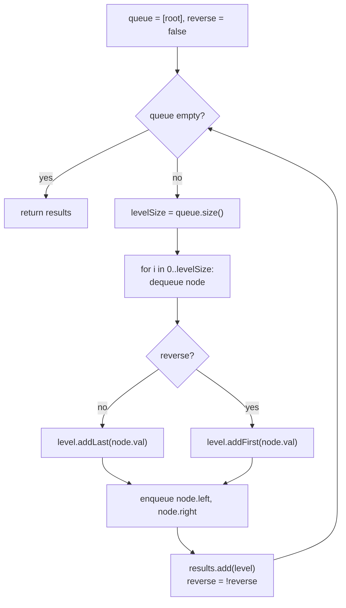

# Binary Tree Zigzag Level Order Traversal

## The problem

Given the root of a binary tree, return its level order traversal, but alternate the direction on every level: left-to-right, then right-to-left, then left-to-right again, and so on. Return the result as a list of lists — one inner list per level.

Example:

```
      3
     / \
    9   20
       /  \
      15    7
```

Level 0 reads left-to-right: `[3]`. Level 1 reads right-to-left: `[20, 9]`. Level 2 reads left-to-right again: `[15, 7]`. So `zigzagLevelOrder(root)` returns `[[3], [20, 9], [15, 7]]`.

## Solution

A plain breadth-first search already visits nodes level by level and naturally discovers each level's nodes in left-to-right order. Zigzagging doesn't need a different traversal — it just needs the *order the values get written into the output* to flip on alternating levels.

Steps:

1. If the root is `null`, return an empty list.
2. Use a queue seeded with the root, and a boolean flag `reverse` that starts `false`.
3. Process the tree level by level: at the start of each level, note how many nodes are currently in the queue (`levelSize`) — that's exactly the nodes belonging to this level.
4. For each of those nodes: dequeue it, and record its value into the current level's list — appended to the **end** if `reverse` is `false` (normal left-to-right order), or inserted at the **front** if `reverse` is `true` (which effectively reverses the level as it's built, one insert at a time). Then enqueue its children as usual, left before right — the queue itself always stays left-to-right internally.
5. After finishing a level, flip `reverse` for the next one.

Because insertion at the front of a `LinkedList` is O(1), building each level's zigzag order this way costs no more than a normal level order traversal.



## Code

```java
import java.util.*;

class TreeNode {
    int val;
    TreeNode left;
    TreeNode right;
    TreeNode(int val) { this.val = val; }
}

class Solution {
    public static List<List<Integer>> zigzagLevelOrder(TreeNode root) {
        List<List<Integer>> results = new ArrayList<>();
        if (root == null) {
            return results;
        }

        Deque<TreeNode> queue = new ArrayDeque<>();
        queue.add(root);
        boolean reverse = false;

        while (!queue.isEmpty()) {
            int levelSize = queue.size();
            LinkedList<Integer> level = new LinkedList<>();

            for (int i = 0; i < levelSize; i++) {
                TreeNode node = queue.poll();

                if (reverse) {
                    level.addFirst(node.val);
                } else {
                    level.addLast(node.val);
                }

                if (node.left != null) queue.add(node.left);
                if (node.right != null) queue.add(node.right);
            }

            results.add(level);
            reverse = !reverse;
        }

        return results;
    }

    public static void main(String[] args) {
        //       3
        //      / \
        //     9   20
        //        /  \
        //       15    7
        TreeNode root = new TreeNode(3);
        root.left = new TreeNode(9);
        root.right = new TreeNode(20);
        root.right.left = new TreeNode(15);
        root.right.right = new TreeNode(7);

        System.out.println(zigzagLevelOrder(root));
        // [[3], [20, 9], [15, 7]]
    }
}
```

## Complexity measures

Let **n** be the number of nodes in the tree.

### Time Complexity

`O(n)` — every node is dequeued, processed, and enqueued exactly once.

### Space Complexity

`O(n)` — the queue can hold up to the widest level of the tree, which in the worst case (a complete binary tree's last level) is proportional to `n`; the returned result list also holds all `n` values.
