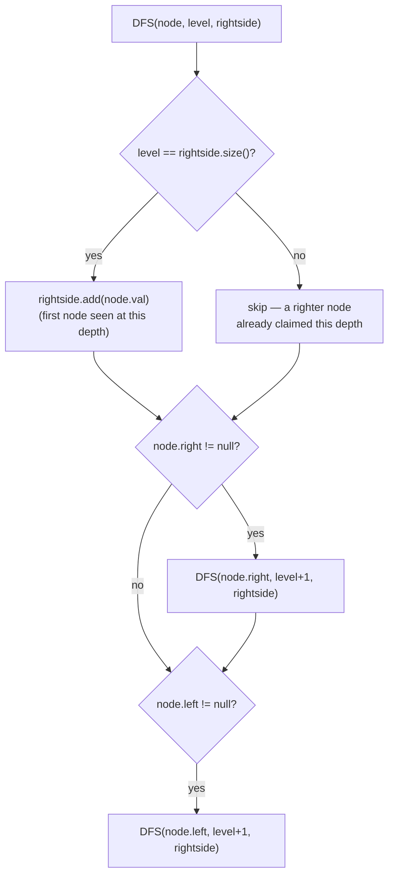

# Binary Tree Right Side View

## The problem

Given the root of a binary tree, imagine standing to the right of it and looking at it edge-on. Return the values of the nodes you'd be able to see, ordered from top to bottom — that is, the rightmost node at every level.

Example:

```
      1
     / \
    2   3
     \    \
      5    4
```

Standing on the right: at level 0 you see `1`, at level 1 the rightmost visible node is `3` (node `2` is hidden behind it), and at level 2 the rightmost visible node is `4` (node `5` is hidden behind it, since `4` is farther right on its level). So `rightSideView(root)` returns `[1, 3, 4]`.

## Solution

The nodes you can see standing to the right are simply the first node encountered at each depth, *if you always visit the right side of the tree before the left*. That reframes the problem as a depth-first search with a right-first visiting order, tracking depth as you go:

1. Do a DFS starting at the root at `level = 0`, visiting **right child before left child** at every node.
2. Keep a running result list, `rightside`, where `rightside.size()` at any moment tells you the deepest level recorded so far.
3. At each node: if `level == rightside.size()`, this is the *first* node the search has reached at this depth — since right is visited before left, that means it's the rightmost node at this level — so append its value.
4. Recurse into the right child first (at `level + 1`), then the left child (also at `level + 1`).

Because the right subtree is always explored before the left at every node, the first node the recursion reaches at any given depth is guaranteed to be the rightmost one — any node further right at that depth would have already been visited and already claimed that depth's slot in `rightside`.



## Code

```java
import java.util.*;

class TreeNode {
    int val;
    TreeNode left;
    TreeNode right;
    TreeNode(int val) { this.val = val; }
}

class Solution {
    public static List<Integer> rightSideView(TreeNode root) {
        List<Integer> rightside = new ArrayList<>();
        if (root == null) {
            return rightside;
        }
        DFS(root, 0, rightside);
        return rightside;
    }

    public static void DFS(TreeNode node, int level, List<Integer> rightside) {
        // first time we reach this depth -> it's the rightmost node here,
        // because we always explore right before left
        if (level == rightside.size())
            rightside.add(node.val);

        if (node.right != null)
            DFS(node.right, level + 1, rightside);
        if (node.left != null)
            DFS(node.left, level + 1, rightside);
    }

    public static void main(String[] args) {
        //       1
        //      / \
        //     2   3
        //      \    \
        //       5    4
        TreeNode root = new TreeNode(1);
        root.left = new TreeNode(2);
        root.right = new TreeNode(3);
        root.left.right = new TreeNode(5);
        root.right.right = new TreeNode(4);

        System.out.println(rightSideView(root));
        // [1, 3, 4]
    }
}
```

## Complexity measures

Let **n** be the number of nodes and **h** the height of the tree.

### Time Complexity

`O(n)` — the DFS visits every node exactly once.

### Space Complexity

`O(h)` — bounded by the recursion call stack, which is `O(log n)` for a balanced tree and `O(n)` in the worst case for a completely skewed tree.
