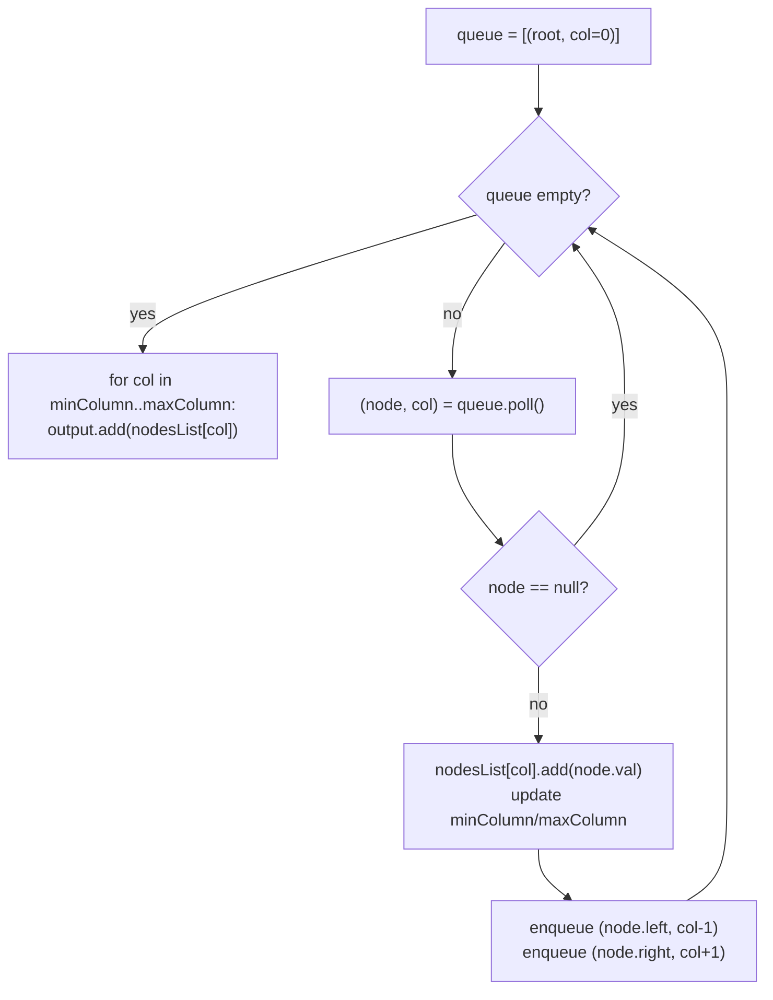

# Binary Tree Vertical Order Traversal

## The problem

Given the root of a binary tree, return its **vertical order traversal**: group nodes into vertical columns, then return the columns from leftmost to rightmost. Within a column, nodes are ordered top to bottom by their row; if two nodes land in the same column *and* the same row, they're ordered left to right.

To make this concrete, assign every node a column index: the root is column `0`, a left child is one less than its parent's column, and a right child is one more.

Simple example:

```
        3
       / \
      9   20
         /  \
        15    7
```

Columns: `9` is at `-1`; `3` and `15` are both at `0`; `20` is at `1`; `7` is at `2`. Reading columns left to right, top to bottom within each: `[[9], [3, 15], [20], [7]]`.

A trickier example, where two different nodes share both a column *and* a row:

```
        3
       / \
      9    8
     / \  / \
    4  0 1   7
       /
      5
```

Here `0` (left subtree) and `1` (right subtree) both land in column `0`, at the same row (row 2). Since `0` is reached via the left side of the tree and `1` via the right side, `0` must come before `1`. Columns: `-2 -> [4]`, `-1 -> [9, 5]`, `0 -> [3, 0, 1]`, `1 -> [8]`, `2 -> [7]`.

## Solution

Breadth-first search naturally visits nodes top row first, and — because it enqueues children left-before-right — it also visits nodes left-to-right within anything it discovers at the same time. That's exactly the ordering the problem wants, so the whole trick is to carry a **column index** alongside each node through the BFS and bucket values by that index as they're dequeued.

1. Use two parallel queues (or a queue of pairs): one tracks nodes, the other tracks each node's column index. Seed both with the root and column `0`.
2. Keep a `HashMap<Integer, List<Integer>>` called `nodesList`, mapping column index to the list of values seen in that column so far — and track the running `minColumn` / `maxColumn` seen.
3. Run the BFS: pop a node and its column. If the node isn't `null`, append its value to `nodesList.get(column)`, update `minColumn`/`maxColumn`, then push its left child with `column - 1` and its right child with `column + 1`.
4. Because BFS processes level by level, and within a level processes nodes in the order their parents were processed (left parent before right parent), any two nodes that end up in the *same column and same row* are still appended to that column's list in left-to-right order automatically — no extra sorting needed.
5. Once the queue is empty, walk column indices from `minColumn` to `maxColumn` and collect each column's list into the final result — this puts columns in left-to-right order.



## Code

```java
import java.util.*;

class TreeNode {
    int val;
    TreeNode left;
    TreeNode right;
    TreeNode(int val) { this.val = val; }
}

class Solution {
    public static List<List<Integer>> verticalOrder(TreeNode root) {
        List<List<Integer>> output = new ArrayList<>();
        if (root == null) {
            return output;
        }

        Map<Integer, List<Integer>> nodesList = new HashMap<>();
        int minColumn = 0;
        int maxColumn = 0;

        Queue<TreeNode> queueNode = new LinkedList<>();
        Queue<Integer> queueColumn = new LinkedList<>();
        queueNode.add(root);
        queueColumn.add(0);

        while (!queueNode.isEmpty()) {
            TreeNode node = queueNode.poll();
            int column = queueColumn.poll();

            if (node != null) {
                nodesList.computeIfAbsent(column, k -> new ArrayList<>()).add(node.val);
                minColumn = Math.min(minColumn, column);
                maxColumn = Math.max(maxColumn, column);

                queueNode.add(node.left);
                queueColumn.add(column - 1);
                queueNode.add(node.right);
                queueColumn.add(column + 1);
            }
        }

        for (int i = minColumn; i <= maxColumn; i++) {
            output.add(nodesList.get(i));
        }

        return output;
    }

    public static void main(String[] args) {
        //        3
        //       / \
        //      9   20
        //         /  \
        //        15    7
        TreeNode root = new TreeNode(3);
        root.left = new TreeNode(9);
        root.right = new TreeNode(20);
        root.right.left = new TreeNode(15);
        root.right.right = new TreeNode(7);

        System.out.println(verticalOrder(root));
        // [[9], [3, 15], [20], [7]]

        // trickier case: nodes 0 and 1 share the same column AND the same row
        //        3
        //       / \
        //      9    8
        //     / \  / \
        //    4  0 1   7
        //       /
        //      5
        TreeNode t2 = new TreeNode(3);
        t2.left = new TreeNode(9);
        t2.right = new TreeNode(8);
        t2.left.left = new TreeNode(4);
        t2.left.right = new TreeNode(0);
        t2.right.left = new TreeNode(1);
        t2.right.right = new TreeNode(7);
        t2.left.right.left = new TreeNode(5);

        System.out.println(verticalOrder(t2));
        // [[4], [9, 5], [3, 0, 1], [8], [7]]
    }
}
```

## Complexity measures

Let **n** be the number of nodes in the tree.

### Time Complexity

`O(n)` — BFS visits every node exactly once.

### Space Complexity

`O(n)` — `nodesList` holds all `n` values across its column buckets in the worst case (every node in its own column), the two queues together never hold more than roughly two levels' worth of nodes, and the output list also holds all `n` values. All of these are linear in `n`.
