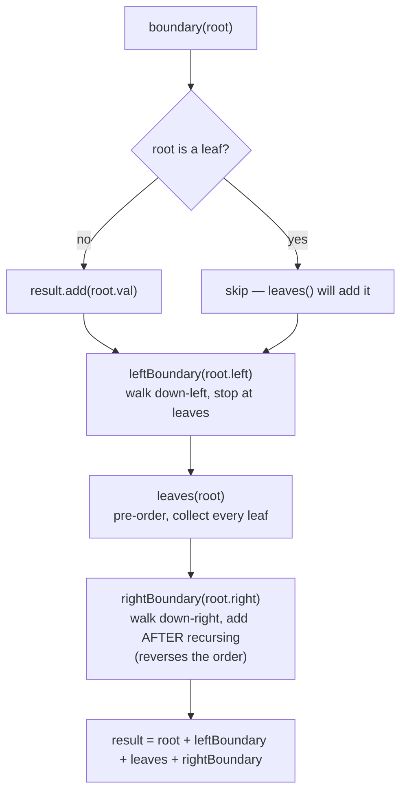

# Boundary of Binary Tree

## The problem

The **boundary** of a binary tree is the outline you'd trace walking around its edge: the root, then the left boundary going down, then all the leaves left to right, then the right boundary coming back up. Concretely, it's the concatenation of four pieces, in this order:

1. **The root node** (unless the root is itself a leaf, in which case it's just covered by the leaves piece).
2. **The left boundary** — starting from the root's left child, keep going to the left child if one exists, otherwise fall through to the right child, stopping the moment a leaf is reached (the leaf itself is not included here — it belongs to the leaves piece).
3. **All leaves**, left to right, across the whole tree.
4. **The right boundary**, mirrored the same way from the root's right child, but written out in *reverse* (bottom-to-top) order, since we're tracing back up the right edge toward the root.

Example:

```
             1
           /   \
          2     3
         / \     \
        4   5     6
           / \   / \
          7   8 9  10
```

- Root: `1`
- Left boundary (root's left child, then keep going left; node `2` has a left child `4`, and `4` is a leaf so the walk stops there without including `4`): `[2]`
- Leaves, left to right: `[4, 7, 8, 9, 10]`
- Right boundary (root's right child, then keep going right; node `3` has no left child but has right child `6`, and `6` has right child `10` which is a leaf — stop before including `10` — then written in reverse): `[6, 3]`

Concatenated: `boundary(root) = [1, 2, 4, 7, 8, 9, 10, 6, 3]`.

## Solution

Rather than one tangled traversal, split the problem into three independent helper walks and glue their outputs together in order: root, left boundary, leaves, right boundary.

- **`leftBoundary(node)`** — walk down the left edge. Stop (add nothing) once a leaf is reached, since leaves are handled separately. At each non-leaf node visited, add it to the result, then continue into `node.left` if it exists, otherwise fall through to `node.right` (some left-boundary nodes have only a right child, and the walk must still continue downward through them).
- **`rightBoundary(node)`** — the mirror image: prefer `node.right`, falling through to `node.left` when there's no right child, again stopping at leaves. The subtlety here is *order*: the right boundary must appear in the final answer bottom-to-top (reversed), so instead of adding a node's value before recursing, add it **after** the recursive call returns. That flips the order for free — the call that goes deepest finishes (and adds) first, so the recursion's own call stack does the reversal.
- **`leaves(node)`** — a plain pre-order walk over the *entire* tree: whenever a node has no children, add it; otherwise recurse into both children. Because it's pre-order, leaves are collected strictly left to right.

`boundary(root)` ties it together: add the root (unless the root is itself a leaf, since then it'll be picked up by the leaves walk), then call `leftBoundary(root.left)`, then `leaves(root)` over the whole tree, then `rightBoundary(root.right)` — and each helper only ever appends, so simple concatenation in that call order produces the final list without duplicating any node.



## Code

```java
import java.util.*;

class TreeNode {
    int val;
    TreeNode left;
    TreeNode right;
    TreeNode(int val) { this.val = val; }
}

class Solution {
    public static List<Integer> boundary(TreeNode root) {
        List<Integer> result = new ArrayList<>();
        if (root == null) {
            return result;
        }
        if (!isLeaf(root)) {
            result.add(root.val);
        }
        leftBoundary(root.left, result);
        leaves(root, result);
        rightBoundary(root.right, result);
        return result;
    }

    private static boolean isLeaf(TreeNode node) {
        return node.left == null && node.right == null;
    }

    public static void leftBoundary(TreeNode node, List<Integer> boundary) {
        if (node == null || isLeaf(node))
            return;
        boundary.add(node.val);
        if (node.left != null)
            leftBoundary(node.left, boundary);
        else
            leftBoundary(node.right, boundary);
    }

    public static void rightBoundary(TreeNode node, List<Integer> boundary) {
        if (node == null || isLeaf(node))
            return;
        if (node.right != null)
            rightBoundary(node.right, boundary);
        else
            rightBoundary(node.left, boundary);
        boundary.add(node.val); // added AFTER the recursive call -> ends up in reverse (bottom-up) order
    }

    public static void leaves(TreeNode node, List<Integer> boundary) {
        if (node == null)
            return;
        if (isLeaf(node)) {
            boundary.add(node.val);
            return;
        }
        leaves(node.left, boundary);
        leaves(node.right, boundary);
    }

    public static void main(String[] args) {
        //             1
        //           /   \
        //          2     3
        //         / \     \
        //        4   5     6
        //           / \   / \
        //          7   8 9  10
        TreeNode root = new TreeNode(1);
        root.left = new TreeNode(2);
        root.right = new TreeNode(3);
        root.left.left = new TreeNode(4);
        root.left.right = new TreeNode(5);
        root.right.right = new TreeNode(6);
        root.left.right.left = new TreeNode(7);
        root.left.right.right = new TreeNode(8);
        root.right.right.left = new TreeNode(9);
        root.right.right.right = new TreeNode(10);

        System.out.println(boundary(root));
        // [1, 2, 4, 7, 8, 9, 10, 6, 3]

        // simple case
        //     1
        //      \
        //       2
        //      / \
        //     3   4
        TreeNode root2 = new TreeNode(1);
        root2.right = new TreeNode(2);
        root2.right.left = new TreeNode(3);
        root2.right.right = new TreeNode(4);
        System.out.println(boundary(root2));
        // [1, 3, 4, 2]
    }
}
```

## Complexity measures

Let **n** be the number of nodes in the tree.

### Time Complexity

`O(n)` — `leaves()` visits every node once via a full pre-order traversal, while `leftBoundary()` and `rightBoundary()` each only walk one side down to a leaf, adding at most the tree's height in extra work.

### Space Complexity

`O(n)` — the output list holds up to `n` values in the worst case (a tree that's entirely leaves, such as a single-level star), and the recursive helpers use up to `O(n)` stack space in the worst case of a completely skewed tree.
