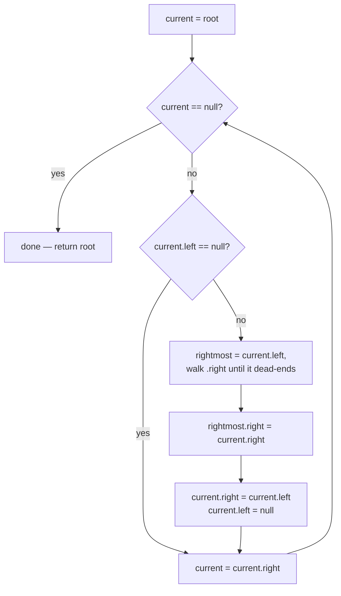

# Flatten Binary Tree to Linked List

## The problem

Given the root of a binary tree, flatten it in place into a "linked list": every node's `left` pointer becomes `null`, and every node's `right` pointer points to the next node — where "next" means the order you'd visit nodes in a **pre-order traversal** (root, then left subtree, then right subtree).

Example:

```
        1
       / \
      2   5
     / \   \
    3   4   6
```

Pre-order visits `1, 2, 3, 4, 5, 6`. So after flattening, following `right` pointers from the root gives exactly that sequence, and every `left` pointer along the way is `null`:

```
1 -> 2 -> 3 -> 4 -> 5 -> 6
```

## Solution

The key realization: in a pre-order traversal, once you finish visiting a node's entire left subtree, the very next node visited is the *start* of its right subtree. So if a node has a left subtree, the right subtree needs to be spliced in *after* the last node of that left subtree (its rightmost descendant) — not after the node itself.

This can be done with a single pass, no extra data structure, no recursion:

1. Start `current` at the root.
2. While `current` isn't `null`:
   - If `current.left` is `null`, there's nothing to rewire — just move `current` to `current.right` and continue.
   - Otherwise, find the **rightmost node in `current.left`'s subtree** by following `.right` pointers as far as they go — this is the last node pre-order would visit before it would otherwise jump to `current.right`.
   - Splice `current.right` onto that rightmost node's `.right`, so the old right subtree now dangles off the end of the left subtree instead of off `current`.
   - Move the entire left subtree over to become the new right subtree: `current.right = current.left`, then clear `current.left = null`.
   - Advance `current = current.right` — which now walks straight down what used to be the left subtree, repeating the same process for every node in it.

Each node is visited by `current` once as the outer pointer advances, though nodes can additionally be walked past while chasing "rightmost" — the total work across the whole run is still bounded by the number of nodes, since every right-pointer that gets traversed by the inner loop is a pointer that will *not* be re-traversed later (once `current.left` is set to `null`, that subtree is folded into the main chain and inspected exactly once).



## Code

```java
import java.util.*;

class TreeNode {
    int val;
    TreeNode left;
    TreeNode right;
    TreeNode(int val) { this.val = val; }
}

class Solution {
    public static TreeNode flatten(TreeNode root) {
        if (root == null) {
            return null;
        }

        TreeNode current = root;

        while (current != null) {
            if (current.left != null) {
                // find the rightmost node of the left subtree
                TreeNode rightmost = current.left;
                while (rightmost.right != null) {
                    rightmost = rightmost.right;
                }
                // splice the old right subtree onto the end of the left subtree
                rightmost.right = current.right;
                // move the left subtree to become the new right subtree
                current.right = current.left;
                current.left = null;
            }
            current = current.right;
        }

        return root;
    }

    private static List<Integer> toList(TreeNode root) {
        List<Integer> result = new ArrayList<>();
        TreeNode node = root;
        while (node != null) {
            result.add(node.val);
            node = node.right;
        }
        return result;
    }

    public static void main(String[] args) {
        //         1
        //        / \
        //       2   5
        //      / \   \
        //     3   4   6
        TreeNode root = new TreeNode(1);
        root.left = new TreeNode(2);
        root.right = new TreeNode(5);
        root.left.left = new TreeNode(3);
        root.left.right = new TreeNode(4);
        root.right.right = new TreeNode(6);

        TreeNode flattened = flatten(root);
        System.out.println(toList(flattened));
        // [1, 2, 3, 4, 5, 6]
    }
}
```

## Complexity measures

Let **n** be the number of nodes in the tree.

### Time Complexity

`O(n)` — every node's right subtree gets spliced onto its left subtree's rightmost node exactly once, and once a node's `left` is nulled out it's never revisited by the "find rightmost" inner walk, so the total pointer-chasing work across the whole run is linear.

### Space Complexity

`O(1)` — the rewiring happens entirely in place using existing `left`/`right` pointers and a couple of local variables; no recursion stack or auxiliary structure is used.
