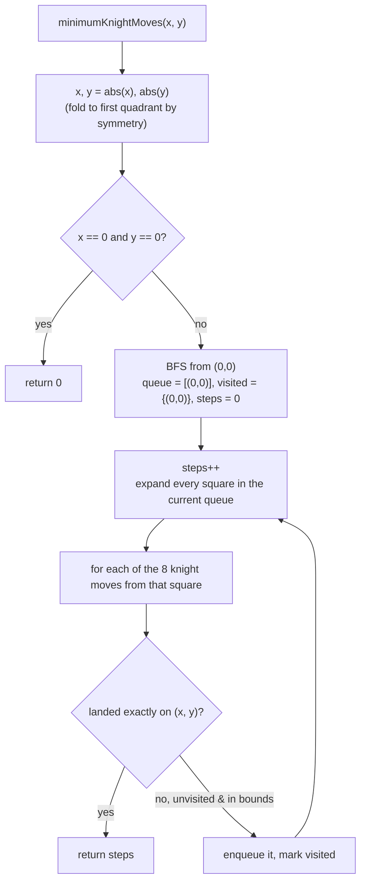

# Minimum Knight Moves

## The problem

A knight sits on an infinite chessboard at the origin `(0, 0)`. Like a normal chess knight, it moves in an L-shape: two squares in one direction and then one square perpendicular to it — eight possible moves from any square. Given a target square `(x, y)` (guaranteed reachable, with `|x| + |y| <= 300`), find the minimum number of moves the knight needs to get from the origin to that target.

Example: for target `(5, 5)`, the answer is `4` — the knight needs exactly four L-shaped hops to land on `(5, 5)`.

## Solution

Every knight move costs the same ("one move"), so this is a shortest-path problem on an unweighted graph — and the standard tool for shortest paths in an unweighted graph is **breadth-first search (BFS)**. Starting from the origin, explore the board one "ring" of moves at a time: all squares reachable in 1 move, then all *new* squares reachable in 2 moves, and so on. The first time the target square is produced, the number of rings expanded so far is the answer, because BFS visits squares in strictly increasing order of distance.

Two things make this practical on an "infinite" board:

- **Symmetry.** The board's four quadrants are mirror images of each other with the knight's move set, so the number of moves to reach `(x, y)` is the same as to reach `(|x|, |y|)`. Taking absolute values up front collapses the problem down to the first quadrant, which is small (bounded by `|x| + |y| <= 300`).
- **Bounding the search.** BFS on a truly infinite board would never terminate if the target were unreachable, but the knight never benefits from wandering more than a couple of squares outside the box that contains the origin and the target — so it's safe to restrict the search to a small padded rectangle (2 squares of margin around `[0, max(x, y)]` on each axis) without missing the optimal path.

At each step, pop every square currently in the queue, try all eight knight moves from it, and enqueue any square not visited yet. If a move lands exactly on the target, return the current move count immediately.



## Code

```java
import java.util.*;

class Solution {
    private static final int[][] DIRS = {
        {1, 2}, {2, 1}, {-1, 2}, {1, -2}, {-1, -2}, {-2, -1}, {-2, 1}, {2, -1}
    };

    public static int minimumKnightMoves(int x, int y) {
        x = Math.abs(x);
        y = Math.abs(y);
        if (x == 0 && y == 0) {
            return 0;
        }

        // The knight never needs to wander more than a couple of squares
        // past the box containing the origin and the target.
        int lo = -2;
        int hi = Math.max(x, y) + 2;

        Queue<int[]> queue = new LinkedList<>();
        Set<Long> visited = new HashSet<>();
        queue.add(new int[]{0, 0});
        visited.add(key(0, 0));
        int steps = 0;

        while (!queue.isEmpty()) {
            int levelSize = queue.size();
            steps++;
            for (int i = 0; i < levelSize; i++) {
                int[] cur = queue.poll();
                for (int[] d : DIRS) {
                    int nx = cur[0] + d[0];
                    int ny = cur[1] + d[1];
                    if (nx < lo || nx > hi || ny < lo || ny > hi) {
                        continue;
                    }
                    if (nx == x && ny == y) {
                        return steps;
                    }
                    long k = key(nx, ny);
                    if (visited.add(k)) {
                        queue.add(new int[]{nx, ny});
                    }
                }
            }
        }
        return -1; // unreachable — won't happen under the problem's constraints
    }

    private static long key(int x, int y) {
        return (long) (x + 1000) * 100_000L + (y + 1000);
    }

    public static void main(String[] args) {
        System.out.println(minimumKnightMoves(5, 5));
        // 4

        System.out.println(minimumKnightMoves(2, 1));
        // 1  (a single knight move reaches it directly)

        System.out.println(minimumKnightMoves(-5, -5));
        // 4  (symmetry: same distance as (5, 5))

        System.out.println(minimumKnightMoves(1, 1));
        // 2  (a known edge case near the origin — no single move lands on (1, 1))
    }
}
```

## Complexity measures

Let **x** and **y** be the (absolute values of the) target coordinates.

### Time Complexity

`O(|x| * |y|)` — BFS explores every square inside the bounded rectangle around the origin and the target at most once, and that rectangle has roughly `|x| * |y|` squares.

### Space Complexity

`O(|x| * |y|)` — the `visited` set and the BFS queue can together hold every square in that same bounded rectangle in the worst case.
