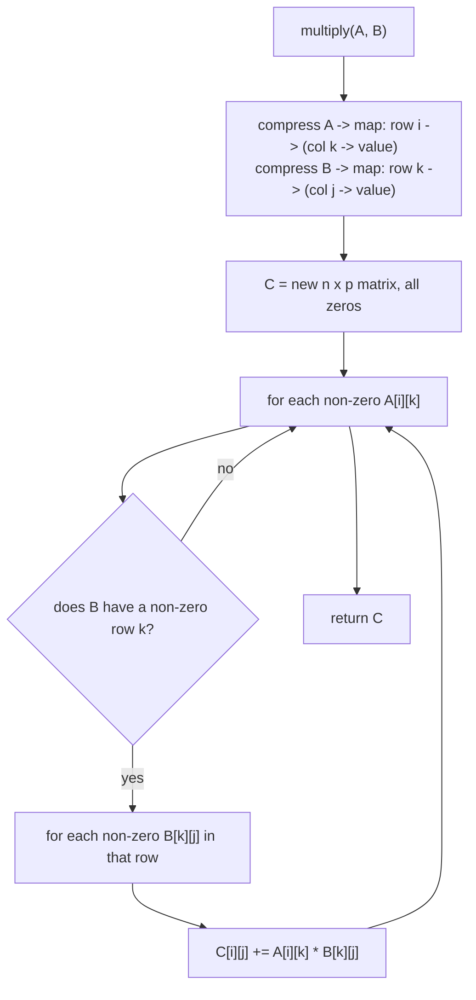

# Sparse Matrix Multiplication

## The problem

A **sparse matrix** is one where most of the elements are zero. Given two sparse matrices `A` (size `n x m`) and `B` (size `m x p`), compute their product `A x B` and return the resulting `n x p` matrix. It's guaranteed that `A`'s number of columns equals `B`'s number of rows, so the multiplication is always valid.

Example:

```
A = [ 1  0  0]      B = [7  0  0]
    [-1  0  3]          [0  0  0]
                        [0  0  1]
```

`A` is `2x3` and `B` is `3x3`, so the product `C = A x B` is `2x3`:

```
C = [1*7 + 0*0 + 0*0,   1*0 + 0*0 + 0*0,   1*0 + 0*0 + 0*1]   = [ 7, 0, 0]
    [-1*7 + 0*0 + 3*0,  -1*0 + 0*0 + 3*0,  -1*0 + 0*0 + 3*1]    [-7, 0, 3]
```

## Solution

The textbook matrix-multiplication formula, `C[i][j] = sum over k of A[i][k] * B[k][j]`, works fine but wastes enormous effort here: for a sparse matrix, almost every `A[i][k]` or `B[k][j]` term is zero, and multiplying by zero only to add zero to the running total is pure overhead. The fix is to skip zeros entirely by **compressing each matrix down to only its non-zero entries** before multiplying.

- **Compress.** Walk each matrix once and build a lookup — for every row `i`, a map from column index `k` to the non-zero value at `(i, k)`. Rows or columns that are entirely zero simply never appear, so the whole compressed structure only costs space proportional to the number of non-zero entries, not `rows * cols`.
- **Multiply using only the non-zero terms.** For every non-zero `A[i][k]`, the only terms of the sum that can possibly be non-zero are those where `B[k][j]` is also non-zero — so look up row `k` of `B`'s compressed form directly (instead of scanning all `p` columns), and only for the columns `B` actually has a value in that row. For each such column `j`, accumulate `A[i][k] * B[k][j]` into `C[i][j]`.
- Once every non-zero entry of `A` has been walked this way, `C` holds the complete product — any position never touched by the accumulation naturally stays at its initial value of `0`.

This turns a triple nested loop over *all* `i, k, j` into a walk that only visits the pairs of non-zero entries that can actually contribute something.



## Code

```java
import java.util.*;

class Solution {
    public static int[][] multiply(int[][] A, int[][] B) {
        int n = A.length;
        int p = B[0].length;
        int[][] C = new int[n][p];

        Map<Integer, Map<Integer, Integer>> sparseA = compress(A);
        Map<Integer, Map<Integer, Integer>> sparseB = compress(B);

        for (Map.Entry<Integer, Map<Integer, Integer>> rowEntry : sparseA.entrySet()) {
            int i = rowEntry.getKey();
            for (Map.Entry<Integer, Integer> colEntry : rowEntry.getValue().entrySet()) {
                int k = colEntry.getKey();
                int valA = colEntry.getValue();

                Map<Integer, Integer> rowB = sparseB.get(k);
                if (rowB == null) {
                    continue; // row k of B is entirely zero — nothing to add
                }
                for (Map.Entry<Integer, Integer> bEntry : rowB.entrySet()) {
                    int j = bEntry.getKey();
                    C[i][j] += valA * bEntry.getValue();
                }
            }
        }
        return C;
    }

    // Builds row -> (col -> value) for every non-zero entry in the matrix.
    private static Map<Integer, Map<Integer, Integer>> compress(int[][] matrix) {
        Map<Integer, Map<Integer, Integer>> sparse = new HashMap<>();
        for (int i = 0; i < matrix.length; i++) {
            for (int j = 0; j < matrix[0].length; j++) {
                if (matrix[i][j] != 0) {
                    sparse.computeIfAbsent(i, k -> new HashMap<>()).put(j, matrix[i][j]);
                }
            }
        }
        return sparse;
    }

    public static void main(String[] args) {
        int[][] A = {
            {1, 0, 0},
            {-1, 0, 3}
        };
        int[][] B = {
            {7, 0, 0},
            {0, 0, 0},
            {0, 0, 1}
        };

        int[][] C = multiply(A, B);
        for (int[] row : C) {
            System.out.println(Arrays.toString(row));
        }
        // [7, 0, 0]
        // [-7, 0, 3]
    }
}
```

## Complexity measures

Let **n** and **m** be `A`'s dimensions, **m** and **p** be `B`'s dimensions, and (loosely) treat the non-zero count as bounded by the matrix sizes.

### Time Complexity

`O(n * m + m * p)` to build both compressed maps (one full scan of each matrix), plus `O(nnz(A) * avg_row_size(B))` for the multiply step — bounded above by `O(n * m * p)` in the dense worst case, but typically far closer to `O(n * m + m * p)` when the matrices are actually sparse, since only non-zero pairs are ever visited.

### Space Complexity

`O(n * m + m * p)` in the worst case for the two compressed maps (bounded by the number of non-zero entries in each matrix), plus `O(n * p)` for the output matrix `C`.
