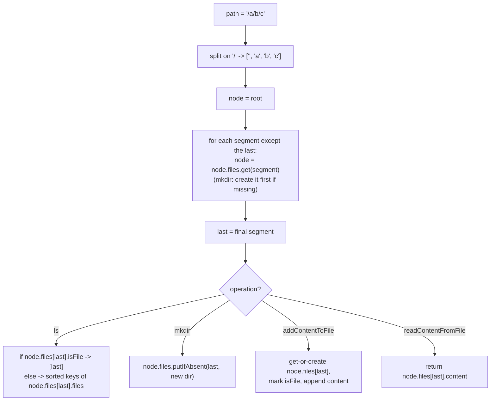

# Design In-Memory File System

## The problem

Design an in-memory file system supporting four operations:

- **`ls(path)`** — if `path` is a file, return a single-element list with just that file's name; if it's a directory, return the names of everything directly inside it (files and subdirectories together), sorted lexicographically.
- **`mkdir(path)`** — create the directory at `path`, creating any missing parent directories along the way (like `mkdir -p`).
- **`addContentToFile(filePath, content)`** — create the file with the given content if it doesn't exist yet, or append the content if it already exists.
- **`readContentFromFile(filePath)`** — return the file's full content as a string.

All paths are absolute, start with `/`, and never end with `/` (except the root path `"/"` itself). Names use only lowercase letters and are unique within their parent directory.

Example:

```
FileSystem fs = new FileSystem();
fs.ls("/")                                        -> []          (root starts empty)
fs.mkdir("/dir1/dir2/dir3")                        -> creates dir1, dir2, dir3 nested inside each other
fs.addContentToFile("/dir1/dir2/dir3/file1", "File") -> creates file1 with content "File"
fs.ls("/")                                        -> ["dir1"]    (only dir1 sits directly under root)
fs.readContentFromFile("/dir1/dir2/dir3/file1")    -> "File"
```

## Solution

A file system is naturally a **tree**: every directory is a node that can hold child nodes (files or subdirectories) keyed by name, and there's a single root. So represent both files and directories with one unified node type, distinguished by a flag:

- `isFile` — `true` if this node is a file, `false` if it's a directory.
- `files` — a map from child name to child node, used when this node is a directory (a plain file leaves this empty).
- `content` — the file's text, used when this node is a file (a directory leaves this empty).

All four operations share the same core move: **split the path on `/` and walk the tree one name at a time**, starting from the root, following the `files` map at each level. The only differences are what happens once the walk reaches its destination:

- **`ls(path)`** — walk to the *parent* of the last path segment, then look up the last segment there. If that node is a file, return just its name. If it's a directory, collect all the keys of its `files` map and sort them alphabetically before returning (the underlying map doesn't guarantee any order, so sorting at read time is what actually produces the lexicographical output the problem asks for).
- **`mkdir(path)`** — walk every segment of the path from the root; whenever a segment isn't present yet in the current node's `files` map, create a fresh directory node for it before continuing downward. This single loop handles creating all missing intermediate directories for free.
- **`addContentToFile(filePath, content)`** — walk to the parent directory of the last segment, then either fetch the existing file node (and append) or create a brand-new file node (mark `isFile = true` and set its initial content).
- **`readContentFromFile(filePath)`** — walk to the parent directory of the last segment and return that file node's `content` directly.



## Code

```java
import java.util.*;

class FileSystem {
    private static class File {
        boolean isFile = false;
        Map<String, File> files = new HashMap<>();
        String content = "";
    }

    private final File root;

    public FileSystem() {
        root = new File();
    }

    public List<String> ls(String path) {
        File node = root;
        if (!path.equals("/")) {
            String[] parts = path.split("/");
            for (int i = 1; i < parts.length - 1; i++) {
                node = node.files.get(parts[i]);
            }
            String last = parts[parts.length - 1];
            File target = node.files.get(last);
            if (target.isFile) {
                List<String> result = new ArrayList<>();
                result.add(last);
                return result;
            }
            node = target;
        }
        List<String> names = new ArrayList<>(node.files.keySet());
        Collections.sort(names);
        return names;
    }

    public void mkdir(String path) {
        String[] parts = path.split("/");
        File node = root;
        for (int i = 1; i < parts.length; i++) {
            node.files.computeIfAbsent(parts[i], k -> new File());
            node = node.files.get(parts[i]);
        }
    }

    public void addContentToFile(String filePath, String content) {
        String[] parts = filePath.split("/");
        File node = root;
        for (int i = 1; i < parts.length - 1; i++) {
            node = node.files.get(parts[i]);
        }
        String fileName = parts[parts.length - 1];
        File file = node.files.computeIfAbsent(fileName, k -> new File());
        file.isFile = true;
        file.content += content;
    }

    public String readContentFromFile(String filePath) {
        String[] parts = filePath.split("/");
        File node = root;
        for (int i = 1; i < parts.length - 1; i++) {
            node = node.files.get(parts[i]);
        }
        String fileName = parts[parts.length - 1];
        return node.files.get(fileName).content;
    }
}

class Solution {
    public static void main(String[] args) {
        FileSystem fs = new FileSystem();

        System.out.println(fs.ls("/"));
        // []

        fs.mkdir("/dir1/dir2/dir3");
        fs.addContentToFile("/dir1/dir2/dir3/file1", "File");

        System.out.println(fs.ls("/"));
        // [dir1]

        System.out.println(fs.readContentFromFile("/dir1/dir2/dir3/file1"));
        // File

        fs.addContentToFile("/dir1/dir2/dir3/file1", " more");
        System.out.println(fs.readContentFromFile("/dir1/dir2/dir3/file1"));
        // File more

        System.out.println(fs.ls("/dir1/dir2/dir3"));
        // [file1]

        System.out.println(fs.ls("/dir1/dir2/dir3/file1"));
        // [file1]  (a file path returns just its own name)
    }
}
```

## Complexity measures

Let **m** be the length of the input path string, **n** the depth of the path (number of `/`-separated segments, `n = O(m)`), and **k** the number of entries in a directory being listed.

### Time Complexity

- `ls`: `O(m + n + k log k)` — splitting the path costs `O(m)`, walking down `n` levels costs `O(n)`, and sorting the final directory's `k` entries costs `O(k log k)`.
- `mkdir`, `addContentToFile`, `readContentFromFile`: `O(m + n)` each — splitting the path plus a single walk down to the target node, with no sorting involved.

### Space Complexity

`O(|directories| + |files|)` — the tree stores exactly one node per directory and file ever created, plus `O(m)` transient space per call for the split path segments.
