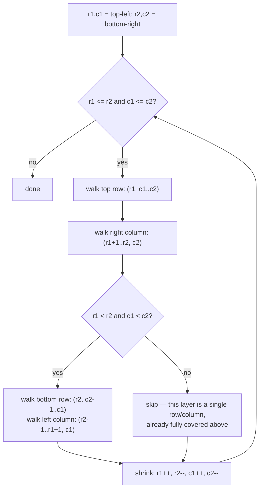

# Spiral Matrix

## The problem

Given an `m x n` matrix, return all its elements in spiral order — starting at the top-left corner and walking clockwise, spiraling inward, until every element has been visited.

Example:

```
1  2  3
4  5  6
7  8  9
```

Spiral order: `[1, 2, 3, 6, 9, 8, 7, 4, 5]` — across the top row, down the right column, back across the bottom row, up the left column, then into the single remaining center element.

## Solution

Think of the matrix as a set of nested rectangular **layers** (rings), like an onion: the outermost ring of cells, then the ring inside it, and so on toward the center. Spiral order is simply: walk the outermost ring clockwise, then the next ring in, then the next, until there are no rings left.

Track each layer with two corners: top-left `(r1, c1)` and bottom-right `(r2, c2)`, starting at the matrix's actual corners. Walking one layer clockwise means four straight sweeps:

1. **Top row**, left to right: `(r1, c)` for `c` from `c1` to `c2`.
2. **Right column**, top to bottom: `(r, c2)` for `r` from `r1 + 1` to `r2` (starts one below the corner already visited by the top sweep).
3. **Bottom row**, right to left: `(r2, c)` for `c` from `c2 - 1` down to `c1` — but only if this layer still has more than one row (`r1 < r2`), otherwise the "bottom row" is the same row as the top row and re-visiting it would duplicate cells.
4. **Left column**, bottom to top: `(r, c1)` for `r` from `r2 - 1` down to `r1 + 1` — again only if the layer has more than one column (`c1 < c2`), for the same reason.

After finishing a layer, shrink inward — `r1++, r2--, c1++, c2--` — and repeat for the next layer, stopping once `r1 > r2` or `c1 > c2` (the layer has collapsed to nothing).

The `r1 < r2` and `c1 < c2` guards matter: without them, a matrix that's a single row or single column would have its one row/column walked twice (once "left to right" and then immediately "right to left" again), duplicating every element.



## Code

```java
import java.util.*;

class Solution {
    public static List<Integer> spiralOrder(int[][] matrix) {
        List<Integer> result = new ArrayList<>();
        if (matrix.length == 0) {
            return result;
        }

        int r1 = 0, r2 = matrix.length - 1;
        int c1 = 0, c2 = matrix[0].length - 1;

        while (r1 <= r2 && c1 <= c2) {
            for (int c = c1; c <= c2; c++) {
                result.add(matrix[r1][c]);
            }
            for (int r = r1 + 1; r <= r2; r++) {
                result.add(matrix[r][c2]);
            }
            if (r1 < r2 && c1 < c2) {
                for (int c = c2 - 1; c > c1; c--) {
                    result.add(matrix[r2][c]);
                }
                for (int r = r2; r > r1; r--) {
                    result.add(matrix[r][c1]);
                }
            }
            r1++;
            r2--;
            c1++;
            c2--;
        }
        return result;
    }

    public static void main(String[] args) {
        int[][] matrix = {
            {1, 2, 3},
            {4, 5, 6},
            {7, 8, 9}
        };
        System.out.println(spiralOrder(matrix));
        // [1, 2, 3, 6, 9, 8, 7, 4, 5]

        int[][] rectangular = {
            {1, 2, 3, 4},
            {5, 6, 7, 8},
            {9, 10, 11, 12}
        };
        System.out.println(spiralOrder(rectangular));
        // [1, 2, 3, 4, 8, 12, 11, 10, 9, 5, 6, 7]

        int[][] singleRow = {{1, 2, 3}};
        System.out.println(spiralOrder(singleRow));
        // [1, 2, 3]  (guarded so the single row isn't walked twice)
    }
}
```

## Complexity measures

Let **n** be the total number of elements in the matrix (`m * n` for an `m x n` matrix).

### Time Complexity

`O(n)` — every element is visited and added to the result exactly once, across all layers combined.

### Space Complexity

`O(n)` — the output list holds every element of the matrix; no extra space is used beyond that (the four corner variables are constant-size regardless of matrix dimensions).
