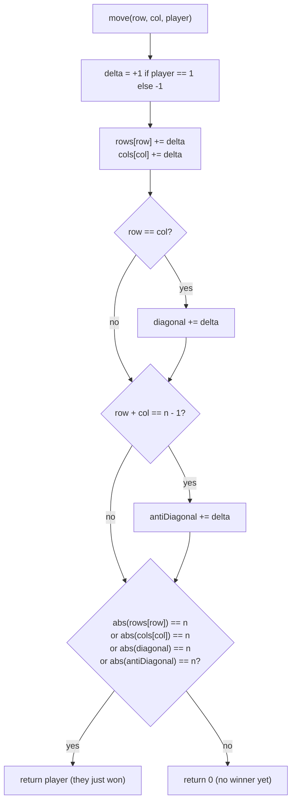

# Design Tic-Tac-Toe

## The problem

Design a `TicTacToe` class for two players on an `n x n` board. It needs:

- `TicTacToe(int n)` — create an empty `n x n` board.
- `move(int row, int col, int player)` — record that `player` (`1` or `2`) marks cell `(row, col)`. Every move is guaranteed valid (an empty cell, and the game stops being played once someone has already won). Return the ID of the player who just won by making this move, or `0` if nobody has won yet.

A player wins by marking all `n` cells of any row, any column, the main diagonal, or the anti-diagonal.

Example: on a `3 x 3` board, feed these moves in order — `(0,0,1)`, `(0,2,2)`, `(2,2,1)`, `(1,1,2)`, `(2,0,1)`, `(1,0,2)`, `(2,1,1)`. After the last move, player 1 has marked `(0,0)`, `(2,2)`, `(2,0)`, and `(2,1)` — that completes the entire bottom row (`(2,0)`, `(2,1)`, `(2,2)`), so `move` returns `1` on that call.

## Solution

The naive approach — after every move, scan the whole row, column, and both diagonals to check for a win — costs `O(n)` per move. We can do better: `O(1)` per move, by keeping running counters instead of rescanning.

**Step 1 — separate counters per line.** Keep an array `rows[n]` and `cols[n]`. Also keep two single integers `diagonal` and `antiDiagonal` (there's only ever one diagonal and one anti-diagonal, regardless of board size). Each time a player marks `(row, col)`, bump `rows[row]`, `cols[col]`, and — if the cell sits on the diagonal (`row == col`) or anti-diagonal (`row + col == n - 1`) — bump those too. A player wins the moment one of these counters reaches `n` *marks by that player*.

**Step 2 — track both players with signed counts, not two sets of arrays.** Since a move is always placed on an empty cell, if player 1 has marked a whole row, no one else could have touched any cell in it — the counters are naturally per-line, not per-player, as long as we can tell "5 marks by player 1" apart from "5 marks by player 2." The trick: add `+1` for player 1's marks and `-1` for player 2's marks to the *same* counters. Then:

- If `rows[row]` reaches `+n`, player 1 has marked every cell in that row.
- If `rows[row]` reaches `-n`, player 2 has marked every cell in that row.

So after updating a counter, just check `Math.abs(counter) == n` — if true, the player who just moved is the winner (since only their move could have just pushed the magnitude to `n`).

This turns four separate "did anyone win" checks (row/col/diagonal/anti-diagonal) into one `O(1)` update-and-compare per move, with no board grid needed at all — the board's cell contents are never actually stored.



## Code

```java
class Solution {
    static class TicTacToe {
        private final int[] rows;
        private final int[] cols;
        private int diagonal;
        private int antiDiagonal;
        private final int n;

        public TicTacToe(int n) {
            this.n = n;
            rows = new int[n];
            cols = new int[n];
        }

        public int move(int row, int col, int player) {
            int currentPlayer = (player == 1) ? 1 : -1;

            rows[row] += currentPlayer;
            cols[col] += currentPlayer;
            if (row == col) {
                diagonal += currentPlayer;
            }
            if (row + col == n - 1) {
                antiDiagonal += currentPlayer;
            }

            if (Math.abs(rows[row]) == n || Math.abs(cols[col]) == n
                    || Math.abs(diagonal) == n || Math.abs(antiDiagonal) == n) {
                return player;
            }
            return 0;
        }
    }

    public static void main(String[] args) {
        TicTacToe game = new TicTacToe(3);
        int[][] moves = {
            {0, 0, 1}, {0, 2, 2}, {2, 2, 1}, {1, 1, 2}, {2, 0, 1}, {1, 0, 2}, {2, 1, 1}
        };
        int winner = 0;
        for (int[] mv : moves) {
            winner = game.move(mv[0], mv[1], mv[2]);
        }
        System.out.println(winner);
        // 1  (player 1 completes the bottom row: (2,0), (2,1), (2,2))
    }
}
```

## Complexity measures

Let **n** be the board's side length.

### Time Complexity

`move()` is `O(1)` — each call updates a constant number of counters (its row, its column, and possibly the diagonal and anti-diagonal) and compares them, with no scanning of the board.

### Space Complexity

`O(n)` — the `rows` and `cols` arrays each hold `n` integers; `diagonal` and `antiDiagonal` are single variables regardless of board size, and the board's cell contents are never stored.
