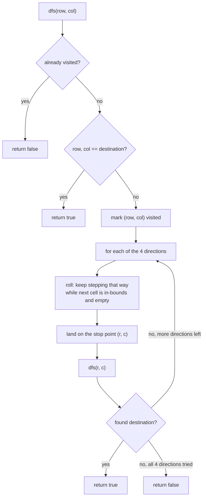

# The Maze

## The problem

A ball sits in a maze made of empty spaces (`0`) and walls (`1`), with the maze's outer border also acting as a wall. The ball can roll up, down, left, or right — but once it starts rolling in a direction, it doesn't stop after one cell like a normal grid walk. It keeps rolling until it smacks into a wall (or the border), and only then can it change direction. Given a `start` cell and a `destination` cell, decide whether the ball can reach the destination and stop there exactly (rolling past it doesn't count).

Example:

```
0 0 1 0 0
0 0 0 0 0
0 0 0 1 0
1 1 0 1 1
0 0 0 0 0
```

With `start = (0, 4)` and `destination = (4, 4)`, the answer is `true` — the ball can roll down column 4 from row 0, and the wall at `(3,4)` stops it exactly at `(4, 4)`. But with `destination = (3, 2)`, the answer is `false` — no sequence of rolls lands the ball exactly on that cell (any path through it rolls straight past).

## Solution

This is a graph search, but the "neighbors" of a cell aren't its four adjacent cells — they're the four cells the ball actually *stops* at after a roll in each direction. So the search has two layers:

1. **Rolling.** From a given cell, to roll in a direction, keep stepping that way while the next cell is in bounds and empty. Stop as soon as the next step would go out of bounds or hit a `1`. The cell you land on is the one true neighbor in that direction.
2. **Searching.** Treat each "stop point" as a node and do a depth-first search (DFS) over these roll-neighbors, same as any graph traversal: mark a stop point visited, try rolling in all four directions from it, and recurse into whichever new stop points that produces. If a recursive call ever lands exactly on the destination, propagate `true` back up. If the DFS exhausts every reachable stop point without ever landing on the destination, the answer is `false`.

A `visited[][]` grid (sized to the maze) prevents revisiting the same stop point — without it, the ball could bounce between the same two walls forever.



## Code

```java
class Solution {
    private static final int[][] DIRS = {{-1, 0}, {1, 0}, {0, -1}, {0, 1}};

    public static boolean hasPath(int[][] maze, int[] start, int[] destination) {
        int m = maze.length;
        int n = maze[0].length;
        boolean[][] visited = new boolean[m][n];
        return dfs(maze, start[0], start[1], destination, visited);
    }

    private static boolean dfs(int[][] maze, int row, int col, int[] destination, boolean[][] visited) {
        if (visited[row][col]) {
            return false;
        }
        if (row == destination[0] && col == destination[1]) {
            return true;
        }
        visited[row][col] = true;

        int m = maze.length;
        int n = maze[0].length;

        for (int[] d : DIRS) {
            int r = row;
            int c = col;
            // Keep rolling until hitting a wall or the maze boundary.
            while (r + d[0] >= 0 && r + d[0] < m && c + d[1] >= 0 && c + d[1] < n
                    && maze[r + d[0]][c + d[1]] == 0) {
                r += d[0];
                c += d[1];
            }
            if (dfs(maze, r, c, destination, visited)) {
                return true;
            }
        }
        return false;
    }

    public static void main(String[] args) {
        int[][] maze = {
            {0, 0, 1, 0, 0},
            {0, 0, 0, 0, 0},
            {0, 0, 0, 1, 0},
            {1, 1, 0, 1, 1},
            {0, 0, 0, 0, 0}
        };
        System.out.println(hasPath(maze, new int[]{0, 4}, new int[]{4, 4}));
        // true

        System.out.println(hasPath(maze, new int[]{0, 4}, new int[]{3, 2}));
        // false (every path through that cell rolls straight past it)
    }
}
```

## Complexity measures

Let **m** and **n** be the maze's row and column counts.

### Time Complexity

`O(m * n * max(m, n))` — the DFS visits each of the `m * n` cells at most once, and from each cell a roll in any of the 4 directions can scan up to `O(max(m, n))` cells before hitting a wall.

### Space Complexity

`O(m * n)` — the `visited` grid holds one boolean per cell, and the recursion (DFS call stack) can go as deep as the number of distinct stop points, bounded by `m * n`.
