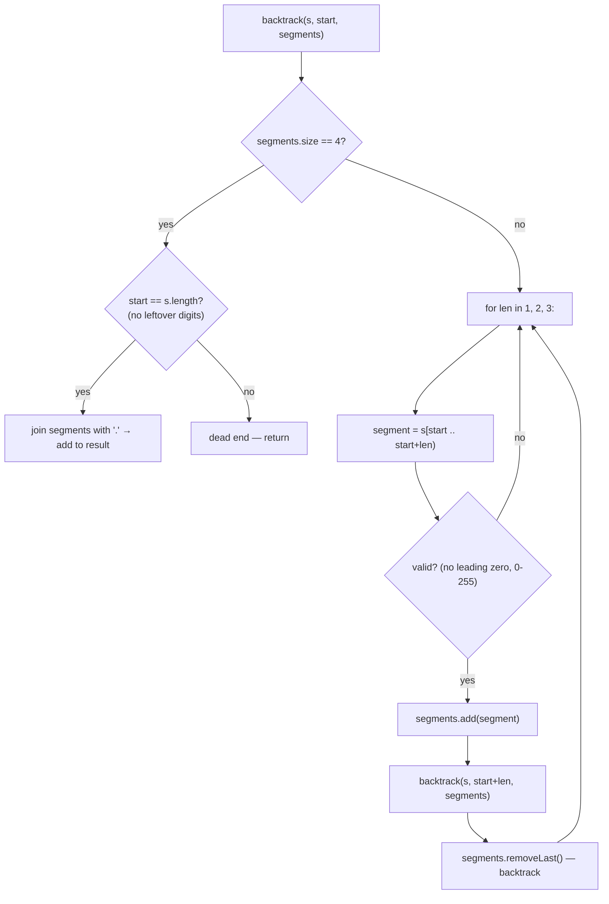

# Restore IP Addresses

## The problem

Given a string `s` of only digits (length 4 to 12), find every way to insert three dots into it so the result is a valid IPv4 address — four numbers between `0` and `255`, none with a leading zero (except the single digit `"0"` itself), separated by dots. Return all such addresses, in any order.

Example: `s = "25525511135"` produces `["255.255.11.135", "255.255.111.35"]` — those are the only two ways to split the digits into four valid, dot-separated segments that use up the whole string.

## Solution

The brute-force idea is to try every pair of dot positions and validate whatever four segments come out — with up to 11 possible slots for each of 3 dots, that's up to `11 x 10 x 9 = 990` checks. But each IP segment can only be 1, 2, or 3 digits long (nothing longer is ever a valid `0-255` number), so instead of choosing an absolute *position* for each dot, choose a *length* for each segment. That collapses the branching factor from "11 slots" down to "3 possible lengths," for at most `3 x 3 x 3 x 3 = 81` combinations to check — small enough that the whole algorithm runs in constant time regardless of input.

This is a textbook **backtracking** shape: build the four segments one at a time, and the moment a partial choice can't lead anywhere valid, back out and try the next option instead of continuing down a doomed path.

- At each step, try taking the next segment as 1, 2, or 3 digits from the current position in `s`.
- A candidate segment is valid only if: it doesn't have a leading zero (unless it's just `"0"`), and its numeric value is between `0` and `255`.
- If the segment is valid, add it to the running list of segments and recurse on the rest of the string.
- Once 4 segments have been chosen, it's a complete valid IP address only if the segments together consumed the *entire* string — if there are still leftover digits, backtrack instead.
- After a recursive call returns, remove the last-added segment (backtrack) and try the next candidate length, so every combination gets a fair chance.



## Code

```java
import java.util.*;

class Solution {
    public static List<String> restoreIpAddresses(String s) {
        List<String> result = new ArrayList<>();
        backtrack(s, 0, new ArrayList<>(), result);
        return result;
    }

    private static void backtrack(String s, int start, List<String> segments, List<String> result) {
        if (segments.size() == 4) {
            if (start == s.length()) {
                result.add(String.join(".", segments));
            }
            return;
        }

        for (int len = 1; len <= 3 && start + len <= s.length(); len++) {
            String segment = s.substring(start, start + len);
            if (!isValidSegment(segment)) {
                continue;
            }
            segments.add(segment);
            backtrack(s, start + len, segments, result);
            segments.remove(segments.size() - 1);
        }
    }

    private static boolean isValidSegment(String segment) {
        if (segment.length() > 1 && segment.charAt(0) == '0') {
            return false; // no leading zeros, e.g. "01" is invalid
        }
        int value = Integer.parseInt(segment);
        return value >= 0 && value <= 255;
    }

    public static void main(String[] args) {
        System.out.println(restoreIpAddresses("25525511135"));
        // [255.255.11.135, 255.255.111.35]

        System.out.println(restoreIpAddresses("0000"));
        // [0.0.0.0]

        System.out.println(restoreIpAddresses("101023"));
        // [1.0.10.23, 1.0.102.3, 10.1.0.23, 10.10.2.3, 101.0.2.3]
    }
}
```

## Complexity measures

Let **s** be the input string (length bounded between 4 and 12 by the problem's constraints).

### Time Complexity

`O(1)` — each of the 4 segments has only 3 possible lengths to try, so the search tree has at most `3^4 = 81` branches to explore regardless of how long `s` is; each branch does `O(1)` validation work (segments are at most 3 characters).

### Space Complexity

`O(1)` — at most 19 valid IP addresses can ever be produced from a string this short, and the recursion depth is capped at 4 (one level per segment), so both the output and the call stack are bounded by constants independent of input size.
