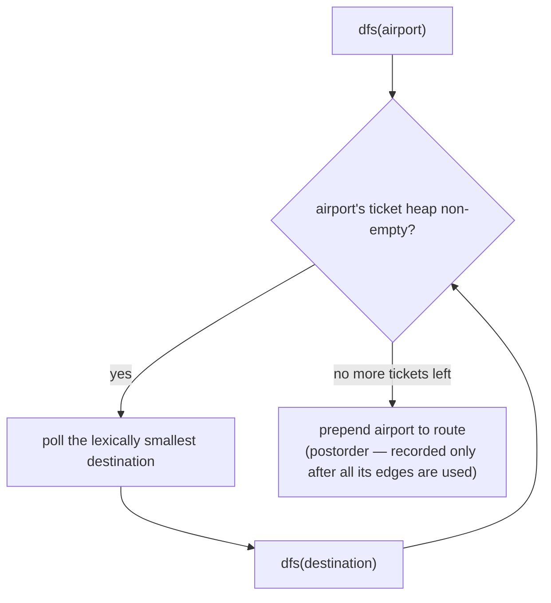

# Reconstruct Itinerary

## The problem

Given a list of airline tickets as `[from, to]` pairs, reconstruct the exact order the traveler flew them in, using every single ticket exactly once, starting from `"JFK"`. If more than one valid order exists, return the lexicographically smallest one.

Example: tickets `[["MUC","LHR"], ["JFK","MUC"], ["LHR","SFO"], ["SFO","SJC"]]` produce the itinerary `["JFK", "MUC", "LHR", "SFO", "SJC"]` — one single chain that uses each of the four tickets exactly once.

A trickier example: tickets `[["JFK","KUL"], ["JFK","NRT"], ["NRT","JFK"]]` produce `["JFK", "NRT", "JFK", "KUL"]`, *not* `["JFK", "KUL", ...]` — even though `"KUL"` is alphabetically smaller than `"NRT"`, flying to `KUL` first strands the traveler there with an unused ticket left over (`NRT -> JFK`), so it isn't a valid complete itinerary.

## Solution

Model airports as graph vertices and tickets as directed edges. Using every ticket exactly once, starting at a fixed vertex, is exactly the definition of an **Eulerian path** — and there's a well-known algorithm for finding one: **Hierholzer's algorithm**.

**Why plain greedy fails.** A tempting shortcut is: at each airport, always fly to the lexically smallest reachable airport that still has an unused ticket, and never look back. The `KUL`/`NRT` example above shows why that's wrong — greedily taking `JFK -> KUL` first uses up the only ticket out of `JFK` that could reach `NRT` (indirectly), leaving the `NRT -> JFK` ticket stranded with no way to place it. The greedy choice looked locally correct but painted the traveler into a corner.

**The fix — postorder DFS, then reverse.** Hierholzer's insight: instead of trying to commit to an order upfront, do a DFS that always follows the smallest available ticket next, but only *record* an airport once every ticket leaving it has been used up. Recording happens on the way back out of the recursion (postorder), not on the way in. Reversing that postorder sequence produces a valid Eulerian path.

Why this fixes the `KUL`/`NRT` case: DFS still greedily tries `JFK -> KUL` first. From `KUL` there are no more tickets, so `KUL` gets recorded immediately (it's a dead end, but that's fine — it just means `KUL` will end up last in the reversed order, not first). The recursion unwinds back to `JFK`, which still has the `JFK -> NRT` ticket left, so it takes that: `NRT -> JFK` (only ticket left) `-> KUL` is already used, so `JFK` now has nothing left and gets recorded. Unwinding continues, recording `NRT`, then finally `JFK` the second time is never separately recorded — each visit corresponds to one recursive call. The postorder comes out as `[KUL, JFK, NRT, JFK]`; reversed, that's `[JFK, NRT, JFK, KUL]` — the correct answer.

Concretely:

1. Build a map from each airport to a **min-heap** (priority queue) of its destinations, so the lexically smallest unused ticket is always polled first.
2. Run a recursive DFS from `"JFK"`: while the current airport still has tickets left in its heap, poll the smallest one and recurse into it.
3. When an airport's heap is empty (no tickets left from here), prepend it to the result list — this is the postorder step. Using `addFirst` on a linked list as the recursion unwinds automatically produces the final, correctly-reversed order without needing a separate reverse pass at the end.



## Code

```java
import java.util.*;

class Solution {
    public static List<String> findItinerary(List<List<String>> tickets) {
        Map<String, PriorityQueue<String>> graph = new HashMap<>();
        for (List<String> ticket : tickets) {
            graph.computeIfAbsent(ticket.get(0), k -> new PriorityQueue<>()).add(ticket.get(1));
        }

        LinkedList<String> route = new LinkedList<>();
        dfs("JFK", graph, route);
        return route;
    }

    // Hierholzer's algorithm: always follow the lexically smallest unused
    // ticket, but only record a vertex once all its outgoing tickets are
    // exhausted (postorder). Prepending as we unwind reverses that postorder
    // into a correct Eulerian path in one pass.
    private static void dfs(String airport, Map<String, PriorityQueue<String>> graph, LinkedList<String> route) {
        PriorityQueue<String> destinations = graph.get(airport);
        while (destinations != null && !destinations.isEmpty()) {
            String next = destinations.poll();
            dfs(next, graph, route);
        }
        route.addFirst(airport);
    }

    public static void main(String[] args) {
        List<List<String>> tickets1 = Arrays.asList(
            Arrays.asList("MUC", "LHR"),
            Arrays.asList("JFK", "MUC"),
            Arrays.asList("LHR", "SFO"),
            Arrays.asList("SFO", "SJC")
        );
        System.out.println(findItinerary(tickets1));
        // [JFK, MUC, LHR, SFO, SJC]

        List<List<String>> tickets2 = Arrays.asList(
            Arrays.asList("JFK", "KUL"),
            Arrays.asList("JFK", "NRT"),
            Arrays.asList("NRT", "JFK")
        );
        System.out.println(findItinerary(tickets2));
        // [JFK, NRT, JFK, KUL]
        // (the naive "always fly to the alphabetically smallest reachable
        //  airport and never look back" greedy would wrongly pick JFK -> KUL
        //  first and get stuck with the NRT -> JFK ticket unused)
    }
}
```

## Complexity measures

Let **V** be the number of distinct airports and **E** be the number of tickets.

### Time Complexity

`O(E log E)` — building the map inserts each of the `E` tickets into a priority queue in `O(log E)` time, and the DFS itself polls each ticket exactly once (`O(log E)` per poll), visiting each of the `V` airports and `E` edges once overall — the sorting/heap cost dominates the `O(V + E)` traversal cost.

### Space Complexity

`O(V + E)` — the map holds all `V` airports as keys and all `E` tickets across their heaps, and the recursive call stack can go as deep as `E` (one call per ticket followed before the first dead end is hit).
