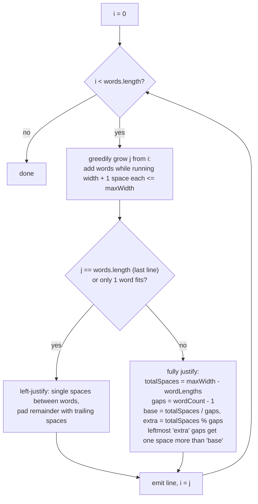

# Text Justification

## The problem

Given an array of words and a fixed line width `maxWidth`, lay the words out into lines of text like a word processor's "justify" mode:

- Pack as many words as possible onto each line, keeping their original order, with at least one space between consecutive words.
- Every line except the last must be **fully justified**: padded with extra spaces so it's exactly `maxWidth` characters wide, with the first word flush against the left edge and the last word flush against the right edge. If the needed spaces don't divide evenly between the gaps, the leftmost gaps get one extra space each until the remainder runs out.
- The **last line** (and any line that ends up with only a single word) is left-justified instead: single spaces between words, with all the extra padding as trailing spaces on the right.

Example: `words = ["This", "is", "an", "example", "of", "text", "justification."]`, `maxWidth = 16` produces:

```
"This    is    an"
"example  of text"
"justification.  "
```

The first line has 3 words and 2 gaps; it needs `16 - (4+2+2) = 8` extra spaces spread across those 2 gaps, `4` each. The last line has only one word, so it's just left-padded with trailing spaces to reach width 16.

## Solution

This is a **greedy line-packing** problem followed by careful **space-distribution arithmetic**. Two passes over each line:

**Pass 1 — decide which words fit.** Starting from the current word index `i`, keep adding words to the line as long as the running total (word lengths, plus one mandatory space before each word after the first) doesn't exceed `maxWidth`. The first word that would overflow the line stops the greedy scan — that word starts the next line instead.

**Pass 2 — lay out the spacing**, which depends on which kind of line this is:

- **Fully justified line** (not the last line, and more than one word fits): let `totalSpaces = maxWidth - (sum of word lengths)` and `gaps = wordCount - 1`. Every gap gets `totalSpaces / gaps` spaces at minimum; the remainder `totalSpaces % gaps` is handed out one extra space at a time, starting from the *leftmost* gaps, until it's used up. This is exactly the "first two words get more spaces" rule the problem describes when the count doesn't divide evenly.
- **Left-justified line** (the last line, or any line where only one word fits): join the words with a single space each, then pad the rest of the line with trailing spaces to reach `maxWidth`.

The single-word-line case has to fall into the left-justified branch even when it isn't the last line, because "distribute spaces across gaps" is undefined when there's only one word and zero gaps — dividing by `gaps = 0` would blow up, and even conceptually there's nothing to justify *between*.



## Code

```java
import java.util.*;

class Solution {
    public static List<String> fullJustify(String[] words, int maxWidth) {
        List<String> result = new ArrayList<>();
        int i = 0;
        int n = words.length;

        while (i < n) {
            // Greedily pack as many words as fit on this line: the words
            // themselves, plus one mandatory space before each further word.
            int j = i;
            int lineLength = 0;
            while (j < n && lineLength + words[j].length() + (j - i) <= maxWidth) {
                lineLength += words[j].length();
                j++;
            }

            int wordCount = j - i;
            boolean isLastLine = (j == n);
            StringBuilder line = new StringBuilder();

            if (isLastLine || wordCount == 1) {
                // Last line (or a line with a single word): left-justified,
                // single space between words, pad the remainder on the right.
                for (int k = i; k < j; k++) {
                    line.append(words[k]);
                    if (k < j - 1) {
                        line.append(' ');
                    }
                }
                while (line.length() < maxWidth) {
                    line.append(' ');
                }
            } else {
                // Fully justified: distribute extra spaces as evenly as
                // possible; leftover spaces go to the leftmost gaps first.
                int totalSpaces = maxWidth - lineLength;
                int gaps = wordCount - 1;
                int spacesEach = totalSpaces / gaps;
                int extra = totalSpaces % gaps;

                for (int k = i; k < j - 1; k++) {
                    line.append(words[k]);
                    int spaces = spacesEach + (k - i < extra ? 1 : 0);
                    for (int s = 0; s < spaces; s++) {
                        line.append(' ');
                    }
                }
                line.append(words[j - 1]);
            }

            result.add(line.toString());
            i = j;
        }
        return result;
    }

    public static void main(String[] args) {
        String[] words1 = {"This", "is", "an", "example", "of", "text", "justification."};
        for (String line : fullJustify(words1, 16)) {
            System.out.println("[" + line + "]");
        }
        // [This    is    an]
        // [example  of text]
        // [justification.  ]

        System.out.println();
        String[] words2 = {"What", "must", "be", "acknowledgment", "shall", "be"};
        for (String line : fullJustify(words2, 16)) {
            System.out.println("[" + line + "]");
        }
        // [What   must   be]
        // [acknowledgment  ]   (single word — left-justified with trailing padding)
        // [shall be        ]  (last line — left-justified with trailing padding)
    }
}
```

## Complexity measures

Let **n** be the total number of characters across all words, and **maxWidth** the fixed line width.

### Time Complexity

`O(n)` — every word is examined once while greedily packing lines, and once more while laying out its final spacing; the total work across all lines is proportional to the combined length of all words.

### Space Complexity

`O(1)` extra space beyond the required output — the algorithm uses a constant number of index variables per line; the result list itself is the mandatory output, not auxiliary space.
