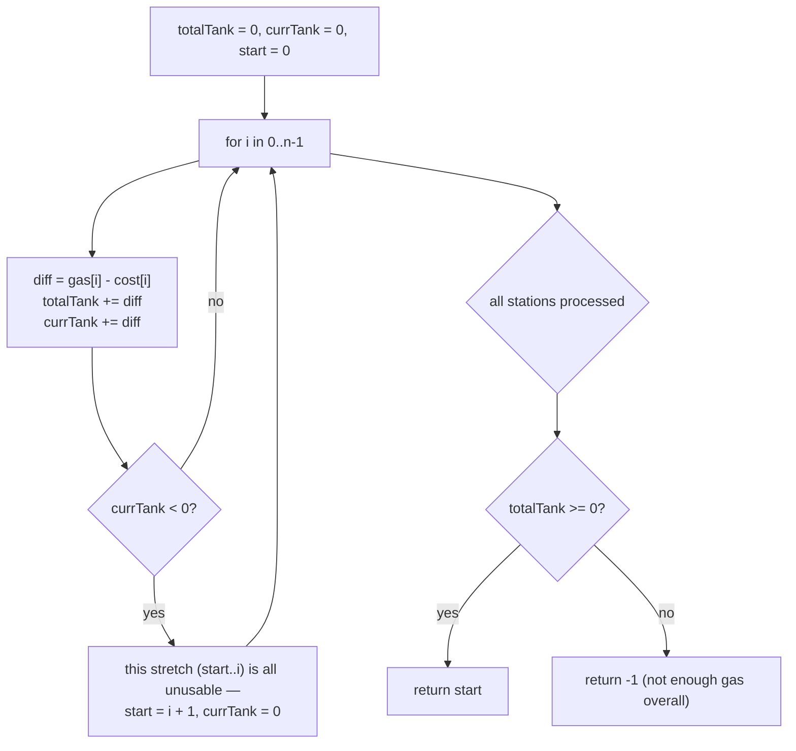

# Gas Station

## The problem

There are `n` gas stations arranged in a circle. Station `i` has `gas[i]` units of fuel available, and it costs `cost[i]` units of fuel to drive from station `i` to the next station `i + 1` (wrapping back to station `0` after the last one). Starting with an empty tank at some station, decide which single starting station (if any) lets a car complete the full clockwise loop without ever running out of gas. If a solution exists it's guaranteed unique; otherwise return `-1`.

Example: `gas = [1, 2, 3, 4, 5]`, `cost = [3, 4, 5, 1, 2]` — starting at station `3` works: tank goes `0 -> 4-1=3 -> 3+5-2=6 -> 6+1-3=4 -> 4+2-4=2 -> 2+3-5=0`, arriving back at station `3` with exactly `0` left over, never dipping negative. The answer is `3`.

## Solution

Two observations turn this from "try every starting station and simulate the whole loop" (`O(n^2)`) into a single linear scan.

**Observation 1 — a global feasibility check.** Add up `gas[i] - cost[i]` across *all* stations. If that total is negative, there simply isn't enough gas in the whole system to cover the whole trip's cost, no matter where you start — so the answer is `-1` immediately. If the total is `>= 0`, a valid starting station is guaranteed to exist.

**Observation 2 — where a failed attempt points you next.** Simulate a running tank while walking through the stations in order, starting the attempt at station `0`. If the tank ever goes negative right after leaving station `i`, that means *no station between the current start and `i`* could have been a valid starting point either — because arriving at each of those stations only added `gas[k] - cost[k]` along the way, and if the cumulative sum from the current start already goes negative by station `i`, starting anywhere in between still hits that same shortfall no later. So the whole stretch from the current start through `i` can be ruled out in one shot, and the next candidate start becomes `i + 1`, with the tank reset to `0` (a fresh attempt starts with nothing carried over).

Combining the two: do one pass, tracking both the running total (for the global feasibility check) and the current attempt's running tank (to find the candidate start). By the time the pass finishes, the last candidate start recorded is the answer — provided the global total came out non-negative.



## Code

```java
class Solution {
    public static int canCompleteCircuit(int[] gas, int[] cost) {
        int totalTank = 0;
        int currTank = 0;
        int startStation = 0;

        for (int i = 0; i < gas.length; i++) {
            int diff = gas[i] - cost[i];
            totalTank += diff;
            currTank += diff;
            if (currTank < 0) {
                // Can't reach station i+1 from the current start — every
                // station between the old start and i is also unusable as a
                // start, so the next candidate start is i + 1.
                startStation = i + 1;
                currTank = 0;
            }
        }
        return totalTank >= 0 ? startStation : -1;
    }

    public static void main(String[] args) {
        int[] gas1 = {1, 2, 3, 4, 5};
        int[] cost1 = {3, 4, 5, 1, 2};
        System.out.println(canCompleteCircuit(gas1, cost1));
        // 3

        int[] gas2 = {2, 3, 4};
        int[] cost2 = {3, 4, 3};
        System.out.println(canCompleteCircuit(gas2, cost2));
        // -1  (total cost 10 exceeds total gas 9 — no starting point works)
    }
}
```

## Complexity measures

Let **n** be the number of gas stations.

### Time Complexity

`O(n)` — a single pass over the stations, doing constant-time work (a subtraction, two additions, one comparison) at each one.

### Space Complexity

`O(1)` — only three running variables (`totalTank`, `currTank`, `startStation`) are used, regardless of how many stations there are.
