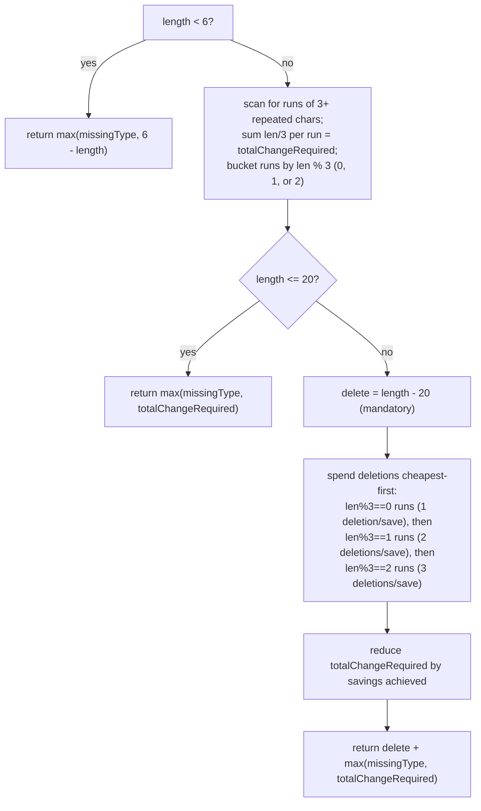

# Strong Password Checker

## The problem

A password is "strong" if it satisfies all of these:

- Length between 6 and 20 characters (inclusive).
- Contains at least one lowercase letter, one uppercase letter, and one digit.
- Never has three identical characters in a row (e.g. `"aaa"` is disallowed, but `"aa.a"` is fine).

Given a password, return the **minimum number of edit operations** — insert one character, delete one character, or replace one character — needed to make it strong. If it's already strong, return `0`.

Examples:

- `"aaa"` -> `3` (too short at 3 characters, missing an uppercase letter and a digit, and it's a repeated run — but a handful of well-chosen inserts fix everything at once).
- `"1337C0d3"` -> `0` (already 8 characters, has upper/lower/digit, no repeats — already strong).
- `"1010101010aaaB10101010"` -> `2` (22 characters — 2 over the limit — with upper/lower/digit already present; the fix is two deletions that also happen to break its one repeated run).

## Solution

The three rules interact, so the trick is handling them together rather than one at a time — an insert that fixes the length can *also* break a repeated run for free, and a mandatory deletion (when the password is too long) can *also* save a replacement. The problem splits cleanly into three length regimes.

**Missing character types, always.** First, regardless of length, count how many of {lowercase, uppercase, digit} are completely absent — call this `missingType` (0 to 3). Any strong password needs at least this many character-type fixes somewhere.

**Case 1 — too short (`length < 6`).** Only inserts can fix the length, and every insert can simultaneously supply one missing character type. So the answer is simply `max(missingType, 6 - length)` — whichever need is bigger, since each insert can serve double duty (both add length and, if placed thoughtfully, cover a missing type or break a repeat).

**Case 2 — in range (`6 <= length <= 20`).** No length fix needed, so only insert/replace operations for repeated runs and missing types matter. Scan the string for maximal runs of 3+ identical characters; a run of length `len` needs `len / 3` replacements to break (one replacement every 3 characters, e.g. `"aaaaaa"` needs 2: `"aabaab"`). Sum this over all runs to get `totalChangeRequired`. The answer is `max(missingType, totalChangeRequired)` — again, one replacement can double as fixing a missing type *and* breaking a repeat, so the fixes aren't purely additive.

**Case 3 — too long (`length > 20`).** Now deletions are mandatory — `delete = length - 20` of them, no way around it. But *which* characters get deleted matters, because deleting from inside a repeated run can shrink the replacements that run would otherwise need — and each mandatory deletion should be spent where it saves the most. A run of length `len` needs `len / 3` replacements; deleting one character changes that count only when `len % 3` "rolls over":

- `len % 3 == 0` (e.g. `"aaa"`, needs 1 replacement): **1 deletion** shrinks it to `len - 1` (`%3==2`, still needs 1 less... actually shrinks `len/3` by 1) — cheapest, 1 deletion saves 1 replacement.
- `len % 3 == 1` (e.g. `"aaaa"`): needs **2 deletions** to save 1 replacement.
- `len % 3 == 2` (e.g. `"aaaaa"`): needs **3 deletions** to save 1 replacement.

So spend the mandatory deletions in that priority order — cheapest savings first — capping at how many runs actually fall in each bucket, until the deletion budget runs out. Whatever savings that produces reduces `totalChangeRequired`, and the final answer is `delete + max(missingType, totalChangeRequired)` — the mandatory deletions plus whatever replacement/insert work is still needed afterward.



## Code

```java
class Solution {
    public static int strongPasswordChecker(String password) {
        int n = password.length();

        int missingType = 3;
        if (password.matches(".*[a-z].*")) missingType--;
        if (password.matches(".*[A-Z].*")) missingType--;
        if (password.matches(".*\\d.*")) missingType--;

        if (n < 6) {
            // Only inserts can fix length; each insert can also break one
            // repetition or supply one missing character type, whichever
            // this password needs more of.
            return Math.max(missingType, 6 - n);
        }

        // Scan for runs of 3+ repeated characters; each run of length `len`
        // needs len/3 replacements to break (one replacement breaks 3 chars).
        int oneChangeReq = 0;   // number of runs with len % 3 == 0
        int twoChangeReq = 0;   // number of runs with len % 3 == 1
        int threeChangeReq = 0; // number of runs with len % 3 == 2
        int totalChangeRequired = 0;

        int i = 2;
        while (i < n) {
            if (password.charAt(i) == password.charAt(i - 1) && password.charAt(i - 1) == password.charAt(i - 2)) {
                int len = 2;
                while (i < n && password.charAt(i) == password.charAt(i - 1)) {
                    len++;
                    i++;
                }
                totalChangeRequired += len / 3;
                if (len % 3 == 0) {
                    oneChangeReq++;
                } else if (len % 3 == 1) {
                    twoChangeReq++;
                } else {
                    threeChangeReq++;
                }
            } else {
                i++;
            }
        }

        if (n <= 20) {
            // Only inserts/replacements matter; no need to delete.
            return Math.max(missingType, totalChangeRequired);
        }

        // n > 20: must delete (n - 20) characters. Deleting one character
        // from a run can shrink its replacement cost, but only if the
        // deletion changes len/3 — that's cheapest for len % 3 == 0 runs
        // (1 deletion saves 1 replacement), then len % 3 == 1 runs (2
        // deletions save 1 replacement), then len % 3 == 2 runs (3
        // deletions save 1 replacement). Spend the mandatory deletions in
        // that priority order to shrink totalChangeRequired as much as possible.
        int delete = n - 20;

        int used1 = Math.min(delete, oneChangeReq);
        totalChangeRequired -= used1;
        int remaining = delete - used1;

        int used2 = Math.min(Math.max(remaining, 0), twoChangeReq * 2) / 2;
        totalChangeRequired -= used2;
        remaining -= used2 * 2;

        int used3 = Math.min(Math.max(remaining, 0), threeChangeReq * 3) / 3;
        totalChangeRequired -= used3;

        return delete + Math.max(missingType, totalChangeRequired);
    }

    public static void main(String[] args) {
        System.out.println(strongPasswordChecker("aaa"));
        // 3  (too short, missing upper/digit, and a repeated run — 3 inserts cover it all)

        System.out.println(strongPasswordChecker("1337C0d3"));
        // 0  (already strong)

        System.out.println(strongPasswordChecker("1010101010aaaB10101010"));
        // 2  (22 chars — 2 mandatory deletions, which also break the "aaa" run for free)
    }
}
```

## Complexity measures

Let **n** be the length of the password.

### Time Complexity

`O(n)` — the three regex checks and the repeated-run scan each pass over the string once; the deletion-budgeting math at the end is constant-time arithmetic on the bucket counts.

### Space Complexity

`O(n)` in the worst case — beyond a constant number of counters, no auxiliary structure is required; the only space proportional to input size is implicit in scanning the string itself (and, if implemented with regex matching, the temporary state Java's regex engine uses).
