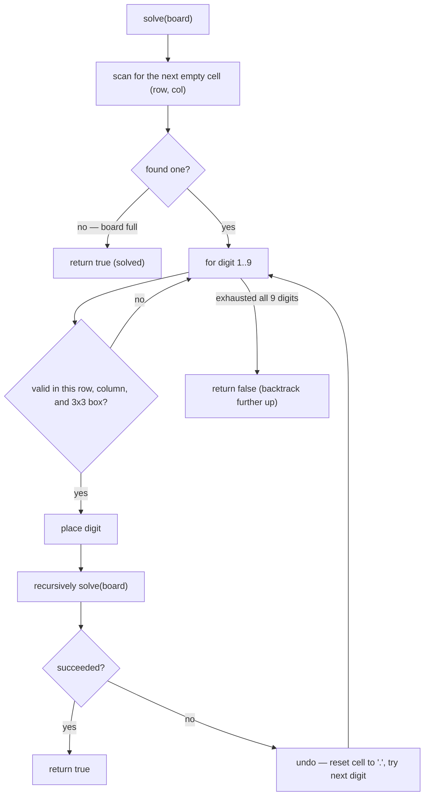

# Sudoku Solver

## The problem

Given a partially filled 9x9 Sudoku board (empty cells marked `'.'`), fill in the empty cells so the finished board is a valid solution: each digit `1`-`9` appears exactly once in every row, every column, and every one of the nine 3x3 sub-boxes. The board is modified in place — there's nothing to return.

Example: given

```
5 3 . . 7 . . . .
6 . . 1 9 5 . . .
. 9 8 . . . . 6 .
8 . . . 6 . . . 3
4 . . 8 . 3 . . 1
7 . . . 2 . . . 6
. 6 . . . . 2 8 .
. . . 4 1 9 . . 5
. . . . 8 . . 7 9
```

the (unique) solved board is:

```
5 3 4 6 7 8 9 1 2
6 7 2 1 9 5 3 4 8
1 9 8 3 4 2 5 6 7
8 5 9 7 6 1 4 2 3
4 2 6 8 5 3 7 9 1
7 1 3 9 2 4 8 5 6
9 6 1 5 3 7 2 8 4
2 8 7 4 1 9 6 3 5
3 4 5 2 8 6 1 7 9
```

## Solution

This is textbook **backtracking with constraint checking**: try a value, recurse assuming it's correct, and if that path leads nowhere, undo the value and try the next one.

Walk the board cell by cell. Whenever a cell already has a digit, skip it. At an empty cell, try each digit `1` through `9` in turn:

- **Check the constraint.** A digit is only a legal candidate for this cell if it doesn't already appear in the same row, the same column, or the same 3x3 sub-box. Finding which sub-box a cell belongs to is arithmetic: `boxRow = (row / 3) * 3` and `boxCol = (col / 3) * 3` gives the sub-box's top-left corner, and iterating a 3x3 window from there covers all 9 of its cells.
- **Place and recurse.** If a digit passes the check, place it and recursively try to solve the rest of the board with that choice in effect. If the recursive call succeeds (returns `true`, meaning it filled every remaining cell validly), we're done — bubble `true` all the way back up.
- **Backtrack.** If the recursive call fails — meaning no combination of digits in later cells works given this choice — undo the placement (reset the cell back to `'.'`) and try the next digit. If none of the 9 digits work at this cell, this whole branch is a dead end, so return `false` and let the *caller* backtrack instead.

The recursion bottoms out successfully once every cell has been walked past with no empty ones left — meaning the entire board is filled and every placement along the way passed its row/column/box check, which is exactly what a valid Sudoku solution requires.



## Code

```java
class Solution {
    public static void solveSudoku(char[][] board) {
        solve(board);
    }

    private static boolean solve(char[][] board) {
        for (int row = 0; row < 9; row++) {
            for (int col = 0; col < 9; col++) {
                if (board[row][col] != '.') {
                    continue;
                }
                for (char digit = '1'; digit <= '9'; digit++) {
                    if (isValid(board, row, col, digit)) {
                        board[row][col] = digit;
                        if (solve(board)) {
                            return true;
                        }
                        board[row][col] = '.'; // backtrack
                    }
                }
                return false; // no digit works here — this whole branch fails
            }
        }
        return true; // reached the end with every cell filled
    }

    private static boolean isValid(char[][] board, int row, int col, char digit) {
        int boxRow = (row / 3) * 3;
        int boxCol = (col / 3) * 3;
        for (int i = 0; i < 9; i++) {
            if (board[row][i] == digit) return false;
            if (board[i][col] == digit) return false;
            if (board[boxRow + i / 3][boxCol + i % 3] == digit) return false;
        }
        return true;
    }

    public static void main(String[] args) {
        char[][] board = {
            {'5', '3', '.', '.', '7', '.', '.', '.', '.'},
            {'6', '.', '.', '1', '9', '5', '.', '.', '.'},
            {'.', '9', '8', '.', '.', '.', '.', '6', '.'},
            {'8', '.', '.', '.', '6', '.', '.', '.', '3'},
            {'4', '.', '.', '8', '.', '3', '.', '.', '1'},
            {'7', '.', '.', '.', '2', '.', '.', '.', '6'},
            {'.', '6', '.', '.', '.', '.', '2', '8', '.'},
            {'.', '.', '.', '4', '1', '9', '.', '.', '5'},
            {'.', '.', '.', '.', '8', '.', '.', '7', '9'}
        };
        solveSudoku(board);
        for (char[] row : board) {
            StringBuilder sb = new StringBuilder();
            for (char c : row) sb.append(c);
            System.out.println(sb);
        }
        // 534678912
        // 672195348
        // 198342567
        // 859761423
        // 426853791
        // 713924856
        // 961537284
        // 287419635
        // 345286179
    }
}
```

## Complexity measures

The board size is always fixed at 9x9, so both measures are technically constant — but it's worth spelling out what that constant hides.

### Time Complexity

`O(9^81)` in the absolute worst case — each of the 81 cells could in principle try up to 9 digits before the constraint checks and backtracking prune the search space dramatically in practice. Since the board size never changes, this is still `O(1)` in the strict big-O sense (bounded by a fixed number independent of any growing input), but the constant is what makes brute-force enumeration infeasible without the row/column/box pruning.

### Space Complexity

`O(1)` — the board itself is a fixed 81 cells, and the recursive call stack goes at most 81 levels deep (one per cell), both bounded by the fixed board size regardless of the puzzle's contents.
