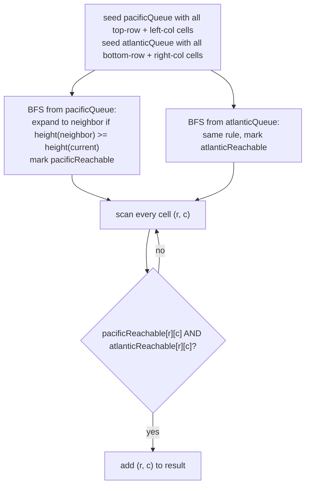

# Pacific Atlantic Water Flow

## The problem

An `m x n` island grid borders the Pacific Ocean along its top and left edges, and the Atlantic Ocean along its bottom and right edges. `heights[r][c]` gives the elevation at cell `(r, c)`. Rainwater on a cell can flow to a neighboring cell (north, south, east, or west) only if that neighbor's height is **less than or equal to** the current cell's height, and water standing at the border can flow directly into the adjacent ocean. Find every cell from which water can reach *both* oceans.

Example:

```
1  2  2  3  5
3  2  3  4  4
2  4  5  3  1
6  7  1  4  5
5  1  1  2  4
```

The cells that can reach both oceans are `(0,4)`, `(1,3)`, `(1,4)`, `(2,2)`, `(3,0)`, `(3,1)`, and `(4,0)`.

## Solution

The obvious approach — from every cell, search for a downhill path to each ocean — means running a full grid search from up to `m x n` different starting points, which is wasteful and repeats enormous amounts of work.

The fix: **run the search backward, from the oceans inward, instead of forward from every cell.** Water flows downhill (or level) toward the ocean; reverse that and ask, starting at the ocean's edge, "which cells could water have flowed *from* to get here?" — that's exactly the cells whose height is **greater than or equal to** the current cell's height (the reverse of the forward flow condition). Running this reversed search once from *all* of the Pacific's border cells at the same time (multi-source BFS) marks every cell that can reach the Pacific, in a single pass over the grid. Do the same thing once more from all of the Atlantic's border cells. A cell that shows up in both result sets can reach both oceans — exactly the answer being asked for.

Concretely:

1. **Seed two queues.** All cells along the top row and left column go into the Pacific's BFS queue (mark them `pacificReachable`); all cells along the bottom row and right column go into the Atlantic's BFS queue (mark them `atlanticReachable`).
2. **Run BFS twice, independently**, once per ocean. From each cell being processed, look at its 4 neighbors; a neighbor gets added to the queue (and marked reachable) if it hasn't been visited yet *and* its height is `>=` the current cell's height — meaning, forward, water at that neighbor could actually flow down into the current cell and onward to the ocean.
3. **Intersect.** After both BFS traversals finish, scan the grid once more: any cell marked reachable in *both* `pacificReachable` and `atlanticReachable` goes into the final answer.

Two independent BFS passes, each visiting every cell at most once, replace what would otherwise be a search from every individual cell.



## Code

```java
import java.util.*;

class Solution {
    private static final int[][] DIRS = {{0, 1}, {1, 0}, {-1, 0}, {0, -1}};

    public static List<List<Integer>> pacificAtlantic(int[][] heights) {
        List<List<Integer>> result = new ArrayList<>();
        if (heights == null || heights.length == 0 || heights[0].length == 0) {
            return result;
        }

        int m = heights.length;
        int n = heights[0].length;

        boolean[][] pacificReachable = new boolean[m][n];
        boolean[][] atlanticReachable = new boolean[m][n];

        Queue<int[]> pacificQueue = new LinkedList<>();
        Queue<int[]> atlanticQueue = new LinkedList<>();

        for (int c = 0; c < n; c++) {
            pacificQueue.add(new int[]{0, c});
            pacificReachable[0][c] = true;
            atlanticQueue.add(new int[]{m - 1, c});
            atlanticReachable[m - 1][c] = true;
        }
        for (int r = 0; r < m; r++) {
            pacificQueue.add(new int[]{r, 0});
            pacificReachable[r][0] = true;
            atlanticQueue.add(new int[]{r, n - 1});
            atlanticReachable[r][n - 1] = true;
        }

        bfs(heights, pacificQueue, pacificReachable);
        bfs(heights, atlanticQueue, atlanticReachable);

        for (int r = 0; r < m; r++) {
            for (int c = 0; c < n; c++) {
                if (pacificReachable[r][c] && atlanticReachable[r][c]) {
                    result.add(Arrays.asList(r, c));
                }
            }
        }
        return result;
    }

    // BFS backward from the ocean: a neighbor is reachable-to-the-ocean if
    // its height is >= the current cell's height (water could have flowed
    // from the neighbor down into the current cell, toward the ocean).
    private static void bfs(int[][] heights, Queue<int[]> queue, boolean[][] reachable) {
        int m = heights.length;
        int n = heights[0].length;

        while (!queue.isEmpty()) {
            int[] cell = queue.poll();
            int row = cell[0];
            int col = cell[1];

            for (int[] d : DIRS) {
                int nr = row + d[0];
                int nc = col + d[1];
                if (nr < 0 || nr >= m || nc < 0 || nc >= n || reachable[nr][nc]) {
                    continue;
                }
                if (heights[nr][nc] >= heights[row][col]) {
                    reachable[nr][nc] = true;
                    queue.add(new int[]{nr, nc});
                }
            }
        }
    }

    public static void main(String[] args) {
        int[][] heights = {
            {1, 2, 2, 3, 5},
            {3, 2, 3, 4, 4},
            {2, 4, 5, 3, 1},
            {6, 7, 1, 4, 5},
            {5, 1, 1, 2, 4}
        };
        List<List<Integer>> result = pacificAtlantic(heights);
        result.sort((a, b) -> a.get(0) != b.get(0) ? a.get(0) - b.get(0) : a.get(1) - b.get(1));
        System.out.println(result);
        // [[0, 4], [1, 3], [1, 4], [2, 2], [3, 0], [3, 1], [4, 0]]
    }
}
```

## Complexity measures

Let **m** and **n** be the grid's row and column counts.

### Time Complexity

`O(m * n)` — each of the two BFS traversals visits every cell at most once (the `reachable` check prevents revisits), so the total work is `2 * (m * n)`, which is `O(m * n)`.

### Space Complexity

`O(m * n)` — the two `reachable` grids together hold one boolean per cell for each ocean, and each BFS queue can hold at most `m * n` cells at once in the worst case.
