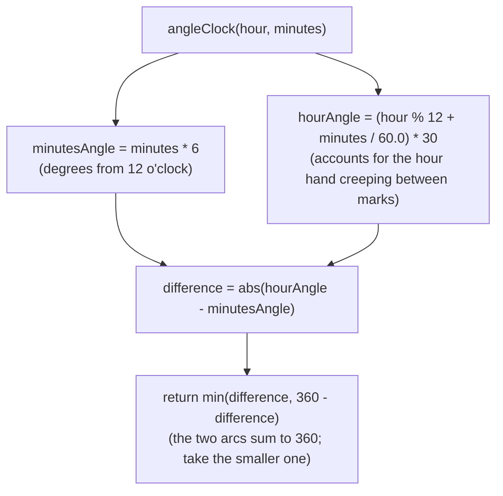

# Angle Between the Hands of a Clock

## The problem

Given an `hour` (1 to 12) and `minutes` (0 to 59), return the smaller of the two angles formed between the clock's hour hand and minute hand, in degrees.

Example: at `12:30`, the answer is `165` degrees — the minute hand points straight down at the "6", and the hour hand has crept halfway between "12" and "1".

## Solution

Instead of reasoning about the two hands relative to each other directly, measure each hand's angle relative to the same fixed reference line — the 12 o'clock mark — and then take the difference.

**Minute hand.** The minute hand sweeps the full 360-degree circle over 60 minutes, so each minute is worth `360 / 60 = 6` degrees. At `minutes` past the hour, the minute hand sits at `minutes * 6` degrees from the 12 o'clock mark.

**Hour hand.** The hour hand sweeps the full circle over 12 hours, so each hour is worth `360 / 12 = 30` degrees. But the hour hand doesn't jump instantly at the top of each hour — it creeps continuously between hour marks as the minutes tick by. Since 60 minutes moves the hour hand by one full 30-degree hour-mark gap, `minutes` minutes moves it an extra `(minutes / 60) * 30` degrees on top of the whole-hour position. So the hour hand's angle is `(hour % 12 + minutes / 60.0) * 30` degrees — the `% 12` folds the special case of `hour = 12` down to `0`, since 12 o'clock and 0 o'clock point at the same mark.

**Combine.** Subtract the two angles and take the absolute value to get the raw difference. But that raw difference measures the angle going *one way around* the clock face — the two hands actually carve the circle into two arcs that add up to 360 degrees, and the problem wants the smaller one. So the answer is `min(difference, 360 - difference)`.



## Code

```java
class Solution {
    private static final double ONE_MIN_ANGLE = 6.0;
    private static final double ONE_HOUR_ANGLE = 30.0;

    public static double angleClock(int hour, int minutes) {
        double minutesAngle = ONE_MIN_ANGLE * minutes;
        double hourAngle = (hour % 12 + minutes / 60.0) * ONE_HOUR_ANGLE;

        double difference = Math.abs(hourAngle - minutesAngle);
        return Math.min(difference, 360 - difference);
    }

    public static void main(String[] args) {
        System.out.println(angleClock(12, 30));
        // 165.0

        System.out.println(angleClock(3, 30));
        // 75.0

        System.out.println(angleClock(3, 15));
        // 7.5
    }
}
```

## Complexity measures

### Time Complexity

`O(1)` — the answer is computed with a fixed handful of arithmetic operations, regardless of the input values.

### Space Complexity

`O(1)` — only a constant number of `double` variables are used, with no data structures that grow with input.
