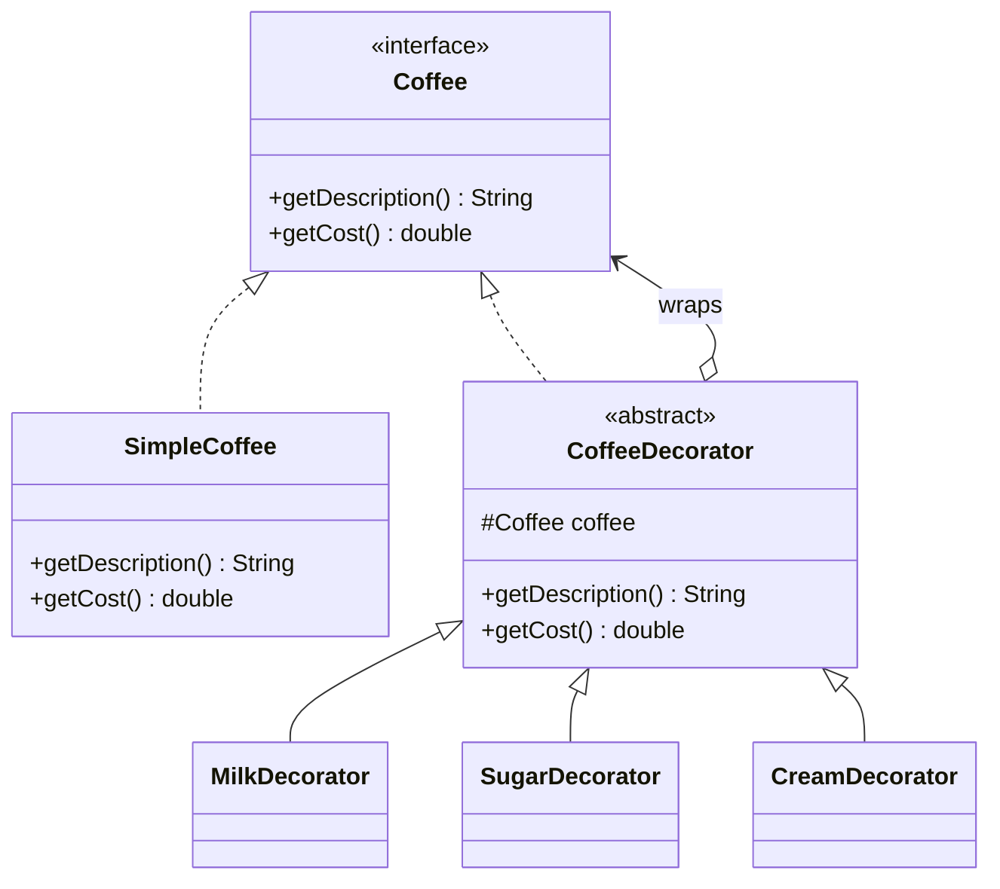

# 5. Decorator Design Pattern

Now we are at the second **Structural Design Pattern** in your list:

```text
Structural
├── Adapter
└── Decorator
```

The **Decorator Pattern** is extremely useful in Java because it lets you **add behavior to an object dynamically without modifying its class**.

The central idea is:

> **Wrap an object with another object that has the same interface and adds extra behavior.**

The most important phrase to remember is:

> **Same interface + additional behavior.**

---

# 1. Start with the problem

Suppose we have a coffee shop application.

We have:

```java
public interface Coffee {

    double cost();

    String description();
}
```

Basic coffee:

```java
public class SimpleCoffee implements Coffee {

    @Override
    public double cost() {
        return 100;
    }

    @Override
    public String description() {
        return "Simple Coffee";
    }
}
```

Now customers can add:

```text
Milk
Sugar
Whipped cream
Chocolate
Caramel
```

We could create classes like:

```text
SimpleCoffee
CoffeeWithMilk
CoffeeWithSugar
CoffeeWithMilkAndSugar
CoffeeWithMilkSugarChocolate
CoffeeWithMilkSugarChocolateCaramel
...
```

This quickly becomes a mess.

---

# 2. The inheritance problem

Suppose we try inheritance:

```java
public class CoffeeWithMilk extends SimpleCoffee {
}
```

Then:

```java
public class CoffeeWithSugar extends SimpleCoffee {
}
```

Then:

```java
public class CoffeeWithMilkAndSugar extends SimpleCoffee {
}
```

Then:

```java
public class CoffeeWithMilkSugarChocolate extends SimpleCoffee {
}
```

The problem is the combinations.

If you have:

```text
Milk
Sugar
Chocolate
Caramel
WhippedCream
```

you can potentially have a huge number of combinations.

Inheritance starts exploding:

```text
                     Coffee
                       │
       ┌───────────────┼───────────────┐
       ▼               ▼               ▼
     Milk            Sugar          Chocolate
       │
       ├── Milk+Sugar
       ├── Milk+Chocolate
       ├── Milk+Sugar+Chocolate
       └── ...
```

This is often called a **class explosion**.

---

# 3. What if we use composition?

Instead of creating:

```java
CoffeeWithMilk
```

we could create:

```java
MilkDecorator
```

that contains a:

```java
Coffee
```

Conceptually:

```text id="decorator0"
Coffee
   ▲
   │
MilkDecorator
   │
   └── has-a Coffee
```

Then:

```java
Coffee coffee = new SimpleCoffee();

coffee = new MilkDecorator(coffee);
```

Now we have:

```text
MilkDecorator
      │
      ▼
SimpleCoffee
```

And we can continue:

```java
coffee = new SugarDecorator(coffee);
```

Now:

```text
SugarDecorator
      │
      ▼
MilkDecorator
      │
      ▼
SimpleCoffee
```

Then:

```java
coffee = new ChocolateDecorator(coffee);
```

Now:

```text
ChocolateDecorator
        │
        ▼
 SugarDecorator
        │
        ▼
  MilkDecorator
        │
        ▼
 SimpleCoffee
```

This is the key insight behind Decorator.

---

# 4. Basic Decorator structure

The standard structure is:

```text
                Component
                ▲       ▲
                │       │
                │       │
          Concrete   Decorator
          Component      │
                         │
                     Concrete
                     Decorator
```

More explicitly:

```text
                    Component
                       ▲
              ┌────────┴────────┐
              │                 │
       ConcreteComponent     Decorator
                                  │
                             has-a Component
                                  ▲
                         ┌────────┴────────┐
                         │                 │
                 ConcreteDecoratorA  ConcreteDecoratorB
```

In our coffee example:

```text
Component
    = Coffee

ConcreteComponent
    = SimpleCoffee

Decorator
    = CoffeeDecorator

ConcreteDecorators
    = MilkDecorator
    = SugarDecorator
    = ChocolateDecorator
```

---

# 5. The Decorator interface

Let's build it properly.

Our component:

```java
public interface Coffee {

    double cost();

    String description();
}
```

Concrete component:

```java
public class SimpleCoffee implements Coffee {

    @Override
    public double cost() {
        return 100;
    }

    @Override
    public String description() {
        return "Simple Coffee";
    }
}
```

Now the base Decorator:

```java
public abstract class CoffeeDecorator
        implements Coffee {

    protected final Coffee coffee;

    protected CoffeeDecorator(Coffee coffee) {
        this.coffee = coffee;
    }
}
```

Notice:

```java
implements Coffee
```

This is extremely important.

The decorator has the **same interface** as the object it wraps.

---

# 6. Milk Decorator

```java
public class MilkDecorator
        extends CoffeeDecorator {

    public MilkDecorator(Coffee coffee) {
        super(coffee);
    }

    @Override
    public double cost() {
        return coffee.cost() + 30;
    }

    @Override
    public String description() {
        return coffee.description() + ", Milk";
    }
}
```

Sugar:

```java
public class SugarDecorator
        extends CoffeeDecorator {

    public SugarDecorator(Coffee coffee) {
        super(coffee);
    }

    @Override
    public double cost() {
        return coffee.cost() + 10;
    }

    @Override
    public String description() {
        return coffee.description() + ", Sugar";
    }
}
```

Chocolate:

```java
public class ChocolateDecorator
        extends CoffeeDecorator {

    public ChocolateDecorator(Coffee coffee) {
        super(coffee);
    }

    @Override
    public double cost() {
        return coffee.cost() + 40;
    }

    @Override
    public String description() {
        return coffee.description() + ", Chocolate";
    }
}
```

---

# 7. Using the Decorators

Start with:

```java
Coffee coffee = new SimpleCoffee();
```

Then:

```java
coffee = new MilkDecorator(coffee);
```

Then:

```java
coffee = new SugarDecorator(coffee);
```

Then:

```java
coffee = new ChocolateDecorator(coffee);
```

Finally:

```java
System.out.println(coffee.description());
System.out.println(coffee.cost());
```

Output:

```text
Simple Coffee, Milk, Sugar, Chocolate
180.0
```

Because:

```text
100
+ 30
+ 10
+ 40
----
180
```

---

# 8. What is actually happening?

This line:

```java
coffee = new MilkDecorator(coffee);
```

creates:

```text
MilkDecorator
     │
     ▼
SimpleCoffee
```

Then:

```java
coffee = new SugarDecorator(coffee);
```

creates:

```text
SugarDecorator
     │
     ▼
MilkDecorator
     │
     ▼
SimpleCoffee
```

Then:

```java
coffee = new ChocolateDecorator(coffee);
```

creates:

```text
ChocolateDecorator
        │
        ▼
   SugarDecorator
        │
        ▼
    MilkDecorator
        │
        ▼
   SimpleCoffee
```

Each decorator delegates to the wrapped object and adds something.

---

# 9. How method calls flow through the decorators

Suppose we call:

```java
coffee.cost();
```

The outermost object is:

```text
ChocolateDecorator
```

So:

```java
ChocolateDecorator.cost()
```

runs:

```java
return coffee.cost() + 40;
```

Its `coffee` is:

```text
SugarDecorator
```

So:

```text
ChocolateDecorator
    ↓
SugarDecorator.cost()
```

Sugar does:

```java
return coffee.cost() + 10;
```

which calls:

```text
MilkDecorator.cost()
```

which calls:

```text
SimpleCoffee.cost()
```

So execution is:

```text
ChocolateDecorator
      ↓
SugarDecorator
      ↓
MilkDecorator
      ↓
SimpleCoffee
      ↓
100
      ↑
Milk +30
      ↑
Sugar +10
      ↑
Chocolate +40
      ↑
180
```

This chain is the essence of Decorator.

---

# 10. Why is it called Decorator?

Because each wrapper "decorates" the object by adding something.

For example:

```text
SimpleCoffee
     ↓
+ Milk
     ↓
+ Sugar
     ↓
+ Chocolate
```

The underlying object remains the same kind of abstraction.

We're simply wrapping it with additional responsibilities.

---

# 11. The most important property: same interface

Look carefully:

```java
public interface Coffee
```

Base object:

```java
public class SimpleCoffee
        implements Coffee
```

Decorator:

```java
public abstract class CoffeeDecorator
        implements Coffee
```

Concrete decorators:

```java
public class MilkDecorator
        extends CoffeeDecorator
```

Therefore all of these are usable as:

```java
Coffee
```

That's why this is possible:

```java
Coffee coffee = new SimpleCoffee();

coffee = new MilkDecorator(coffee);

coffee = new SugarDecorator(coffee);
```

The variable type never changes:

```java
Coffee
```

This is essential to Decorator.

---

# 12. Decorator is composition

The decorator contains:

```java
protected final Coffee coffee;
```

So it has:

```text
Decorator
   │
   └── has-a → Coffee
```

This is composition.

And this allows decorators to be chained.

```text
Decorator
   │
   ▼
Decorator
   │
   ▼
Decorator
   │
   ▼
Concrete Component
```

---

# 13. Decorator solves a different problem from Adapter

You just learned Adapter, so this comparison is crucial.

## Adapter

The client expects:

```text
Interface A
```

but the object provides:

```text
Interface B
```

Adapter converts:

```text
A ← Adapter → B
```

The main concern is:

> **Compatibility**

---

## Decorator

The client already expects:

```text
Interface A
```

and the wrapped object also implements:

```text
Interface A
```

Decorator adds:

```text
extra behavior
```

The main concern is:

> **Enhancement**

So:

```text
Adapter
→ change interface

Decorator
→ preserve interface, add behavior
```

This is one of the most frequently tested distinctions.

---

# 14. Decorator vs inheritance

Without Decorator:

```text
Coffee
 ├── CoffeeWithMilk
 ├── CoffeeWithSugar
 ├── CoffeeWithMilkSugar
 ├── CoffeeWithMilkChocolate
 └── ...
```

With Decorator:

```text
Coffee
  ▲
  │
SimpleCoffee
  ▲
  │
MilkDecorator
  ▲
  │
SugarDecorator
  ▲
  │
ChocolateDecorator
```

Instead of representing every combination as a class, we compose behavior dynamically.

---

# 15. Why runtime composition is powerful

Suppose today you need:

```java
Coffee coffee =
        new SimpleCoffee();

coffee =
        new MilkDecorator(coffee);
```

Tomorrow you want:

```java
coffee =
        new ChocolateDecorator(coffee);
```

No new combination class is necessary.

You simply compose:

```java
coffee =
        new ChocolateDecorator(
                new MilkDecorator(
                        new SimpleCoffee()
                )
        );
```

This is one of the major advantages of Decorator.

---

# 16. Order matters

This is a subtle but important point.

Consider:

```java
coffee =
    new MilkDecorator(
        new SugarDecorator(
            new SimpleCoffee()
        )
    );
```

versus:

```java
coffee =
    new SugarDecorator(
        new MilkDecorator(
            new SimpleCoffee()
        )
    );
```

For our simple price example, both might produce the same total.

But in a real system, decorator order can matter.

For example:

```text
Compression
Encryption
Logging
Caching
Authentication
```

The order can affect behavior.

For example:

```text
Encrypt(Compress(data))
```

is not necessarily equivalent to:

```text
Compress(Encrypt(data))
```

So decorator chains are ordered behavior pipelines.

---

# 17. Real-world example: Java I/O

This is one of the best examples to remember for interviews.

Java I/O uses the Decorator-style idea extensively.

For example:

```java
InputStream input =
        new FileInputStream("data.txt");
```

Then:

```java
input =
        new BufferedInputStream(input);
```

Then perhaps:

```java
input =
        new DataInputStream(input);
```

Conceptually:

```text
DataInputStream
      ↓
BufferedInputStream
      ↓
FileInputStream
```

Each layer implements/extends the relevant stream abstraction and adds functionality.

That's Decorator thinking in the Java standard library.

---

# 18. Java I/O example

Suppose:

```java
InputStream input =
        new FileInputStream("data.txt");
```

`FileInputStream` reads bytes from the file.

Wrap it:

```java
InputStream input =
        new BufferedInputStream(
                new FileInputStream("data.txt")
        );
```

Now buffering is added.

Add another layer:

```java
DataInputStream input =
        new DataInputStream(
                new BufferedInputStream(
                        new FileInputStream("data.txt")
                )
        );
```

Now:

```text
DataInputStream
        ↓
BufferedInputStream
        ↓
FileInputStream
```

This is a perfect mental model for Decorator.

---

# 19. Another real-world example: logging

Suppose we have:

```java
public interface OrderService {

    void createOrder(Order order);
}
```

Actual implementation:

```java
public class OrderServiceImpl
        implements OrderService {

    @Override
    public void createOrder(Order order) {
        // business logic
    }
}
```

Now we want logging.

Instead of modifying the original class:

```java
public class LoggingOrderService
        implements OrderService {

    private final OrderService delegate;

    public LoggingOrderService(OrderService delegate) {
        this.delegate = delegate;
    }

    @Override
    public void createOrder(Order order) {

        System.out.println("Creating order");

        delegate.createOrder(order);

        System.out.println("Order created");
    }
}
```

Usage:

```java
OrderService service =
        new LoggingOrderService(
                new OrderServiceImpl()
        );
```

The client still sees:

```java
OrderService
```

but behavior has been enhanced.

That's Decorator.

---

# 20. Multiple decorators for a service

Suppose we want:

```text
Logging
Metrics
Caching
Authorization
```

We can compose:

```java
OrderService service =
        new LoggingDecorator(
            new MetricsDecorator(
                new CachingDecorator(
                    new AuthorizationDecorator(
                        new OrderServiceImpl()
                    )
                )
            )
        );
```

Architecture:

```text
LoggingDecorator
       ↓
MetricsDecorator
       ↓
CachingDecorator
       ↓
AuthorizationDecorator
       ↓
OrderServiceImpl
```

This allows behavior to be added independently.

---

# 21. Decorator vs inheritance

This is a very important design decision.

Suppose:

```text
BaseService
```

has:

```text
LoggingService
CachingService
MetricsService
AuthorizationService
```

Inheritance might produce:

```text
BaseService
 ├── LoggingService
 ├── CachingService
 ├── MetricsService
 └── ...
```

But then combinations become difficult.

With Decorator:

```text
BaseService
   ↓
LoggingDecorator
   ↓
CachingDecorator
   ↓
MetricsDecorator
```

We compose behavior rather than creating subclasses for every combination.

That's why Decorator is particularly useful when behaviors are **independently combinable**.

---

# 22. Decorator and Open/Closed Principle

Decorator is strongly associated with the **Open/Closed Principle**.

You can add behavior by creating a new decorator:

```java
public class LoggingDecorator
        implements OrderService {
}
```

without changing:

```java
OrderServiceImpl
```

The existing class is closed for modification but can be extended through composition.

Again, the correct statement is:

> Decorator is a design technique that can help us follow OCP.

Not:

> "Using Decorator automatically guarantees OCP."

---

# 23. Decorator and Single Responsibility Principle

Suppose:

```java
OrderServiceImpl
```

does:

```text
order business logic
logging
metrics
caching
authorization
```

That's a lot of responsibilities.

Decorator can separate them:

```text
OrderServiceImpl
→ order logic

LoggingDecorator
→ logging

MetricsDecorator
→ metrics

CachingDecorator
→ caching

AuthorizationDecorator
→ authorization
```

Each component has a more focused responsibility.

This is another reason the pattern can make systems easier to maintain.

---

# 24. Decorator and dependency injection

Decorator works particularly well with Dependency Injection.

Spring can inject one implementation into another.

For example:

```java
@Component
public class LoggingOrderService
        implements OrderService {

    private final OrderService delegate;

    public LoggingOrderService(OrderService delegate) {
        this.delegate = delegate;
    }

    @Override
    public void createOrder(Order order) {
        System.out.println("Creating order");
        delegate.createOrder(order);
    }
}
```

Conceptually:

```text
LoggingOrderService
        ↓
OrderService
```

Spring can also use qualifiers, ordering, proxies, or other mechanisms depending on the architecture.

In real Spring applications, however, much cross-cutting behavior is implemented through **AOP/proxies**, which is conceptually related to wrapping but isn't simply "Decorator pattern."

That distinction is important.

---

# 25. Decorator vs Spring AOP

You may get asked:

> "Is Spring AOP a Decorator?"

Not exactly.

Spring AOP commonly uses **proxies** to apply cross-cutting behavior such as:

```text
logging
transactions
security
caching
```

The mechanism is often proxy-based.

It can resemble Decorator because:

```text
Proxy
   ↓
Target object
```

and the proxy can perform additional work before/after calling the target.

But:

```text
Decorator
→ explicit structural pattern

Spring AOP
→ framework infrastructure based largely on proxies/interceptors
```

There is conceptual overlap, but they're not identical.

---

# 26. Decorator can change state too

Decorator doesn't have to simply log something.

It can modify results.

For example:

```java
public class DiscountDecorator
        implements PricingService {

    private final PricingService pricingService;

    public DiscountDecorator(
            PricingService pricingService) {
        this.pricingService = pricingService;
    }

    @Override
    public double calculatePrice(Product product) {

        double originalPrice =
                pricingService.calculatePrice(product);

        return originalPrice * 0.9;
    }
}
```

Now:

```text
PricingService
      ↓
DiscountDecorator
```

The same interface exists, but the result changes.

---

# 27. Decorator can operate before and after delegation

A decorator commonly follows this structure:

```java
@Override
public void execute() {

    before();

    delegate.execute();

    after();
}
```

So a decorator can add behavior:

```text
before
 ↓
delegate
 ↓
after
```

Examples:

```text
Logging
Authorization
Timing
Metrics
Transaction handling
Caching
Retries
```

---

# 28. Decorator can choose not to delegate

This is a subtle point.

A decorator could decide:

```java
if (cacheHit) {
    return cachedResult;
}
```

without calling the wrapped object.

For example:

```java
@Override
public Result getData() {

    if (cache.containsKey(id)) {
        return cache.get(id);
    }

    Result result = delegate.getData();

    cache.put(id, result);

    return result;
}
```

This is still compatible with the Decorator idea.

The wrapper controls access to the underlying component and adds responsibility.

---

# 29. Decorator vs Proxy

These two are easy to confuse.

Both often look like:

```text
Wrapper
  ↓
Real object
```

But their **intent** differs.

### Decorator

Adds responsibilities.

```text
Component
   ↓
Decorator
   ↓
Component + behavior
```

### Proxy

Controls access to the object.

```text
Client
   ↓
Proxy
   ↓
Real Object
```

Typical Proxy responsibilities:

```text
access control
lazy creation
remote access
caching
```

Caching can actually appear in both designs, which is why intent is more important than implementation shape.

A useful distinction:

> **Decorator's primary intent is enhancement; Proxy's primary intent is controlled access.**

---

# 30. Decorator vs Adapter

Let's make this absolutely clear.

Suppose you have:

```java
interface Payment {
    void pay();
}
```

Third-party system:

```java
class ExternalPayment {
    void makePayment() {}
}
```

Adapter:

```text
ExternalPayment
      ↓
PaymentAdapter
      ↓
Payment
```

The interface mismatch is solved.

Now suppose you already have:

```java
class PaymentService implements Payment {
}
```

and want logging:

```text
PaymentService
      ↓
LoggingDecorator
      ↓
Payment
```

The interface stays the same.

So:

```text
Adapter
→ "Make this compatible."

Decorator
→ "Make this more capable."
```

---

# 31. Decorator vs Strategy

Another important comparison.

### Strategy

Selects one algorithm/behavior.

```text
PaymentStrategy
├── UPI
├── Card
└── PayPal
```

Usually the client chooses one strategy:

```java
paymentService.setStrategy(upiStrategy);
```

### Decorator

Stacks additional responsibilities.

```text
Service
 ↓
Logging
 ↓
Metrics
 ↓
Caching
```

So:

```text
Strategy
→ choose behavior

Decorator
→ layer behaviors
```

This difference is important.

---

# 32. Decorator vs Composite

Both are structural patterns, and both can contain multiple objects.

### Composite

Treats individual objects and groups uniformly.

```text
File
Folder
```

A folder can contain:

```text
File
File
Folder
```

Main idea:

> **Tree / part-whole structure**

### Decorator

Wraps one component and adds behavior.

```text
Decorator
    ↓
Component
```

Main idea:

> **Layered enhancement**

So:

```text
Composite → structure
Decorator → behavior enhancement
```

---

# 33. A real-world example: HTTP clients

Imagine:

```java
public interface HttpClient {

    Response execute(Request request);
}
```

Base implementation:

```text
HttpClientImpl
```

Decorators:

```text
LoggingHttpClient
RetryingHttpClient
MetricsHttpClient
CachingHttpClient
```

We can compose:

```text
Logging
   ↓
Retry
   ↓
Metrics
   ↓
Caching
   ↓
HttpClientImpl
```

The application still sees:

```java
HttpClient
```

This is a very natural use of Decorator.

---

# 34. Decorator and middleware

Another useful connection is **middleware pipelines**.

For example:

```text
Request
  ↓
Authentication
  ↓
Logging
  ↓
Rate Limiting
  ↓
Validation
  ↓
Controller
```

Conceptually, this resembles decorator chaining:

```text
Decorator
   ↓
Decorator
   ↓
Decorator
   ↓
Core handler
```

However, not every middleware implementation should literally be called the Decorator Pattern.

The architectural concept is similar:

> **Wrap a component with additional processing layers.**

---

# 35. Decorator and functional programming

Java's functional interfaces provide a lightweight way to implement decorator-like behavior.

For example:

```java
Consumer<String> send =
        message -> System.out.println(message);
```

Add logging:

```java
Consumer<String> loggingSend = message -> {
    System.out.println("Sending: " + message);
    send.accept(message);
};
```

Add another layer:

```java
Consumer<String> metricsSend = message -> {
    long start = System.currentTimeMillis();

    loggingSend.accept(message);

    System.out.println(
        "Took " +
        (System.currentTimeMillis() - start) +
        " ms"
    );
};
```

Now:

```text
metricsSend
     ↓
loggingSend
     ↓
send
```

That's essentially the same composition idea.

---

# 36. Decorator and immutability

Decorators do not need to modify the wrapped object.

For example:

```text
Original object
     ↓
Decorator
```

The original object remains unchanged.

The decorator provides another view/behavior around it.

This is useful when the underlying object is immutable or should not be modified.

---

# 37. Decorator can be dynamically assembled

This is one of its strongest features.

At runtime:

```java
PaymentService service =
        new PaymentServiceImpl();

if (loggingEnabled) {
    service = new LoggingDecorator(service);
}

if (metricsEnabled) {
    service = new MetricsDecorator(service);
}

if (cachingEnabled) {
    service = new CachingDecorator(service);
}
```

Now behavior depends on configuration.

We don't need a separate class for every combination.

---

# 38. The class explosion problem revisited

Without Decorator:

```text
Base
├── A
├── B
├── C
├── AB
├── AC
├── BC
├── ABC
├── ABD
└── ...
```

With Decorator:

```text
Base
 ↓
A
 ↓
B
 ↓
C
```

Composition handles the combinations.

This is the fundamental reason the pattern is useful.

---

# 39. One subtle disadvantage: too many wrappers

Decorator solves one complexity problem but can create another.

You might end up with:

```text
LoggingDecorator
    ↓
SecurityDecorator
    ↓
MetricsDecorator
    ↓
RetryDecorator
    ↓
CacheDecorator
    ↓
TransactionDecorator
    ↓
ActualService
```

Now debugging can become challenging because the call travels through many layers.

You may ask:

> "Which component actually handled this call?"

So Decorator should be used thoughtfully.

---

# 40. Another disadvantage: ordering complexity

As mentioned earlier:

```text
A(B(x))
```

may behave differently from:

```text
B(A(x))
```

So when multiple decorators are stacked, their ordering becomes part of the design.

For example:

```text
Authorization
      ↓
Caching
```

could behave differently from:

```text
Caching
      ↓
Authorization
```

depending on what you're trying to achieve.

---

# 41. Another disadvantage: debugging

Suppose:

```java
service.execute();
```

actually runs:

```text
Logging
 ↓
Metrics
 ↓
Retry
 ↓
Cache
 ↓
Authorization
 ↓
ServiceImpl
```

Stack traces can become deeper.

This is one trade-off of layered composition.

---

# 42. A complete practical example

Let's build a service decorator.

### Interface

```java
public interface PaymentService {

    void pay(double amount);
}
```

### Core implementation

```java
public class PaymentServiceImpl
        implements PaymentService {

    @Override
    public void pay(double amount) {
        System.out.println(
                "Processing payment: " + amount
        );
    }
}
```

### Base decorator

```java
public abstract class PaymentDecorator
        implements PaymentService {

    protected final PaymentService delegate;

    protected PaymentDecorator(
            PaymentService delegate) {
        this.delegate = delegate;
    }
}
```

### Logging decorator

```java
public class LoggingPaymentDecorator
        extends PaymentDecorator {

    public LoggingPaymentDecorator(
            PaymentService delegate) {
        super(delegate);
    }

    @Override
    public void pay(double amount) {

        System.out.println(
                "Starting payment: " + amount
        );

        delegate.pay(amount);

        System.out.println(
                "Payment completed"
        );
    }
}
```

### Metrics decorator

```java
public class MetricsPaymentDecorator
        extends PaymentDecorator {

    public MetricsPaymentDecorator(
            PaymentService delegate) {
        super(delegate);
    }

    @Override
    public void pay(double amount) {

        long start = System.nanoTime();

        delegate.pay(amount);

        long duration =
                System.nanoTime() - start;

        System.out.println(
                "Payment duration: " +
                duration +
                " ns"
        );
    }
}
```

### Compose them

```java
PaymentService service =
        new MetricsPaymentDecorator(
                new LoggingPaymentDecorator(
                        new PaymentServiceImpl()
                )
        );
```

Then:

```java
service.pay(1000);
```

Call flow:

```text
MetricsDecorator
      ↓
LoggingDecorator
      ↓
PaymentServiceImpl
```

---

# 43. Why not simply modify PaymentServiceImpl?

You could write:

```java
public class PaymentServiceImpl {

    public void pay(double amount) {

        log();

        metrics();

        actualPayment();

        moreLogging();
    }
}
```

But now the core business class knows about:

```text
logging
metrics
business logic
```

This increases coupling.

Decorator lets us separate them:

```text
PaymentServiceImpl
→ payment

LoggingDecorator
→ logging

MetricsDecorator
→ metrics
```

That is cleaner.

---

# 44. Why not use inheritance?

You could have:

```java
class LoggingPaymentService
        extends PaymentServiceImpl
```

But then:

```text
What if we also want metrics?
What if we also want caching?
What if we want all three?
```

Inheritance leads toward combinations:

```text
PaymentWithLogging
PaymentWithMetrics
PaymentWithLoggingAndMetrics
PaymentWithLoggingMetricsAndCache
...
```

Decorator allows:

```text
Logging
   ↓
Metrics
   ↓
Cache
   ↓
Payment
```

without creating combination classes.

---

# 45. Decorator follows "composition over inheritance"

This is one of the strongest design principles associated with it.

Instead of:

```text
is-a
```

we use:

```text
has-a
```

Inheritance:

```text
LoggingPaymentService
       │
       └── is-a PaymentService
```

Decorator:

```text
LoggingPaymentDecorator
       │
       ├── is-a PaymentService
       │
       └── has-a PaymentService
```

So the decorator simultaneously:

1. Implements the same interface.
2. Contains another implementation of that interface.

That's what makes chaining possible.

---

# 46. Interview question: "What problem does Decorator solve?"

Strong answer:

> "Decorator allows us to add responsibilities or behavior to an object dynamically without modifying its class. It uses composition and preserves the same interface, allowing multiple decorators to be stacked."

---

# 47. Interview question: "Why not inheritance?"

Answer:

> "Inheritance can lead to a large number of subclasses when behaviors are independently combinable. Decorator allows those behaviors to be composed dynamically at runtime instead of creating a subclass for every combination."

---

# 48. Interview question: "What is the key difference between Adapter and Decorator?"

This is extremely important.

Answer:

> "Adapter changes an object's interface so it becomes compatible with what the client expects. Decorator keeps the same interface and adds responsibilities or behavior."

Then give:

```text
Adapter:
A → Adapter → B

Decorator:
A → Decorator → A
```

---

# 49. Interview question: "Can Decorator change the behavior of a method?"

Absolutely.

For example:

```java
@Override
public double cost() {
    return delegate.cost() + 30;
}
```

or:

```java
@Override
public Result execute() {

    if (cacheHit()) {
        return cachedResult();
    }

    return delegate.execute();
}
```

So a decorator can:

```text
before
after
modify result
modify input
skip delegation
conditionally delegate
```

---

# 50. Interview question: "Can decorators be nested?"

Yes.

That's actually one of the defining features.

```java
new A(
    new B(
        new C(
            new ConcreteComponent()
        )
    )
);
```

Conceptually:

```text
A
↓
B
↓
C
↓
Component
```

---

# 51. Interview question: "Does Decorator require inheritance?"

No.

The abstract decorator often uses inheritance for convenience:

```java
class LoggingDecorator
        extends BaseDecorator
```

but the essential relationship is:

```text
Decorator implements Component
Decorator contains Component
```

Composition is the important part.

---

# 52. Interview question: "What is a real Java example?"

Excellent answer:

> "Java I/O streams are a classic example. A `BufferedInputStream` can wrap an `InputStream`, and additional stream wrappers can be layered to add buffering or data-handling capabilities."

For example:

```java
InputStream input =
        new BufferedInputStream(
                new FileInputStream("data.txt")
        );
```

---

# 53. Interview question: "Is Spring AOP Decorator?"

A nuanced answer:

> "Spring AOP and Decorator are conceptually similar because both can wrap a target and add behavior. However, Spring AOP is primarily a proxy/interceptor-based framework mechanism, while Decorator is an explicit structural design pattern."

That's much better than simply saying "yes."

---

# 54. Interview question: "What are disadvantages?"

Good answer:

> "Decorator can introduce many wrapper objects, which can make the system harder to understand and debug. The order of decorators may also affect behavior, so large decorator chains need careful design."

---

# 55. Adapter vs Decorator — memorize this table

|                  | Adapter                        | Decorator                 |
| ---------------- | ------------------------------ | ------------------------- |
| Main purpose     | Interface compatibility        | Add behavior              |
| Interface        | Changes/adapts                 | Stays the same            |
| Wrapped object   | Usually incompatible interface | Same interface            |
| Composition      | Common                         | Core to pattern           |
| Runtime stacking | Not typically the main purpose | Very common               |
| Example          | Legacy API integration         | Logging/caching/buffering |

The easiest memory trick:

```text
Adapter
→ "I can't talk to you."

Decorator
→ "I can talk to you, but let me add something."
```

---

# 56. All patterns you've learned so far

You now have five:

```text
CREATIONAL
│
├── Singleton
│     → Control instance count
│
├── Factory
│     → Encapsulate/select creation
│
└── Builder
      → Construct/configure objects


STRUCTURAL
│
├── Adapter
│     → Make incompatible interfaces compatible
│
└── Decorator
      → Add behavior while preserving interface
```

A very useful interview memory map:

```text
Singleton
→ HOW MANY objects?

Factory
→ WHICH object?

Builder
→ HOW do I construct it?

Adapter
→ HOW do I make incompatible things communicate?

Decorator
→ HOW do I add behavior without modifying the original?
```

---

# 57. One final diagram

Suppose you have:

```java
PaymentService service =
    new LoggingDecorator(
        new MetricsDecorator(
            new RetryDecorator(
                new PaymentServiceImpl()
            )
        )
    );
```

You should immediately visualize:

```text
             Client
                │
                ▼
       LoggingDecorator
                │
                ▼
       MetricsDecorator
                │
                ▼
         RetryDecorator
                │
                ▼
       PaymentServiceImpl
```

Every layer says:

```text
"I am also a PaymentService."
```

but each adds some extra responsibility.

That is **Decorator**.

---

# 58. What you should master before moving on

You should be able to explain:

```text
1. What problem does Decorator solve?
2. Why can inheritance cause class explosion?
3. How does composition solve it?
4. Why must Decorator implement the same interface?
5. What are Component / ConcreteComponent / Decorator / ConcreteDecorator?
6. Why can decorators be chained?
7. Why does decorator order matter?
8. Adapter vs Decorator
9. Decorator vs Proxy
10. Decorator vs Strategy
11. Decorator vs inheritance
12. Java I/O as a Decorator example
13. Decorator + Dependency Injection
14. Decorator + OCP / SRP
15. Why Spring AOP is similar but not identical
```

The **one sentence** to remember is:

> **Decorator wraps an object that implements the same interface and adds responsibilities dynamically.**

We've now completed the **Structural** section from your list.

Say **`next`** and we'll start the **Behavioral Patterns** with **Strategy Pattern**.

---

# Decorator Design Pattern in Java

## 1. The Problem: Why Do We Need It?

Imagine you run a coffee shop app. You start simple:

```
Coffee
  |
  +-- SimpleCoffee
```

Then customers want add-ons: **Milk, Sugar, Whipped Cream**. Using inheritance, you might create:

```
                        Coffee
                          |
   +--------+--------+----+-----+-------------+---------------+
   |        |        |          |             |               |
 Simple  WithMilk  WithSugar  WithMilkAndSugar  WithMilkAndCream  WithMilkSugarCream ...
```

With just 3 add-ons you already need up to **8 combinations**. With 4 add-ons, **16**. With 10 add-ons, **1024 classes**.

This is called **class explosion**. The formula is 2ⁿ, where n is the number of add-ons.

Other problems with this approach:
- **Static:** you choose the combination at compile time. A customer can't say "add extra milk" at runtime.
- **Rigid:** adding a new add-on (say, Caramel) means creating many new classes.
- **Duplicate code:** the "milk cost" logic is copy-pasted across many classes.

---

## 2. What Is the Decorator Pattern?

> **Decorator lets you add new behavior to an object dynamically by wrapping it inside another object that has the same interface.**

Think of a **gift box**:

```
+----------------------------------+
|  Ribbon                          |
|  +----------------------------+  |
|  |  Wrapping Paper            |  |
|  |  +----------------------+  |  |
|  |  |  Gift Box            |  |  |
|  |  |  +----------------+  |  |  |
|  |  |  |   THE GIFT     |  |  |  |
|  |  |  +----------------+  |  |  |
|  |  +----------------------+  |  |
|  +----------------------------+  |
+----------------------------------+
```

The gift is still the gift. Each layer adds something (protection, beauty). You can add or remove layers freely.

**Key idea: use composition ("has-a") instead of inheritance ("is-a") to add features.**

---

## 3. The Structure

There are four players:

| Role | Job |
|---|---|
| **Component** (interface) | Common contract for everyone |
| **ConcreteComponent** | The real, basic object |
| **Decorator** (abstract) | Implements the interface AND holds a reference to a Component |
| **ConcreteDecorator** | Adds one specific extra behavior |



The two most important lines in the diagram:
1. `CoffeeDecorator` **implements** `Coffee`, so it can be used anywhere a Coffee is expected.
2. `CoffeeDecorator` **has a** `Coffee` inside it, which is what makes wrapping possible.

---

## 4. Example 1: Coffee Shop (Step by Step)

### Step 1: Component interface

```java
public interface Coffee {
    String getDescription();
    double getCost();
}
```

### Step 2: Concrete component (the basic object)

```java
public class SimpleCoffee implements Coffee {
    @Override
    public String getDescription() {
        return "Simple Coffee";
    }

    @Override
    public double getCost() {
        return 2.00;
    }
}
```

### Step 3: Abstract decorator

```java
public abstract class CoffeeDecorator implements Coffee {
    protected final Coffee coffee;   // the wrapped object

    public CoffeeDecorator(Coffee coffee) {
        this.coffee = coffee;
    }

    @Override
    public String getDescription() {
        return coffee.getDescription();   // default: just forward
    }

    @Override
    public double getCost() {
        return coffee.getCost();          // default: just forward
    }
}
```

### Step 4: Concrete decorators (one add-on each)

```java
public class MilkDecorator extends CoffeeDecorator {
    public MilkDecorator(Coffee coffee) { super(coffee); }

    @Override
    public String getDescription() {
        return coffee.getDescription() + ", Milk";
    }

    @Override
    public double getCost() {
        return coffee.getCost() + 0.50;
    }
}

public class SugarDecorator extends CoffeeDecorator {
    public SugarDecorator(Coffee coffee) { super(coffee); }

    @Override
    public String getDescription() {
        return coffee.getDescription() + ", Sugar";
    }

    @Override
    public double getCost() {
        return coffee.getCost() + 0.20;
    }
}

public class CreamDecorator extends CoffeeDecorator {
    public CreamDecorator(Coffee coffee) { super(coffee); }

    @Override
    public String getDescription() {
        return coffee.getDescription() + ", Cream";
    }

    @Override
    public double getCost() {
        return coffee.getCost() + 0.70;
    }
}
```

### Step 5: Use it

```java
public class Main {
    public static void main(String[] args) {
        Coffee order = new SimpleCoffee();
        order = new MilkDecorator(order);
        order = new SugarDecorator(order);
        order = new CreamDecorator(order);

        System.out.println(order.getDescription());
        System.out.println("Cost: $" + order.getCost());
    }
}
```

**Output:**
```
Simple Coffee, Milk, Sugar, Cream
Cost: $3.4
```

Or in one line, which shows the wrapping clearly:

```java
Coffee order = new CreamDecorator(new SugarDecorator(new MilkDecorator(new SimpleCoffee())));
```

### What happens inside? (the call chain)

When you call `order.getCost()`:

```
order.getCost()
   |
   v
+-------------------------------------------+
| CreamDecorator                            |
|   getCost() = inner.getCost() + 0.70      |
|                    |                      |
|                    v                      |
|  +--------------------------------------+ |
|  | SugarDecorator                       | |
|  |   getCost() = inner.getCost() + 0.20 | |
|  |                    |                 | |
|  |                    v                 | |
|  |  +-------------------------------+   | |
|  |  | MilkDecorator                 |   | |
|  |  |  getCost() = inner + 0.50     |   | |
|  |  |             |                 |   | |
|  |  |             v                 |   | |
|  |  |  +-------------------------+  |   | |
|  |  |  | SimpleCoffee            |  |   | |
|  |  |  |  getCost() = 2.00       |  |   | |
|  |  |  +-------------------------+  |   | |
|  |  +-------------------------------+   | |
|  +--------------------------------------+ |
+-------------------------------------------+
```

The calculation flows inward, then the answer flows back outward:

```
CALL GOES IN  -->  Cream -> Sugar -> Milk -> Simple
VALUE COMES OUT <--  3.40 <- 2.70 <- 2.50 <- 2.00
```

**Result:** 4 classes handle any combination. Adding Caramel means writing one new class.

---

## 5. Example 2: Java's Own I/O Library (Real World)

You've already used Decorator in Java, probably without knowing it.

```java
BufferedReader reader = new BufferedReader(
                            new InputStreamReader(
                                new FileInputStream("data.txt")));
```

```
+--------------------------------------------------+
| BufferedReader     (adds: buffering, readLine)   |
|  +--------------------------------------------+  |
|  | InputStreamReader  (adds: bytes -> chars)  |  |
|  |  +--------------------------------------+  |  |
|  |  | FileInputStream   (reads raw bytes)  |  |  |
|  |  +--------------------------------------+  |  |
|  +--------------------------------------------+  |
+--------------------------------------------------+
```

Each layer adds one ability. Without Decorator, Java would need classes like `BufferedFileInputStreamWithEncodingAndCompression`. Imagine that.

More Java decorators:

| Decorator | What it wraps | What it adds |
|---|---|---|
| `BufferedInputStream` | any `InputStream` | buffering (faster) |
| `GZIPInputStream` | any `InputStream` | decompression |
| `DataInputStream` | any `InputStream` | read ints, doubles, etc. |
| `Collections.unmodifiableList(list)` | a `List` | makes it read-only |
| `Collections.synchronizedList(list)` | a `List` | thread safety |

---

## 6. Example 3: Notification System

**Requirement:** Always send an Email. Optionally also send SMS, Slack, or both.

```java
public interface Notifier {
    void send(String message);
}

public class EmailNotifier implements Notifier {
    @Override
    public void send(String message) {
        System.out.println("Email: " + message);
    }
}

public abstract class NotifierDecorator implements Notifier {
    protected final Notifier wrapped;

    public NotifierDecorator(Notifier wrapped) {
        this.wrapped = wrapped;
    }

    @Override
    public void send(String message) {
        wrapped.send(message);   // always pass along
    }
}

public class SmsDecorator extends NotifierDecorator {
    public SmsDecorator(Notifier wrapped) { super(wrapped); }

    @Override
    public void send(String message) {
        super.send(message);                 // do the wrapped work first
        System.out.println("SMS: " + message);   // then add my own
    }
}

public class SlackDecorator extends NotifierDecorator {
    public SlackDecorator(Notifier wrapped) { super(wrapped); }

    @Override
    public void send(String message) {
        super.send(message);
        System.out.println("Slack: " + message);
    }
}
```

**Use it. The user's settings decide the layers at runtime:**

```java
Notifier notifier = new EmailNotifier();

if (user.wantsSms())   notifier = new SmsDecorator(notifier);
if (user.wantsSlack()) notifier = new SlackDecorator(notifier);

notifier.send("Server is down!");
```

**Output (if the user wants both):**
```
Email: Server is down!
SMS: Server is down!
Slack: Server is down!
```

```
send("Server is down!")
   |
   v
[Slack] --> [SMS] --> [Email]
   ^          ^          |
   |          |          v
   |          |       prints Email
   |          +--- then prints SMS
   +--- then prints Slack
```

This is where Decorator shines: **behavior is chosen at runtime based on conditions**, which inheritance cannot do.

---

## 7. Example 4: Data Processing (Order Matters!)

**Requirement:** Save data to a file. Optionally compress and encrypt it.

```java
import java.util.Base64;

public interface DataSource {
    void write(String data);
    String read();
}

public class FileDataSource implements DataSource {
    private String stored = "";

    @Override
    public void write(String data) {
        stored = data;
        System.out.println("Saved to file: " + data);
    }

    @Override
    public String read() {
        return stored;
    }
}

public abstract class DataSourceDecorator implements DataSource {
    protected final DataSource wrapped;

    public DataSourceDecorator(DataSource wrapped) {
        this.wrapped = wrapped;
    }

    @Override
    public void write(String data) { wrapped.write(data); }

    @Override
    public String read() { return wrapped.read(); }
}

// Demo only: Base64 is NOT real encryption!
public class EncryptionDecorator extends DataSourceDecorator {
    public EncryptionDecorator(DataSource wrapped) { super(wrapped); }

    @Override
    public void write(String data) {
        String encrypted = Base64.getEncoder().encodeToString(data.getBytes());
        wrapped.write(encrypted);
    }

    @Override
    public String read() {
        String data = wrapped.read();
        return new String(Base64.getDecoder().decode(data));
    }
}

// Demo only: fake "compression" by adding a marker
public class CompressionDecorator extends DataSourceDecorator {
    public CompressionDecorator(DataSource wrapped) { super(wrapped); }

    @Override
    public void write(String data) {
        wrapped.write("[compressed]" + data);
    }

    @Override
    public String read() {
        return wrapped.read().replace("[compressed]", "");
    }
}
```

```java
DataSource source = new EncryptionDecorator(
                        new CompressionDecorator(
                            new FileDataSource()));

source.write("Hello");
System.out.println("Read back: " + source.read());
```

**Output:**
```
Saved to file: W2NvbXByZXNzZWRdSGVsbG8=
Read back: Hello
```

**Flow on write and read:**

```
WRITE:  "Hello" --> [Encrypt] --> [Compress] --> [File]
                     (last layer      (inner layer,
                      touches first)   touches second)

READ:   "Hello" <-- [Decrypt] <-- [Decompress] <-- [File]
```

The **order of wrapping matters**. Compressing before encrypting works well. Encrypting first and then compressing gives poor compression, because encrypted data looks random. This is a common interview follow-up.

---

## 8. When Should You Use Decorator?

Use it when:

- You want to **add responsibilities to individual objects**, not to a whole class.
- You need to **add or remove features at runtime**.
- You have **many optional feature combinations** (class explosion risk).
- Inheritance is not possible (the class is `final`) or would be messy.
- You want to follow the **Open/Closed Principle**: open for extension, closed for modification.
- You want each feature in its own small class (**Single Responsibility Principle**).

Don't use it when:

- You have only 1 or 2 fixed variations. A simple subclass is easier.
- The order of layers causes confusing bugs and can't be controlled.
- You need to know the exact type of the wrapped object (`instanceof` checks fail against wrappers).
- Too many small wrappers make debugging hard (long call stacks).

---

## 9. Inheritance vs Decorator

| | Inheritance | Decorator |
|---|---|---|
| When decided | Compile time | **Runtime** |
| Relationship | is-a | **has-a** (composition) |
| Applies to | The whole class | **One specific object** |
| Combinations | One class per combination | **Mix freely** |
| New feature | Modify or add many classes | **Add one class** |

---

## 10. Decorator vs Similar Patterns

These are often confused in interviews:

```
DECORATOR:  same interface, ADDS behavior
   Client --> [Decorator] --> [Real Object]
              (adds extras)

PROXY:      same interface, CONTROLS ACCESS
   Client --> [Proxy] --> [Real Object]
              (lazy load, security, caching)

ADAPTER:    DIFFERENT interface, CONVERTS
   Client --> [Adapter] --> [Legacy Object]
              (translates calls)
```

| Pattern | Interface | Purpose |
|---|---|---|
| **Decorator** | Same | Add new behavior |
| **Proxy** | Same | Control access to the object |
| **Adapter** | Different | Make incompatible interfaces work together |

---

## 11. Common Mistakes

1. **Forgetting to call the wrapped object.** If a decorator doesn't call `wrapped.method()`, the chain breaks.
2. **Ignoring order.** `A(B(obj))` may behave differently from `B(A(obj))`.
3. **Making decorators too big.** Each one should add one thing.
4. **Relying on concrete type.** A decorated object is not an `instanceof` the inner class.

---

## 12. How to Explain It in an Interview

### The 30-second answer

> "Decorator is a structural design pattern that lets us add new behavior to an object dynamically by wrapping it in another object that implements the same interface. Instead of creating a subclass for every feature combination, we create small decorator classes and stack them at runtime. Java's `BufferedReader` wrapping `InputStreamReader` wrapping `FileInputStream` is a classic example."

### The 2-minute structured answer

Follow this 5-step story:

```
1. PROBLEM   -->  2. IDEA  -->  3. STRUCTURE  -->  4. EXAMPLE  -->  5. BENEFITS
```

1. **Problem:** "If I have a Coffee with optional Milk, Sugar and Cream, inheritance gives me 2ⁿ classes. That's class explosion, and it's fixed at compile time."
2. **Idea:** "Instead of extending, I wrap. Each add-on is a wrapper that implements the same interface and forwards calls to the object inside, adding its own behavior before or after."
3. **Structure:** "There's a Component interface, a ConcreteComponent, an abstract Decorator that holds a Component, and ConcreteDecorators."
4. **Example:** "`new Cream(new Sugar(new Milk(new SimpleCoffee())))`. Cost is calculated layer by layer. In Java, `BufferedInputStream` and `GZIPInputStream` do the same."
5. **Benefits:** "Follows Open/Closed and Single Responsibility, gives runtime flexibility, and prefers composition over inheritance."

### Likely follow-up questions and answers

**Q: Why not just use inheritance?**
A: It's static and causes class explosion. Decorator is dynamic and needs only one class per feature.

**Q: Which SOLID principles does it follow?**
A: Open/Closed (extend without modifying), Single Responsibility (one feature per class), and Liskov (a decorator can replace the component anywhere).

**Q: Where is it used in the JDK?**
A: `java.io` streams and readers, `Collections.unmodifiableXxx()`, `Collections.synchronizedXxx()`.

**Q: Where is it used in frameworks?**
A: Spring's `HttpServletRequestWrapper`, and many logging, caching and security wrappers.

**Q: Decorator vs Proxy?**
A: Both wrap and share the interface. Decorator adds functionality and the client usually builds the chain. Proxy controls access (lazy loading, security) and usually creates or manages the real object itself.

**Q: What are the downsides?**
A: Many small classes, harder debugging through deep wrapper chains, order sensitivity, and `instanceof` problems.

**Q: Does order matter?**
A: Yes. For example, compress then encrypt is not the same as encrypt then compress.

### Interview tip

Draw the gift-box or nested-boxes diagram on the whiteboard. Interviewers love it when you show the structure visually and then write the 3 key lines:

```java
class Decorator implements Component {      // 1. same interface
    private Component wrapped;              // 2. holds a component
    public void operation() {
        wrapped.operation();                // 3. delegates, then adds extra
        addedBehavior();
    }
}
```

---

## 13. Cheat Sheet

```
+---------------------------------------------------------------+
|  DECORATOR PATTERN                                            |
+---------------------------------------------------------------+
|  Type:      Structural                                        |
|  Goal:      Add behavior to objects dynamically               |
|  How:       Wrap object in another with the SAME interface    |
|  Key rule:  Decorator IS-A Component and HAS-A Component      |
|  Replaces:  Deep inheritance / class explosion                |
|  Principles: Open/Closed, Single Responsibility, Composition  |
|  JDK:       BufferedReader, GZIPInputStream, Collections.*    |
|  Watch out: Order of wrapping, many small classes             |
+---------------------------------------------------------------+
```

---

## Quick Practice Exercise

Try this yourself to lock in the pattern.

**Build a `TextProcessor`:**
- Base: `PlainText` returns the text as is.
- Decorators: `UpperCaseDecorator`, `TrimDecorator`, `ExclamationDecorator` (adds "!" at the end).
- Test: `new ExclamationDecorator(new UpperCaseDecorator(new TrimDecorator(new PlainText("  hello  "))))` should give `HELLO!`.

If you'd like, I can review your solution, add a Spring or real-world logging example, or give you a set of mock interview questions on this and related patterns like Proxy and Adapter.
---

