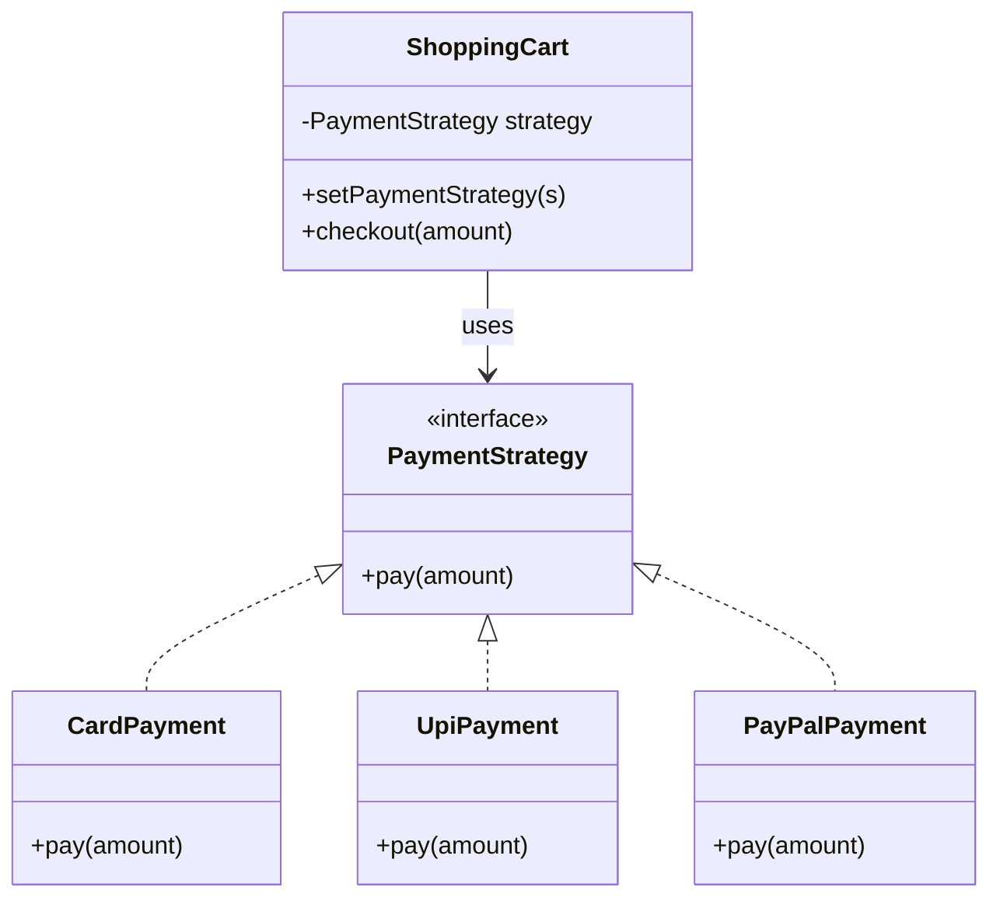

# 6. Strategy Design Pattern

We're now entering the **Behavioral Design Patterns**:

```text
Behavioral
├── Strategy
└── Observer
```

The **Strategy Pattern** is one of the most important patterns for Java/Spring interviews because it appears constantly in real backend systems.

Its core idea:

> **Define a family of interchangeable algorithms/behaviors, encapsulate each one separately, and make them interchangeable at runtime.**

The simplest mental model is:

```text
Strategy
→ "I have multiple ways to do the same thing."
```

For example:

```text
Payment
├── Credit Card
├── UPI
└── PayPal
```

or:

```text
Shipping
├── Standard
├── Express
└── Overnight
```

or:

```text
Discount
├── Regular
├── Premium
└── Festival
```

Instead of putting all of these algorithms into one giant `if-else`, Strategy separates them.

---

# 1. Start with the problem

Suppose we build a payment system.

```java
public class PaymentService {

    public void pay(String paymentType, double amount) {

        if ("CARD".equals(paymentType)) {

            System.out.println(
                    "Processing card payment: " + amount
            );

        } else if ("UPI".equals(paymentType)) {

            System.out.println(
                    "Processing UPI payment: " + amount
            );

        } else if ("PAYPAL".equals(paymentType)) {

            System.out.println(
                    "Processing PayPal payment: " + amount
            );

        } else {
            throw new IllegalArgumentException(
                    "Unsupported payment type"
            );
        }
    }
}
```

This works.

But look at what `PaymentService` now contains:

```text
PaymentService
├── Card algorithm
├── UPI algorithm
├── PayPal algorithm
└── selection logic
```

As more payment methods are added:

```text
CARD
UPI
PAYPAL
BANK_TRANSFER
APPLE_PAY
GOOGLE_PAY
...
```

the class keeps growing.

---

# 2. The real problem

The problem isn't simply "too many if statements."

The deeper problem is:

> **One class contains multiple interchangeable algorithms.**

For example:

```text
How should payment be processed?
      ↓
There are several algorithms.
      ↓
Choose one at runtime.
```

These algorithms vary independently from the main service.

That's exactly the situation Strategy addresses.

---

# 3. Extract the behavior into an interface

First define the common behavior:

```java
public interface PaymentStrategy {

    void pay(double amount);
}
```

Now each algorithm gets its own class.

### Card

```java
public class CardPaymentStrategy
        implements PaymentStrategy {

    @Override
    public void pay(double amount) {

        System.out.println(
                "Processing card payment: " + amount
        );
    }
}
```

### UPI

```java
public class UpiPaymentStrategy
        implements PaymentStrategy {

    @Override
    public void pay(double amount) {

        System.out.println(
                "Processing UPI payment: " + amount
        );
    }
}
```

### PayPal

```java
public class PayPalPaymentStrategy
        implements PaymentStrategy {

    @Override
    public void pay(double amount) {

        System.out.println(
                "Processing PayPal payment: " + amount
        );
    }
}
```

Now:

```text
               PaymentStrategy
                      ▲
          ┌───────────┼───────────┐
          │           │           │
          ▼           ▼           ▼
        Card         UPI        PayPal
      Strategy      Strategy     Strategy
```

Each class represents one algorithm.

---

# 4. The Context

We now need a class that **uses** a strategy.

This class is called the **Context**.

```java
public class PaymentService {

    private PaymentStrategy strategy;

    public PaymentService(
            PaymentStrategy strategy) {
        this.strategy = strategy;
    }

    public void pay(double amount) {
        strategy.pay(amount);
    }
}
```

Now the client decides which strategy to use:

```java
PaymentStrategy strategy =
        new UpiPaymentStrategy();

PaymentService service =
        new PaymentService(strategy);

service.pay(1000);
```

Output:

```text
Processing UPI payment: 1000.0
```

Change the strategy:

```java
PaymentStrategy strategy =
        new CardPaymentStrategy();

PaymentService service =
        new PaymentService(strategy);

service.pay(1000);
```

Now card processing happens.

The `PaymentService` code itself didn't change.

---

# 5. The structure

The classic Strategy structure is:

```text
                    Context
                       │
                       │ has-a
                       ▼
                  Strategy
                  ▲       ▲
                  │       │
             StrategyA  StrategyB
```

More completely:

```text
                     Client
                        │
                        ▼
                    Context
                        │
                        │ uses
                        ▼
                  ┌───────────┐
                  │ Strategy  │
                  └─────▲─────┘
                        │
               ┌────────┼────────┐
               ▼        ▼        ▼
             StrategyA StrategyB StrategyC
```

### Terminology

**Strategy**

The common interface.

```java
PaymentStrategy
```

**Concrete Strategies**

The different algorithms.

```java
CardPaymentStrategy
UpiPaymentStrategy
PayPalPaymentStrategy
```

**Context**

The class that uses a strategy.

```java
PaymentService
```

**Client**

The code that chooses/configures the strategy.

---

# 6. The key idea: encapsulate what varies

This is one of the most important design principles behind Strategy.

Ask:

> **What part of my code changes frequently?**

Suppose:

```text
PaymentService
```

has stable behavior:

```text
receive request
validate amount
log payment
call payment strategy
save result
```

but this part changes:

```text
How do I actually process payment?
```

Then extract that changing part:

```text
PaymentService
      │
      └── PaymentStrategy
             ├── Card
             ├── UPI
             └── PayPal
```

This is essentially:

> **Encapsulate the behavior that varies.**

That phrase is worth remembering.

---

# 7. Without Strategy vs With Strategy

## Without Strategy

```java
public class PaymentService {

    public void pay(
            String type,
            double amount) {

        if ("CARD".equals(type)) {
            // card algorithm
        } else if ("UPI".equals(type)) {
            // UPI algorithm
        } else if ("PAYPAL".equals(type)) {
            // PayPal algorithm
        }
    }
}
```

One class knows everything.

---

## With Strategy

```java
public class PaymentService {

    private final PaymentStrategy strategy;

    public PaymentService(
            PaymentStrategy strategy) {
        this.strategy = strategy;
    }

    public void pay(double amount) {
        strategy.pay(amount);
    }
}
```

Now:

```text
PaymentService
    ↓
PaymentStrategy
    ├── Card
    ├── UPI
    └── PayPal
```

This is much more extensible.

---

# 8. Why Strategy is a behavioral pattern

Remember:

```text
Creational
→ how objects are created

Structural
→ how objects are composed

Behavioral
→ how objects behave/interact
```

Strategy is behavioral because it changes **which algorithm/behavior the object uses**.

The object composition is important, but the main purpose is behavior selection.

---

# 9. Runtime switching

One of Strategy's strongest features is that the strategy can be changed at runtime.

Instead of setting it only in the constructor:

```java
public class PaymentService {

    private PaymentStrategy strategy;

    public void setStrategy(
            PaymentStrategy strategy) {
        this.strategy = strategy;
    }

    public void pay(double amount) {
        strategy.pay(amount);
    }
}
```

Usage:

```java
PaymentService service =
        new PaymentService();

service.setStrategy(
        new UpiPaymentStrategy()
);

service.pay(1000);
```

Later:

```java
service.setStrategy(
        new CardPaymentStrategy()
);

service.pay(1000);
```

Same context.

Different behavior.

Conceptually:

```text
             PaymentService
                   │
        ┌──────────┴──────────┐
        ▼                     ▼
   UPI Strategy          Card Strategy
```

The strategy is interchangeable.

---

# 10. Why is runtime switching useful?

Suppose shipping depends on order type.

```text
Standard order
→ StandardShipping

Premium order
→ ExpressShipping

International order
→ InternationalShipping
```

Instead of:

```java
if (...)
    ...
else if (...)
    ...
else if (...)
```

you can select:

```java
ShippingStrategy strategy =
        strategyFactory.get(order);

shippingService.setStrategy(strategy);
```

Then:

```java
shippingService.ship(order);
```

The shipping service doesn't care which algorithm is currently installed.

---

# 11. A very practical example: Discount calculation

Suppose an e-commerce application has:

```text
Regular customer
Premium customer
VIP customer
Festival promotion
```

Each has a different discount algorithm.

Define:

```java
public interface DiscountStrategy {

    double calculateDiscount(double amount);
}
```

Regular:

```java
public class RegularDiscountStrategy
        implements DiscountStrategy {

    @Override
    public double calculateDiscount(double amount) {
        return amount * 0.05;
    }
}
```

Premium:

```java
public class PremiumDiscountStrategy
        implements DiscountStrategy {

    @Override
    public double calculateDiscount(double amount) {
        return amount * 0.10;
    }
}
```

VIP:

```java
public class VipDiscountStrategy
        implements DiscountStrategy {

    @Override
    public double calculateDiscount(double amount) {
        return amount * 0.20;
    }
}
```

Context:

```java
public class PricingService {

    private final DiscountStrategy discountStrategy;

    public PricingService(
            DiscountStrategy discountStrategy) {
        this.discountStrategy = discountStrategy;
    }

    public double finalPrice(double amount) {

        double discount =
                discountStrategy.calculateDiscount(amount);

        return amount - discount;
    }
}
```

Now:

```java
PricingService service =
        new PricingService(
                new PremiumDiscountStrategy()
        );

double finalPrice =
        service.finalPrice(1000);
```

The pricing service doesn't know the discount formula.

It delegates that behavior to the strategy.

---

# 12. Strategy allows independent variation

This is a very important architectural concept.

Imagine:

```text
Order Processing
```

and:

```text
Payment algorithm
Shipping algorithm
Discount algorithm
```

These may all change independently.

Instead of one giant service:

```text
OrderService
├── payment if/else
├── shipping if/else
├── discount if/else
└── ...
```

we can have:

```text
OrderService
├── PaymentStrategy
├── ShippingStrategy
└── DiscountStrategy
```

Each dimension of behavior can vary independently.

This is one reason Strategy scales well.

---

# 13. Strategy vs inheritance

Suppose you have:

```text
PaymentService
```

and create:

```text
CardPaymentService
UpiPaymentService
PayPalPaymentService
```

using inheritance.

Now:

```text
PaymentService
      ▲
 ┌────┼────┐
 ▼    ▼    ▼
Card UPI PayPal
```

But these aren't necessarily different **types of PaymentService**.

They are different **ways of performing payment**.

Strategy models that relationship better:

```text
PaymentService
      │
      └── has-a PaymentStrategy
                    ▲
               ┌────┼────┐
               ▼    ▼    ▼
             Card  UPI PayPal
```

This is a classic:

> **is-a vs has-a** design decision.

---

# 14. Strategy promotes composition over inheritance

Inheritance:

```text
PaymentService
       ▲
       │
CardPaymentService
```

Strategy:

```text
PaymentService
       │
       └── has-a
             ↓
       PaymentStrategy
```

The behavior can be swapped without changing the Context's type.

This is a strong example of:

> **Favor composition over inheritance.**

---

# 15. Strategy and Open/Closed Principle

Strategy is often used to support OCP.

Suppose:

```java
public class PaymentService {

    private final PaymentStrategy strategy;

    public void pay(double amount) {
        strategy.pay(amount);
    }
}
```

We add:

```java
public class BankTransferStrategy
        implements PaymentStrategy {
}
```

The existing `PaymentService` doesn't need modification.

We've extended the behavior by adding another strategy.

So Strategy makes this kind of change cleaner.

---

# 16. Strategy and Single Responsibility Principle

Without Strategy:

```text
PaymentService
├── card logic
├── UPI logic
├── PayPal logic
└── payment orchestration
```

Multiple responsibilities.

With Strategy:

```text
PaymentService
→ coordinates payment

CardPaymentStrategy
→ card-specific logic

UpiPaymentStrategy
→ UPI-specific logic

PayPalPaymentStrategy
→ PayPal-specific logic
```

Each class becomes more focused.

---

# 17. Strategy vs Factory

This distinction is extremely important because Strategy and Factory are often used together.

### Strategy

Defines interchangeable behavior.

```text
PaymentStrategy
├── Card
├── UPI
└── PayPal
```

### Factory

Chooses/creates one of those strategies.

```text
PaymentStrategyFactory
          │
          ├── CARD → CardPaymentStrategy
          ├── UPI → UpiPaymentStrategy
          └── PAYPAL → PayPalPaymentStrategy
```

So:

```text
Factory
→ creates/selects the strategy

Strategy
→ performs the behavior
```

They complement each other.

---

# 18. Factory + Strategy together

This is a very common architecture.

```java
public class PaymentStrategyFactory {

    public PaymentStrategy getStrategy(
            String paymentType) {

        return switch (paymentType) {

            case "CARD" ->
                    new CardPaymentStrategy();

            case "UPI" ->
                    new UpiPaymentStrategy();

            case "PAYPAL" ->
                    new PayPalPaymentStrategy();

            default ->
                    throw new IllegalArgumentException(
                            "Unsupported payment type"
                    );
        };
    }
}
```

Then:

```java
PaymentStrategy strategy =
        factory.getStrategy("UPI");

PaymentService service =
        new PaymentService(strategy);

service.pay(1000);
```

Architecture:

```text
Client
  ↓
Factory
  ↓
Strategy
  ↓
Context uses Strategy
```

This combination shows up often in real systems.

---

# 19. Strategy vs State

This is one of the harder interview comparisons.

They look very similar structurally.

Both often have:

```text
Context
   ↓
interface
   ▲
multiple implementations
```

So what's the difference?

### Strategy

The client/application chooses the algorithm.

Example:

```text
PaymentService
→ CardStrategy
```

The strategy represents:

> **How should I perform this operation?**

---

### State

The object's behavior changes because its internal **state changes**.

Example:

```text
Order
├── CreatedState
├── PaidState
├── ShippedState
└── DeliveredState
```

The order transitions:

```text
Created
  ↓
Paid
  ↓
Shipped
  ↓
Delivered
```

The object's state determines its behavior.

So:

```text
Strategy
→ behavior selected by choice

State
→ behavior changes based on state
```

This is a very useful distinction.

---

# 20. Strategy vs Template Method

Another classic comparison.

### Strategy

Uses composition.

```text
Context
   ↓
Strategy
```

You can swap behavior.

### Template Method

Usually uses inheritance.

```java
public abstract class DataProcessor {

    public final void process() {

        readData();
        transform();
        writeData();
    }

    protected abstract void transform();
}
```

The algorithm skeleton is fixed by the parent.

So:

```text
Strategy
→ composition + interchangeable algorithm

Template Method
→ inheritance + fixed algorithm skeleton
```

This distinction is very commonly asked.

---

# 21. Strategy vs Decorator

You've just learned Decorator.

Both can involve interfaces and composition, but their goals differ.

### Strategy

Chooses **one algorithm**.

```text
PaymentService
    ↓
CardStrategy
```

### Decorator

Stacks **additional responsibilities**.

```text
Service
  ↓
LoggingDecorator
  ↓
MetricsDecorator
  ↓
ActualService
```

So:

```text
Strategy
→ replace behavior

Decorator
→ augment behavior
```

That's an excellent interview distinction.

---

# 22. Strategy vs Command

Another useful comparison.

### Strategy

Represents:

> **How to perform an operation.**

```text
SortStrategy
├── QuickSort
├── MergeSort
└── HeapSort
```

### Command

Represents:

> **A request/action as an object.**

```text
CreateOrderCommand
CancelOrderCommand
RefundOrderCommand
```

Command is useful for things like:

```text
queueing
logging
undo/redo
scheduling
```

Strategy is about choosing an algorithm.

---

# 23. Strategy with Java functional interfaces

For simple algorithms, you don't always need separate classes.

Java allows Strategy-like behavior using lambdas.

For example:

```java
public class Calculator {

    public int calculate(
            int a,
            int b,
            BinaryOperator<Integer> strategy) {

        return strategy.apply(a, b);
    }
}
```

Usage:

```java
Calculator calculator = new Calculator();

int result = calculator.calculate(
        10,
        5,
        (a, b) -> a + b
);
```

Subtraction:

```java
int result = calculator.calculate(
        10,
        5,
        (a, b) -> a - b
);
```

Multiplication:

```java
int result = calculator.calculate(
        10,
        5,
        (a, b) -> a * b
);
```

This is essentially Strategy using functions.

Conceptually:

```text
Context
   ↓
Function
   ├── addition
   ├── subtraction
   └── multiplication
```

This is an important modern Java perspective.

---

# 24. Strategy with `Function`

Suppose we have:

```java
Function<Order, Double> discountStrategy;
```

Then:

```java
Function<Order, Double> regular =
        order -> order.getAmount() * 0.05;

Function<Order, Double> premium =
        order -> order.getAmount() * 0.10;
```

And:

```java
public double calculate(
        Order order,
        Function<Order, Double> strategy) {

    return strategy.apply(order);
}
```

Now the function itself acts as the Strategy.

So Java 8+ makes lightweight Strategy implementations extremely easy.

---

# 25. When should we use separate strategy classes?

Use separate classes when the algorithm is:

```text
complex
reused
has dependencies
has configuration/state
needs unit tests independently
contains significant domain logic
```

For example:

```text
CreditCardPaymentStrategy
```

might depend on:

```text
PaymentGatewayClient
FraudChecker
Logger
Metrics
```

That's a strong candidate for a class.

For a simple two-line calculation:

```java
a -> a * 0.10
```

a lambda may be enough.

---

# 26. Strategy in Spring Boot

This is extremely important for your interviews.

Suppose:

```java
public interface PaymentStrategy {

    PaymentResult pay(PaymentRequest request);
}
```

Implementations:

```java
@Component
public class UpiPaymentStrategy
        implements PaymentStrategy {

    @Override
    public PaymentResult pay(
            PaymentRequest request) {
        // ...
    }
}
```

```java
@Component
public class CardPaymentStrategy
        implements PaymentStrategy {

    @Override
    public PaymentResult pay(
            PaymentRequest request) {
        // ...
    }
}
```

Now Spring manages the strategies.

You can inject all implementations:

```java
@Component
public class PaymentStrategyFactory {

    private final Map<String, PaymentStrategy> strategies;

    public PaymentStrategyFactory(
            Map<String, PaymentStrategy> strategies) {
        this.strategies = strategies;
    }

    public PaymentStrategy get(String type) {

        PaymentStrategy strategy =
                strategies.get(type);

        if (strategy == null) {
            throw new IllegalArgumentException(
                    "Unsupported payment type: " + type
            );
        }

        return strategy;
    }
}
```

This is essentially:

```text
Spring DI
    ↓
Strategy implementations
    ↓
Factory/registry
    ↓
selected Strategy
```

This is a very common Spring Boot design.

---

# 27. Strategy with `Map<String, Strategy>`

This pattern is especially useful when replacing giant `if-else` or `switch` logic.

Instead of:

```java
switch (type) {

    case "CARD":
        return new CardPaymentStrategy();

    case "UPI":
        return new UpiPaymentStrategy();

    case "PAYPAL":
        return new PayPalPaymentStrategy();

    default:
        throw ...;
}
```

you can have:

```text
Map<String, PaymentStrategy>
```

such as:

```text
"CARD"   → CardPaymentStrategy
"UPI"    → UpiPaymentStrategy
"PAYPAL" → PayPalPaymentStrategy
```

Then:

```java
PaymentStrategy strategy =
        strategies.get(type);
```

This is very readable.

---

# 28. Spring example with names

One approach:

```java
@Component("CARD")
public class CardPaymentStrategy
        implements PaymentStrategy {
}
```

```java
@Component("UPI")
public class UpiPaymentStrategy
        implements PaymentStrategy {
}
```

```java
@Component("PAYPAL")
public class PayPalPaymentStrategy
        implements PaymentStrategy {
}
```

Then:

```java
@Component
public class PaymentStrategyFactory {

    private final Map<String, PaymentStrategy> strategies;

    public PaymentStrategyFactory(
            Map<String, PaymentStrategy> strategies) {
        this.strategies = strategies;
    }

    public PaymentStrategy get(String type) {
        return strategies.get(type);
    }
}
```

This can be a clean alternative to large conditional blocks.

---

# 29. Strategy can reduce conditional complexity

This is one of its most practical benefits.

Before:

```java
if (type.equals("A")) {
    ...
} else if (type.equals("B")) {
    ...
} else if (type.equals("C")) {
    ...
} else if (type.equals("D")) {
    ...
}
```

After:

```text
type
 ↓
strategy lookup
 ↓
selected strategy
 ↓
execute()
```

Architecture:

```text
                    PaymentService
                          │
                          ▼
                  StrategyRegistry
                          │
             ┌────────────┼────────────┐
             ▼            ▼            ▼
           CARD          UPI         PAYPAL
          Strategy      Strategy      Strategy
```

The business code becomes simpler.

---

# 30. But Strategy doesn't magically eliminate conditionals

This is an important nuance.

You still need some mechanism to select a strategy.

For example:

```java
strategies.get(type)
```

or:

```java
switch (type)
```

Somewhere, the mapping exists.

So the goal isn't:

> "Remove every if statement."

The goal is:

> **Move algorithm-specific logic out of the core Context and isolate it behind an abstraction.**

That's much more precise.

---

# 31. A more realistic example: Shipping

Define:

```java
public interface ShippingStrategy {

    double calculateShipping(Order order);
}
```

Standard:

```java
public class StandardShippingStrategy
        implements ShippingStrategy {

    @Override
    public double calculateShipping(Order order) {
        return 50;
    }
}
```

Express:

```java
public class ExpressShippingStrategy
        implements ShippingStrategy {

    @Override
    public double calculateShipping(Order order) {
        return 150;
    }
}
```

International:

```java
public class InternationalShippingStrategy
        implements ShippingStrategy {

    @Override
    public double calculateShipping(Order order) {
        return 500;
    }
}
```

Context:

```java
public class ShippingService {

    private final ShippingStrategy strategy;

    public ShippingService(
            ShippingStrategy strategy) {
        this.strategy = strategy;
    }

    public double calculateShipping(
            Order order) {

        return strategy.calculateShipping(order);
    }
}
```

Client:

```java
ShippingService service =
        new ShippingService(
                new ExpressShippingStrategy()
        );

double cost =
        service.calculateShipping(order);
```

Again:

```text
ShippingService
       ↓
ShippingStrategy
       ├── Standard
       ├── Express
       └── International
```

---

# 32. Strategy can contain complex state/dependencies

A common misconception is that Strategy must be a tiny algorithm.

Not true.

For example:

```java
@Component
public class FraudAwarePaymentStrategy
        implements PaymentStrategy {

    private final FraudService fraudService;
    private final PaymentGateway gateway;

    public FraudAwarePaymentStrategy(
            FraudService fraudService,
            PaymentGateway gateway) {

        this.fraudService = fraudService;
        this.gateway = gateway;
    }

    @Override
    public PaymentResult pay(
            PaymentRequest request) {

        fraudService.check(request);

        return gateway.pay(request);
    }
}
```

This is still a Strategy because it represents one interchangeable way of performing payment.

---

# 33. Strategy and dependency inversion

Instead of:

```java
PaymentService
   ↓
CardPaymentStrategy
```

the context depends on:

```java
PaymentStrategy
```

The concrete implementation is supplied externally.

This is exactly the sort of dependency inversion that makes systems more flexible.

---

# 34. Strategy and testing

This is another major advantage.

Suppose:

```java
public class PricingService {

    private final DiscountStrategy strategy;

    public PricingService(
            DiscountStrategy strategy) {
        this.strategy = strategy;
    }

    public double finalPrice(double amount) {
        return amount -
                strategy.calculateDiscount(amount);
    }
}
```

In a unit test, you can provide:

```java
DiscountStrategy fakeStrategy =
        amount -> 100;
```

Then:

```java
PricingService service =
        new PricingService(fakeStrategy);
```

You don't need the real discount logic.

This makes testing much easier.

---

# 35. Strategy and mocking

With Spring or Mockito:

```java
@Mock
private DiscountStrategy strategy;
```

Then:

```java
when(strategy.calculateDiscount(1000))
        .thenReturn(100.0);
```

Your test focuses on:

```text
PricingService
```

rather than the actual discount algorithm.

This is one of the practical benefits of dependency inversion through Strategy.

---

# 36. When Strategy is a good fit

Think of Strategy when you hear:

```text
"multiple algorithms"
"different ways of doing something"
"behavior changes based on type"
"we need to switch behavior"
"large if-else/switch"
"new variations keep being added"
```

Examples:

```text
Payment methods
Shipping methods
Discount rules
Pricing rules
Sorting algorithms
Compression algorithms
Notification channels
Authentication methods
Tax calculation
Routing algorithms
File export formats
```

---

# 37. When Strategy may be unnecessary

Suppose you have:

```java
public int calculate(int a, int b) {
    return a + b;
}
```

and there is never another algorithm.

You don't need:

```text
AdditionStrategy
AdditionStrategyFactory
CalculatorContext
StrategyRegistry
```

That would be overengineering.

Strategy is useful when there are **meaningful alternatives**.

---

# 38. Strategy vs simple polymorphism

This is a subtle question.

You might ask:

> "Isn't Strategy just polymorphism?"

In a sense, Strategy absolutely **uses polymorphism**.

But Strategy gives us a named design structure:

```text
Context
+
Strategy abstraction
+
interchangeable implementations
```

Polymorphism is the language mechanism.

Strategy is the design approach using that mechanism to encapsulate interchangeable behavior.

So:

```text
Polymorphism
→ mechanism

Strategy
→ design pattern using that mechanism
```

This is a useful interview distinction.

---

# 39. Strategy vs inheritance in detail

Imagine a report processor.

Without Strategy:

```text
ReportProcessor
      ▲
      │
PDFReportProcessor
ExcelReportProcessor
CSVReportProcessor
```

If the only difference is:

> "How should this report be exported?"

Strategy is often more natural:

```text
ReportProcessor
     │
     └── ReportExportStrategy
              ├── Pdf
              ├── Excel
              └── Csv
```

The processor remains the same.

Only the algorithm varies.

---

# 40. Strategy can be combined with Template Method

You can actually use both.

For example:

```java
public abstract class ReportProcessor {

    public final void process() {
        validate();
        generate();
        export();
    }

    protected abstract void export();
}
```

Inside another design, export could itself be provided through Strategy.

Patterns don't have to exist in isolation.

Real systems often combine them.

---

# 41. Strategy and immutability

A Context can hold a final strategy:

```java
private final PaymentStrategy strategy;
```

Then the Context's behavior is fixed for its lifetime.

Or it can be mutable:

```java
private PaymentStrategy strategy;

public void setStrategy(
        PaymentStrategy strategy) {
    this.strategy = strategy;
}
```

The choice depends on whether runtime switching is actually required.

Don't make the strategy mutable just because the pattern allows it.

---

# 42. A complete Spring-style example

Let's build a realistic design.

### Strategy

```java
public interface TaxStrategy {

    BigDecimal calculateTax(
            BigDecimal amount);
}
```

### India tax

```java
@Component("INDIA")
public class IndiaTaxStrategy
        implements TaxStrategy {

    @Override
    public BigDecimal calculateTax(
            BigDecimal amount) {

        return amount
                .multiply(new BigDecimal("0.18"));
    }
}
```

### UK tax

```java
@Component("UK")
public class UkTaxStrategy
        implements TaxStrategy {

    @Override
    public BigDecimal calculateTax(
            BigDecimal amount) {

        return amount
                .multiply(new BigDecimal("0.20"));
    }
}
```

### Factory/registry

```java
@Component
public class TaxStrategyFactory {

    private final Map<String, TaxStrategy> strategies;

    public TaxStrategyFactory(
            Map<String, TaxStrategy> strategies) {

        this.strategies = strategies;
    }

    public TaxStrategy get(String country) {

        TaxStrategy strategy =
                strategies.get(country);

        if (strategy == null) {
            throw new IllegalArgumentException(
                    "Unsupported country: " + country
            );
        }

        return strategy;
    }
}
```

### Service

```java
@Service
public class TaxService {

    private final TaxStrategyFactory factory;

    public TaxService(
            TaxStrategyFactory factory) {
        this.factory = factory;
    }

    public BigDecimal calculateTax(
            String country,
            BigDecimal amount) {

        TaxStrategy strategy =
                factory.get(country);

        return strategy.calculateTax(amount);
    }
}
```

Architecture:

```text
                  TaxService
                      │
                      ▼
              TaxStrategyFactory
                      │
               ┌──────┴──────┐
               ▼             ▼
          IndiaStrategy   UkStrategy
               │             │
               └──────┬──────┘
                      ▼
                TaxStrategy
```

This is a very good example to know for a Spring Boot interview.

---

# 43. An important Spring nuance

Spring beans are usually singleton-scoped by default.

So if you have:

```java
@Component
public class UpiPaymentStrategy
        implements PaymentStrategy {
}
```

Spring typically maintains one bean instance per `ApplicationContext`.

That doesn't change the fact that the **role** of the class is Strategy.

The pattern is about behavior abstraction and interchangeability.

Spring simply manages the objects.

---

# 44. Strategy and interface segregation

The Strategy interface should generally be focused.

Good:

```java
public interface DiscountStrategy {

    double calculateDiscount(double amount);
}
```

Bad:

```java
public interface DiscountStrategy {

    double calculateDiscount(double amount);

    void sendEmail();

    void saveToDatabase();

    void generateInvoice();

    void processPayment();
}
```

A Strategy interface should define the behavior that actually varies.

This keeps implementations clean.

---

# 45. Strategy and Null Object

Sometimes there's a "do nothing" strategy.

For example:

```java
public class NoDiscountStrategy
        implements DiscountStrategy {

    @Override
    public double calculateDiscount(
            double amount) {
        return 0;
    }
}
```

Instead of:

```java
if (strategy != null) {
    ...
}
```

you can always have:

```text
NoDiscountStrategy
```

This is related to the **Null Object Pattern**.

It can simplify client code.

---

# 46. A subtle design question: who selects the Strategy?

There are several possibilities.

### Client selects

```java
new PaymentService(
    new UpiPaymentStrategy()
);
```

Simple and explicit.

### Factory selects

```java
factory.get("UPI");
```

Useful when selection logic is centralized.

### Framework/DI selects

Spring configuration can determine which implementation gets injected.

### Context itself selects

Possible, but often this means the Context becomes responsible for choosing strategies, which can reintroduce conditional complexity.

A common architecture is:

```text
Client
  ↓
Factory/Registry
  ↓
Strategy
  ↓
Context
```

or:

```text
Controller
   ↓
Strategy factory
   ↓
Service using strategy
```

The right choice depends on the domain.

---

# 47. Common interview trap

Interviewer:

> "I have an `if-else`. Should I always use Strategy?"

Answer:

> **No.**

An `if-else` isn't automatically bad.

Strategy is useful when:

* the alternatives represent real interchangeable behaviors,
* they are likely to evolve,
* the algorithms are substantial,
* or separating them improves maintainability/testability.

For a tiny conditional:

```java
if (age >= 18) {
    ...
}
```

Strategy would be excessive.

---

# 48. Common interview question: "What problem does Strategy solve?"

Strong answer:

> "Strategy encapsulates a family of interchangeable algorithms behind a common interface. The context depends on that abstraction and can use different implementations without changing its own code."

---

# 49. "Why use Strategy instead of if-else?"

Strong answer:

> "When conditional branches represent independently varying algorithms, Strategy moves those algorithms into separate classes. This reduces conditional complexity, follows composition over inheritance, improves testability, and makes new behaviors easier to add."

Notice the answer does **not** claim every `if-else` should be eliminated.

---

# 50. "What is the Context?"

Answer:

> "The Context is the class that uses a Strategy to perform an operation. It delegates the variable behavior to the Strategy rather than implementing that behavior itself."

Example:

```java
public class PaymentService {

    private final PaymentStrategy strategy;

    public void pay(double amount) {
        strategy.pay(amount);
    }
}
```

`PaymentService` is the Context.

---

# 51. "Can Strategy be changed at runtime?"

Yes.

For example:

```java
paymentService.setStrategy(
        new UpiPaymentStrategy()
);

paymentService.pay(1000);

paymentService.setStrategy(
        new CardPaymentStrategy()
);

paymentService.pay(1000);
```

That is one of Strategy's characteristic capabilities.

But again, you only need runtime switching if the domain requires it.

---

# 52. "Strategy vs State?"

Excellent answer:

> "Both can have a Context and interchangeable implementations. Strategy represents different algorithms chosen to perform a task, while State represents behavior that changes as an object's internal state transitions."

Memory aid:

```text
Strategy
→ Which algorithm should I use?

State
→ What behavior should I have in my current state?
```

---

# 53. "Strategy vs Template Method?"

Answer:

> "Strategy uses composition and allows the algorithm to be swapped. Template Method uses inheritance and defines a fixed algorithm skeleton, allowing subclasses to customize specific steps."

---

# 54. "Can Strategy be implemented with lambdas?"

Yes.

For simple behaviors:

```java
Function<Order, BigDecimal> strategy =
        order -> order.getAmount()
                .multiply(new BigDecimal("0.10"));
```

Java functional interfaces provide a concise implementation of Strategy-like behavior.

---

# 55. "How does Spring help implement Strategy?"

A very good Spring answer:

> "Spring's dependency injection can manage multiple implementations of a Strategy interface. We can inject them individually, as a collection, or as a `Map<String, Strategy>`, and select the appropriate strategy based on business criteria."

This is a highly practical Spring Boot interview answer.

---

# 56. Strategy and your previous patterns

Let's connect everything you've learned.

### Factory + Strategy

```text
Factory
→ chooses Strategy
```

### Builder + Strategy

```text
Builder
→ configures an object with a particular Strategy
```

### Decorator + Strategy

```text
Strategy
→ selects algorithm

Decorator
→ adds behavior around that algorithm
```

### Singleton + Strategy

A Strategy implementation could technically be Singleton-scoped when stateless.

In Spring:

```text
@Component
```

would normally give you one bean instance per `ApplicationContext`.

So patterns can work together.

---

# 57. Strategy mental model

Whenever you encounter:

```text
"There are several different ways to perform X."
```

think:

```text
                    X
                    │
             multiple algorithms
                    │
        ┌───────────┼───────────┐
        ▼           ▼           ▼
    Strategy A  Strategy B  Strategy C
        │           │           │
        └───────────┼───────────┘
                    ▼
                 Context
```

The Context says:

> "I don't care how you do it. I just need the operation."

Each Strategy says:

> "I'll decide how to do it."

---

# 58. Strategy vs the patterns you've learned

| Pattern      | Main question                                         |
| ------------ | ----------------------------------------------------- |
| Singleton    | How many instances should exist?                      |
| Factory      | Which object should be created?                       |
| Builder      | How should an object be constructed/configured?       |
| Adapter      | How do I make incompatible interfaces work together?  |
| Decorator    | How do I add behavior without changing the interface? |
| **Strategy** | **Which algorithm/behavior should I use?**            |

This gives you a very useful overall mental map:

```text
CREATIONAL
─────────────────────────────
Singleton → instance control
Factory   → creation choice
Builder   → construction process


STRUCTURAL
─────────────────────────────
Adapter   → compatibility
Decorator → behavior extension


BEHAVIORAL
─────────────────────────────
Strategy  → algorithm selection
```

---

# 59. The one diagram I'd remember for Strategy

```text
                         CLIENT
                            │
                            │ chooses
                            ▼
                         CONTEXT
                            │
                            │ delegates to
                            ▼
                      ┌─────────────┐
                      │  STRATEGY   │
                      └──────▲──────┘
                             │
              ┌──────────────┼──────────────┐
              │              │              │
              ▼              ▼              ▼
          Strategy A      Strategy B     Strategy C
              │              │              │
              ▼              ▼              ▼
          Algorithm A     Algorithm B    Algorithm C
```

The key relationship is:

```text
Context HAS-A Strategy
```

rather than:

```text
Context IS-A Strategy
```

---

# 60. Interview-ready definition

When an interviewer asks:

> **"Explain Strategy Pattern."**

A strong answer is:

> "Strategy is a behavioral design pattern used when we have multiple interchangeable algorithms for the same operation. We define a common Strategy interface, put each algorithm in its own implementation, and let a Context delegate the variable behavior to a selected Strategy. This reduces conditional complexity and allows the behavior to be changed without modifying the Context."

Then give a quick example:

```java
PaymentService service =
        new PaymentService(
                new UpiPaymentStrategy()
        );

service.pay(1000);
```

And explain:

```text
PaymentService = Context
PaymentStrategy = Strategy
UpiPaymentStrategy = Concrete Strategy
```

That is a solid interview answer.

---

# 61. What you should master before moving on

You should be comfortable with:

```text
1. What problem Strategy solves
2. What Context means
3. What Strategy interface means
4. Concrete Strategies
5. Encapsulating what varies
6. Composition vs inheritance
7. Strategy vs Factory
8. Strategy vs State
9. Strategy vs Template Method
10. Strategy vs Decorator
11. Strategy + Factory
12. Strategy + Spring DI
13. Map<String, Strategy>
14. Strategy with lambdas
15. Testing with injected strategies
16. When Strategy is overengineering
```

The most important three distinctions to lock in are:

```text
Factory
→ Which object?

Strategy
→ Which behavior/algorithm?

Decorator
→ What extra behavior should I add?
```

And the single best sentence to remember:

> **Strategy encapsulates interchangeable behavior so that the behavior can vary independently of the object that uses it.**

Say **`next`** when you're ready for the final pattern in your list: **Observer**.

---
---
---
---
---
---
---
---
---
---
---
---
---
---
---
---
---
---
---
---
---
---
---
---
---
---
---
---
---
---
---
---
---
---
---
---
---
---
---
---
---
---
---
---

# Strategy Design Pattern in Java

## 1. The Story: Why Does This Pattern Exist?

Imagine you are building an **online shopping checkout**. On day 1, the customer can pay by **Card**. You write this:

```java
class CheckoutService {
    void pay(String type, double amount) {
        if (type.equals("CARD")) {
            System.out.println("Paid " + amount + " using Card");
        }
    }
}
```

Simple. Then the business says: "Add UPI." Then "Add PayPal." Then "Add Crypto." Then "Add Wallet."

```java
class CheckoutService {
    void pay(String type, double amount) {
        if (type.equals("CARD")) {
            // card validation, OTP, gateway call...
        } else if (type.equals("UPI")) {
            // UPI id check, collect request...
        } else if (type.equals("PAYPAL")) {
            // login, token, redirect...
        } else if (type.equals("CRYPTO")) {
            // wallet address, network fee...
        }
        // ... this keeps growing forever
    }
}
```

### What is wrong with this?

| Problem | Meaning in simple words |
|---|---|
| **Breaks Open/Closed Principle** | To add a new payment, you must **edit** old, working code. Every edit can break something. |
| **Giant class** | One class knows *everything* about all payments. |
| **Hard to test** | You cannot test Card logic alone. It is stuck inside a big if-else. |
| **Team conflicts** | Two developers adding two payments edit the same method, so merge conflicts. |
| **No runtime flexibility** | Hard to swap behavior cleanly. |

This is the exact pain the Strategy pattern removes.

---

## 2. What Is the Strategy Pattern?

> **Definition:** Define a *family of algorithms*, put each one in its **own class**, and make them **interchangeable** behind a common interface. The client can pick or switch the algorithm at runtime.

Think of Google Maps. You choose **Car**, **Walk**, or **Bike**. The goal is the same (reach the destination), but the **way** (algorithm) changes. Maps doesn't rewrite itself. It just plugs in a different route strategy.

### The 3 Players

```
+---------------------+         +---------------------------+
|      CONTEXT        |  has-a  |   STRATEGY (interface)    |
|---------------------| ------> |---------------------------|
| - strategy          |         | + execute(...)            |
| + doWork()          |         +---------------------------+
+---------------------+                     ^
                                            | implements
                       +--------------------+--------------------+
                       |                    |                    |
              +----------------+   +----------------+   +----------------+
              | StrategyA      |   | StrategyB      |   | StrategyC      |
              | execute()      |   | execute()      |   | execute()      |
              +----------------+   +----------------+   +----------------+
                  (Concrete Strategies: each has ONE algorithm)
```

1. **Strategy (interface):** the common contract, such as `pay(amount)`.
2. **Concrete Strategies:** the actual algorithms (`CardPayment`, `UpiPayment`).
3. **Context:** the class that *uses* a strategy. It doesn't know which one, only that it follows the contract.

### Same thing in Mermaid



---

## 3. How It Solves the Problem (Step by Step)

**Step 1: Find what changes.** The payment *method* changes. The checkout flow stays the same.

**Step 2: Pull it out behind an interface.**

```java
public interface PaymentStrategy {
    void pay(double amount);
}
```

**Step 3: One class per algorithm.**

```java
public class CardPayment implements PaymentStrategy {
    private final String cardNumber;

    public CardPayment(String cardNumber) {
        this.cardNumber = cardNumber;
    }

    @Override
    public void pay(double amount) {
        System.out.println("Paid " + amount + " using Card " + cardNumber);
    }
}

public class UpiPayment implements PaymentStrategy {
    private final String upiId;

    public UpiPayment(String upiId) {
        this.upiId = upiId;
    }

    @Override
    public void pay(double amount) {
        System.out.println("Paid " + amount + " using UPI " + upiId);
    }
}

public class PayPalPayment implements PaymentStrategy {
    private final String email;

    public PayPalPayment(String email) {
        this.email = email;
    }

    @Override
    public void pay(double amount) {
        System.out.println("Paid " + amount + " using PayPal " + email);
    }
}
```

**Step 4: The Context holds a strategy and delegates.**

```java
public class ShoppingCart {
    private PaymentStrategy strategy;   // has-a (composition)

    public void setPaymentStrategy(PaymentStrategy strategy) {
        this.strategy = strategy;
    }

    public void checkout(double amount) {
        if (strategy == null) {
            throw new IllegalStateException("Choose a payment method first");
        }
        strategy.pay(amount);           // delegate, no if-else!
    }
}
```

**Step 5: The client picks the strategy.**

```java
public class Main {
    public static void main(String[] args) {
        ShoppingCart cart = new ShoppingCart();

        cart.setPaymentStrategy(new CardPayment("1234-5678"));
        cart.checkout(500);

        cart.setPaymentStrategy(new UpiPayment("ravi@upi"));   // switch at runtime
        cart.checkout(250);
    }
}
```

**Output:**
```
Paid 500.0 using Card 1234-5678
Paid 250.0 using UPI ravi@upi
```

### Before vs After

```
BEFORE                                  AFTER
------                                  -----
+-------------------+                   +-------------+      +-----------------+
| CheckoutService   |                   | ShoppingCart| ---> | PaymentStrategy |
|  if card ...      |                   +-------------+      +-----------------+
|  else if upi ...  |                                          ^    ^     ^
|  else if paypal.. |                                          |    |     |
|  else if crypto.. |                                        Card  UPI  PayPal
+-------------------+                                       (add Crypto = add 1 new class,
 (edit this class                                             touch NOTHING else)
  for every change)
```

Adding **Crypto** now means one new class and zero edits to `ShoppingCart`. That is the Open/Closed Principle in action.

---

## 4. Example 2: Discount Calculation (with Java Lambdas)

A store has different discount rules: **Festival**, **Student**, **No discount**.

Since each strategy has only *one method*, it is a **functional interface**. In modern Java (8+) you don't need separate classes for simple logic.

```java
@FunctionalInterface
public interface DiscountStrategy {
    double apply(double price);
}
```

```java
public class PriceCalculator {
    private final DiscountStrategy strategy;

    public PriceCalculator(DiscountStrategy strategy) {   // injected via constructor
        this.strategy = strategy;
    }

    public double finalPrice(double price) {
        return strategy.apply(price);
    }
}
```

```java
public class Main {
    public static void main(String[] args) {
        DiscountStrategy none     = price -> price;
        DiscountStrategy festival = price -> price * 0.80;   // 20% off
        DiscountStrategy student  = price -> price * 0.90;   // 10% off

        System.out.println(new PriceCalculator(none).finalPrice(1000));      // 1000.0
        System.out.println(new PriceCalculator(festival).finalPrice(1000));  // 800.0
        System.out.println(new PriceCalculator(student).finalPrice(1000));   // 900.0
    }
}
```

### Picking a strategy without if-else: use a Map

```java
Map<String, DiscountStrategy> strategies = Map.of(
    "NONE",     price -> price,
    "FESTIVAL", price -> price * 0.80,
    "STUDENT",  price -> price * 0.90
);

String userChoice = "FESTIVAL";
DiscountStrategy chosen = strategies.getOrDefault(userChoice, strategies.get("NONE"));
System.out.println(chosen.apply(1000));   // 800.0
```

> **Tip:** Strategy removes the if-else *inside the algorithm*. Somewhere you still have to *choose* a strategy. Keep that choice in one place (a Map, a factory, or dependency injection), not scattered around.

---

## 5. Example 3: You Already Use It Daily: `Comparator`

`Collections.sort()` doesn't know *how* you want things sorted. You give it the strategy.

```java
List<String> names = new ArrayList<>(List.of("Charlie", "Al", "Bobby"));

// Strategy 1: alphabetical
names.sort(Comparator.naturalOrder());
System.out.println(names);   // [Al, Bobby, Charlie]

// Strategy 2: by length
names.sort(Comparator.comparingInt(String::length));
System.out.println(names);   // [Al, Bobby, Charlie]

// Strategy 3: reverse alphabetical
names.sort((a, b) -> b.compareTo(a));
System.out.println(names);   // [Charlie, Bobby, Al]
```

Mapping to the pattern:

```
Context   ----->  List.sort(...)
Strategy  ----->  Comparator<T>  (interface with compare())
Concrete  ----->  naturalOrder(), comparingInt(...), your lambda
```

Other Strategy examples in Java and frameworks:
- `Comparator` (sorting)
- `ThreadPoolExecutor`'s `RejectedExecutionHandler` (what to do when the pool is full)
- Spring Security's `PasswordEncoder` (BCrypt, PBKDF2, etc.)
- `java.util.zip` compression choices, and Spring's `Resource` loaders

---

## 6. Example 4: Changing Behavior at Runtime (Game Character)

This shows the real power: **a strategy can be swapped while the object is alive**.

A game enemy attacks differently depending on its health.

```java
public interface AttackStrategy {
    void attack();
}

public class MeleeAttack implements AttackStrategy {
    public void attack() { System.out.println("Hits with sword"); }
}

public class RangedAttack implements AttackStrategy {
    public void attack() { System.out.println("Shoots an arrow"); }
}

public class RunAway implements AttackStrategy {
    public void attack() { System.out.println("Too weak! Running away..."); }
}
```

```java
public class Enemy {
    private AttackStrategy attackStrategy = new MeleeAttack();
    private int health = 100;

    public void takeDamage(int damage) {
        health -= damage;
        if (health < 30) {
            attackStrategy = new RunAway();          // swap at runtime
        } else if (health < 70) {
            attackStrategy = new RangedAttack();     // swap at runtime
        }
    }

    public void performAttack() {
        attackStrategy.attack();
    }
}
```

```java
Enemy orc = new Enemy();
orc.performAttack();      // Hits with sword
orc.takeDamage(40);
orc.performAttack();      // Shoots an arrow
orc.takeDamage(40);
orc.performAttack();      // Too weak! Running away...
```

### Why not use inheritance instead?

If you make `MeleeOrc`, `RangedOrc`, `RunAwayOrc`, and later `MeleeElf`, `RangedElf`..., you get **class explosion**, and an object cannot change its class while running. Composition (has-a strategy) solves both.

```
INHERITANCE (bad here)              COMPOSITION / STRATEGY (good)
----------------------              -----------------------------
        Enemy                               Enemy ----has----> AttackStrategy
       /  |  \                                                     ^   ^   ^
 MeleeOrc RangedOrc ...                                        Melee Ranged RunAway
 MeleeElf RangedElf ...
 (2 races x 3 attacks = 6 classes)          (2 races + 3 attacks = 5 small parts,
  and behavior is locked forever)            mix and match, swap anytime)
```

---

## 7. When Should You Use Strategy?

Use it when you see these **smells**:

- A long `if-else` or `switch` that picks between **different ways of doing the same thing**.
- You have **several similar classes** that differ only in *one behavior*.
- You want to **switch behavior at runtime**.
- You want to **add new behaviors without touching existing code**.
- You want to **test each algorithm alone**.
- You want to **hide algorithm details** from the class that uses them.

Real-life use cases: payments, shipping cost, discounts and tax rules, sorting and searching, compression (zip/rar), route planning, validation rules, authentication (OAuth/JWT/Basic), notification channels (email/SMS/push).

### When NOT to use it

- You have only **2 simple options** that will never grow. A plain `if` is fine. Don't over-engineer.
- The algorithm **never changes** and is not selected at runtime.
- Clients would be confused by too many strategy classes, when a simple lambda or method reference would do.

---

## 8. Strategy vs Similar Things

| Compare | Difference |
|---|---|
| **Strategy vs if-else** | if-else hard-codes choices inside one class. Strategy moves each choice into its own class. |
| **Strategy vs State** | Both look the same structurally. In **Strategy**, the *client* picks the algorithm and they are independent. In **State**, the object *changes state itself* and states often know each other. |
| **Strategy vs Template Method** | Template Method uses **inheritance** (a fixed skeleton, subclass overrides steps, chosen at compile time). Strategy uses **composition** (swap the whole algorithm at runtime). |
| **Strategy vs Factory** | Factory *creates* objects. Strategy *uses* interchangeable behaviors. They often work together: a factory returns the right strategy. |

Quick memory trick:
```
Strategy = "HOW do I do this?"      (client chooses the how)
State    = "WHAT mode am I in?"     (object changes its own mode)
```

---

## 9. How to Explain It in an Interview

### The 30-second answer

> "Strategy is a behavioral design pattern. It lets you define a family of algorithms, put each in a separate class behind a common interface, and make them interchangeable. The main class, called the context, holds a reference to the interface and delegates work to it, so the algorithm can change at runtime without modifying the context. It removes big if-else blocks and follows the Open/Closed Principle."

### The 2-minute structured answer (use this flow)

```
1. PROBLEM   -> "Say we have payments: card, UPI, PayPal in one big if-else."
2. PAIN      -> "Every new payment edits old code, hard to test, violates OCP."
3. SOLUTION  -> "Create a PaymentStrategy interface, one class per payment."
4. CONTEXT   -> "ShoppingCart has-a PaymentStrategy and just calls pay()."
5. BENEFIT   -> "Add new payment = add new class. Swap at runtime. Easy tests."
6. REAL WORLD-> "Java's Comparator is Strategy: sort() is context."
```

Tip: draw the small class diagram on the whiteboard. Interviewers love it.

### Likely follow-up questions and short answers

**Q1. Which SOLID principles does it support?**
Open/Closed (extend without modifying), Single Responsibility (one class per algorithm), Dependency Inversion (the context depends on an interface, not concrete classes).

**Q2. Where is Strategy used in the JDK or frameworks?**
`Comparator`, `RejectedExecutionHandler`, Spring Security `PasswordEncoder`, `LayoutManager` in Swing.

**Q3. How is Strategy different from State?**
The client chooses a strategy and strategies are independent. In State, the object transitions between states itself and states know about each other.

**Q4. What are the disadvantages?**
More classes and files. The client must know the differences between strategies to choose one. Overkill for simple cases.

**Q5. How do you avoid if-else when *choosing* the strategy?**
Use a `Map<String, Strategy>`, a factory, an enum with behavior, or Spring's dependency injection (`Map<String, PaymentStrategy>` autowired by bean name).

**Q6. Can lambdas replace strategy classes?**
Yes, when the strategy interface has a single method (functional interface). Use classes when a strategy has state or complex logic.

**Q7. Why composition over inheritance here?**
Inheritance locks behavior at compile time and causes class explosion. Composition allows runtime swapping and reuse.

### Common mistakes to avoid saying

- "Strategy is just polymorphism." Polymorphism is the *tool*. Strategy is the *design* that uses it.
- Forgetting to mention **runtime switching** and **Open/Closed**.
- Confusing it with State without explaining who decides the change.

---

## 10. Quick Cheat Sheet

```
+--------------------------------------------------------------+
| STRATEGY PATTERN                                             |
|--------------------------------------------------------------|
| Type      : Behavioral                                       |
| Intent    : Make algorithms interchangeable                  |
| Key idea  : Composition + Interface + Delegation             |
| Removes   : Big if-else / switch on "type"                   |
| Principle : Open/Closed, Single Responsibility, DIP          |
| Java hint : Functional interface + lambda for simple cases   |
| JDK sample: Comparator                                       |
| Steps     : 1) Interface  2) Concrete classes                |
|             3) Context holds interface  4) Client injects    |
+--------------------------------------------------------------+
```

### Ready-made template

```java
// 1. Strategy
interface Strategy { Result execute(Input in); }

// 2. Concrete strategies
class StrategyA implements Strategy { public Result execute(Input in) { /* ... */ return null; } }
class StrategyB implements Strategy { public Result execute(Input in) { /* ... */ return null; } }

// 3. Context
class Context {
    private Strategy strategy;
    Context(Strategy strategy) { this.strategy = strategy; }
    void setStrategy(Strategy s) { this.strategy = s; }   // optional runtime swap
    Result run(Input in) { return strategy.execute(in); }
}
```

---

## Practice Tasks (to lock it in)

1. **Shipping cost:** build `StandardShipping`, `ExpressShipping`, and `FreeShipping` strategies for an `Order`.
2. **Text formatter:** `UpperCaseFormat`, `LowerCaseFormat`, `TitleCaseFormat` using lambdas.
3. **Notification sender:** `Email`, `SMS`, `Push` strategies with a `Map`-based selector.
4. **Refactor challenge:** take any method with 4+ `else if` branches from your own project and convert it to Strategy.

If you'd like, I can review your solutions to any of these, or build a mock interview round where I ask the questions and you answer.

