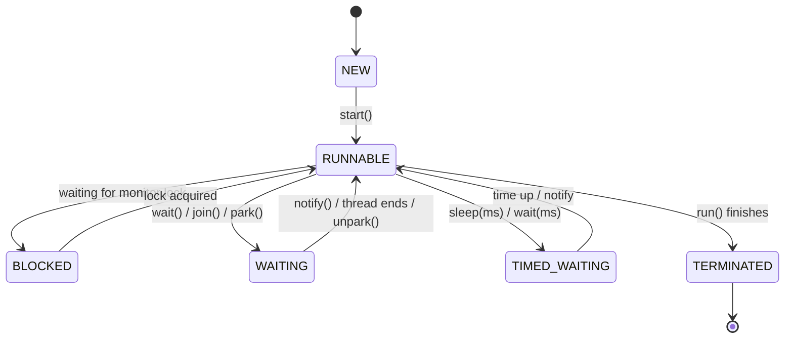
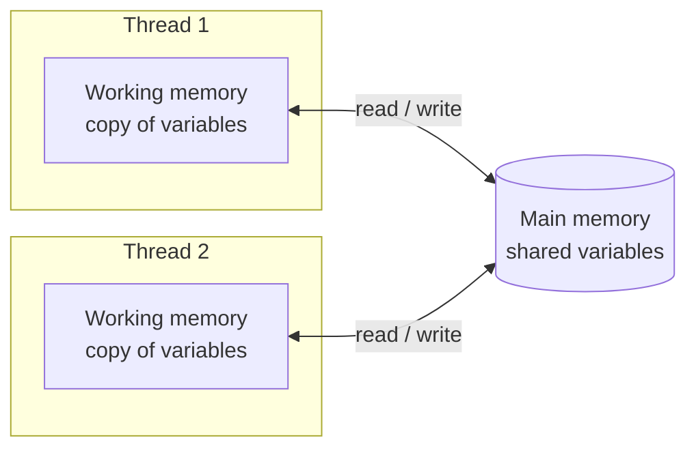
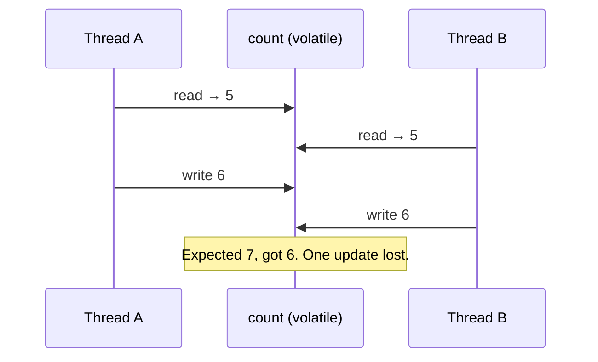
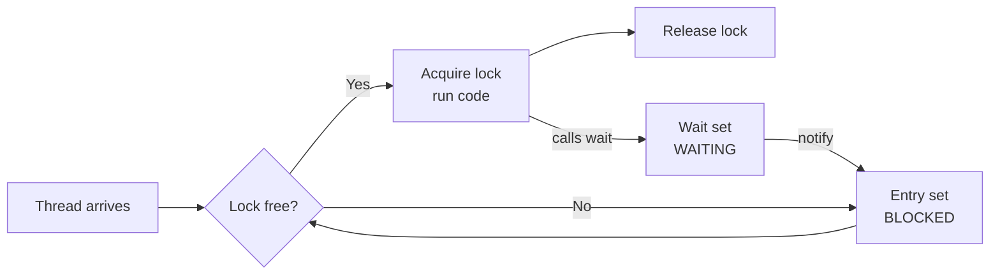
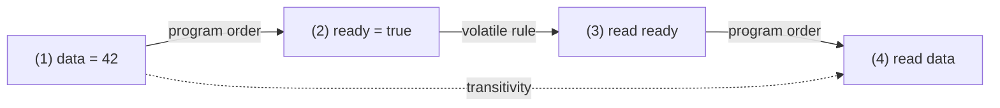

# Concept 1: Threads

## Beginner

**Q1. What is a thread? How is it different from a process?**

A process is a running program. It has its own memory space. A thread is a smaller unit of work that runs *inside* a process.

The key difference is memory:

| | Process | Thread |
|---|---|---|
| Memory | Has its own separate memory | Shares the heap with other threads of the same process |
| Creation cost | Heavy | Lightweight |
| Communication | Hard (needs pipes, sockets, etc.) | Easy (just read and write shared objects) |
| If one crashes | Others are usually safe | Can bring down the whole process |

Every thread gets its own **stack** (local variables, method calls). But all threads share the **heap** (objects, static fields).

This one fact is the root of every concurrency problem. If threads did not share memory, we would not need `volatile`, `synchronized`, or the Java Memory Model at all.

**Q2. How do you create a thread in Java?**

There are three common ways.

```java
// 1. Extend Thread
class MyThread extends Thread {
    public void run() { System.out.println("Hello from " + getName()); }
}
new MyThread().start();

// 2. Implement Runnable (preferred)
Runnable task = () -> System.out.println("Hello from " + Thread.currentThread().getName());
new Thread(task).start();

// 3. Use an ExecutorService (best for real projects)
ExecutorService pool = Executors.newFixedThreadPool(4);
pool.submit(task);
pool.shutdown();
```

Why is Runnable preferred over extending Thread? Two reasons. Java has single inheritance, so extending Thread uses up your only chance to extend a class. Also, Runnable separates *what to run* from *how to run it*. That makes the task reusable with thread pools.

**Q3. What is the difference between `start()` and `run()`?** (Very common question.)

`start()` asks the JVM to create a **new thread**. That new thread then calls `run()`.

If you call `run()` directly, it is just a normal method call. It runs on the **current** thread. No new thread is created.

```java
Thread t = new Thread(() -> System.out.println(Thread.currentThread().getName()));

t.run();    // prints "main"      (no new thread)
t.start();  // prints "Thread-0"  (new thread)
```

Also remember that calling `start()` twice on the same thread throws `IllegalThreadStateException`. A thread object can only be started once.

## Intermediate

**Q4. What are the states of a thread?**

A Java thread is always in one of these states (from `Thread.State`):

| State | Meaning |
|---|---|
| `NEW` | Created, but `start()` not called yet |
| `RUNNABLE` | Running, or ready to run and waiting for CPU |
| `BLOCKED` | Waiting to get a `synchronized` lock |
| `WAITING` | Waiting forever for another thread (`wait()`, `join()`, `LockSupport.park()`) |
| `TIMED_WAITING` | Same, but with a time limit (`sleep(ms)`, `wait(ms)`, `join(ms)`) |
| `TERMINATED` | `run()` has finished |



A common trap: Java has no separate "RUNNING" state. A thread that is actually on the CPU and a thread that is waiting for its turn are both `RUNNABLE`. The OS scheduler decides who runs, and Java does not expose that.

**Q5. What does `join()` do?**

`t.join()` makes the **calling thread wait** until thread `t` finishes.

```java
Thread worker = new Thread(() -> {
    // heavy work
});
worker.start();
worker.join();   // main waits here until worker is done
System.out.println("Worker finished");
```

There is a bonus point here that interviewers love. `join()` also gives you a **happens-before** guarantee. Everything the worker thread did is guaranteed to be visible to the thread that called `join()` once it returns. We will go deep into this in the happens-before concept.

**Q6. What is the difference between `sleep()` and `wait()`?**

| | `sleep()` | `wait()` |
|---|---|---|
| Belongs to | `Thread` class (static) | `Object` class |
| Releases the lock? | **No** | **Yes** |
| Needs `synchronized`? | No | **Yes** (else `IllegalMonitorStateException`) |
| Wakes up when | Time is over | Time is over, or `notify()`/`notifyAll()` is called |
| Purpose | Pause for some time | Coordinate between threads |

Simple way to remember: `sleep` means "I'm taking a nap, but I'm still holding my lock." `wait` means "I'll step aside and give up my lock until someone tells me something has changed."

**Q7. What is a daemon thread?**

A daemon thread is a background helper thread, like the garbage collector. The JVM does **not** wait for daemon threads before shutting down. When all non-daemon (user) threads finish, the JVM exits and kills any daemon threads immediately, even in the middle of work.

```java
Thread t = new Thread(() -> { while (true) { /* background work */ } });
t.setDaemon(true);   // must be called BEFORE start()
t.start();
```

Do not use daemon threads for work that must finish, like writing to a file or a database. They can be cut off halfway.

## Advanced

**Q8. How do you stop a thread safely? Why is `stop()` bad?**

`Thread.stop()` is deprecated because it kills the thread at a random point. The thread releases all its locks in the middle of an operation. Objects can be left half-updated and corrupted.

The right way is **cooperative cancellation** using interruption.

```java
Thread t = new Thread(() -> {
    while (!Thread.currentThread().isInterrupted()) {
        try {
            doWork();
            Thread.sleep(100);
        } catch (InterruptedException e) {
            Thread.currentThread().interrupt(); // restore the flag
            break;                              // and exit cleanly
        }
    }
    // cleanup here
});
t.start();
// later
t.interrupt();
```

Key points to say in the interview:
- `interrupt()` does not kill the thread. It only sets a flag (or wakes the thread if it's blocked in `sleep`, `wait`, or `join`).
- Blocking methods throw `InterruptedException` and **clear** the flag. So, in the catch block, either exit or call `Thread.currentThread().interrupt()` to put the flag back. Never swallow it silently.

**Q9. Why is thread-safety a problem at all? Show a simple broken example.**

Because `count++` looks like one step, but it is actually three: read, add, write.

```java
class Counter {
    int count = 0;
    void increment() { count++; }   // NOT thread-safe
}
```

If two threads run `increment()` 1000 times each, you expect 2000. You will often get less, say 1850. Why? Two threads can both read `5`, both add 1, and both write `6`. One update is lost.

This is a **race condition**: the result depends on the timing of threads. It is the perfect example to start any Java Memory Model discussion, and it leads straight into our next concepts: *atomicity*, *visibility*, and *ordering*.

**Q10. What are platform threads vs virtual threads?**

Platform threads are thin wrappers around OS threads. They are expensive: each uses about 1 MB of stack, and you can only have a few thousand.

Virtual threads (final in Java 21) are lightweight threads managed by the JVM, not the OS. You can create millions of them. When a virtual thread blocks on I/O, the JVM parks it and lets the underlying OS thread run something else.

```java
Thread.startVirtualThread(() -> System.out.println("Hi from a virtual thread"));
```

They are great for I/O-heavy work like handling many web requests. They do **not** make CPU-heavy code faster. One more important point: virtual threads do **not** change the Java Memory Model. `volatile`, `synchronized`, and happens-before work the same way for them.

## Quick recap

- Threads share the heap, and each has its own stack. That sharing is why we have concurrency bugs.
- Use `start()`, not `run()`.
- `sleep` keeps the lock. `wait` releases it.
- Stop threads with interruption, never with `stop()`.
- `count++` is not atomic. This is the seed of everything coming next.

**Next up: Concept 2, the Java Memory Model (why threads can see stale values).** Say "next" when you're ready.

---
---
---

# Concept 2: The Java Memory Model (JMM)

## Beginner

**Q1. What is the Java Memory Model?**

The Java Memory Model is a set of **rules** in the Java language specification. These rules answer one question:

> *When one thread writes to a variable, when is another thread guaranteed to see that write?*

That's it. The JMM is not a piece of memory. It is a contract between you, the JVM, the compiler, and the CPU. It says: "If you follow these rules (use `volatile`, `synchronized`, `final`, etc.), I promise your threads will see each other's changes in a predictable way. If you don't follow them, I promise nothing."

**Q2. Is the JMM the same as JVM memory areas like heap, stack, and metaspace?**

No. This is a very common confusion, so interviewers like to test it.

| | JVM Runtime Memory Areas | Java Memory Model |
|---|---|---|
| Question it answers | *Where* is data stored? | *When* are changes visible between threads? |
| Topics | Heap, stack, metaspace, GC | `volatile`, `synchronized`, happens-before |
| Type | Layout of memory | Rules of behavior |

**Q3. Why do we even need the JMM? Why can't threads just see the latest value always?**

Because modern computers are built for speed, and "always see the latest value" is slow. Three things get in the way:

1. **CPU caches.** Each CPU core has its own cache. A write may sit in one core's cache for a while before other cores can see it.
2. **Registers.** A thread may keep a variable in a CPU register while working on it, and not re-read it from memory.
3. **Reordering.** The compiler, the JIT, and the CPU can all change the **order** of instructions if they think the result is the same for a single thread.

All of these make your program faster. But with multiple threads, they cause surprising results. The JMM tells us exactly how much "surprise" is allowed, and what tools we have to remove it.

**Q4. What are the three core problems in concurrent programs?**

| Problem | Meaning | Example |
|---|---|---|
| **Atomicity** | Is an operation done in one indivisible step? | `count++` is really read, add, write |
| **Visibility** | Will other threads see my write? | A thread never sees `running = false` |
| **Ordering** | Do operations happen in the order I wrote them? | Another thread sees `b = 1` but still sees old `a` |

Almost every concurrency bug is one of these three. The tools we'll learn next (`volatile`, `synchronized`, atomics) each fix some of them, not all. Knowing which tool fixes which problem is the heart of this topic.

## Intermediate

**Q5. Explain a visibility problem with a real example.**

```java
class Worker {
    boolean running = true;   // no volatile

    void run() {
        while (running) {
            // do work
        }
        System.out.println("Stopped");
    }

    void stop() { running = false; }
}
```

Thread A runs `run()`. Thread B calls `stop()`. You would expect Thread A to stop. But it may **run forever**.

Why? Thread A reads `running` once and sees `true`. Nothing inside the loop tells the JIT that another thread may change it. So the JIT can legally turn the code into something like:

```java
if (running) {
    while (true) { /* work */ }   // never re-reads the field
}
```

Thread B's write might also sit in its own cache and never reach Thread A. Both are allowed by the JMM, because there is no rule forcing the write to become visible.

The fix is to declare `volatile boolean running`. We'll cover why in the `volatile` concept.

**Q6. What is instruction reordering? Who does it, and why is it allowed?**

Reordering means the actual execution order is different from the order in your source code. It can be done by:
- the **compiler** (when generating bytecode),
- the **JIT** (when optimizing),
- the **CPU** (out-of-order execution, store buffers).

It is allowed because of the **as-if-serial rule**: within a *single* thread, the result must look as if the code ran in order. So this is fine for one thread:

```java
int a = 1;
int b = 2;   // can be swapped with the line above, nobody can tell
```

But other threads can tell. Here is the classic example:

```java
// shared, all start at 0
int a = 0, b = 0, x = 0, y = 0;

// Thread 1          // Thread 2
a = 1;               b = 1;
x = b;               y = a;
```

You might think at least one of `x` and `y` must be 1. But the result `x == 0 && y == 0` is **possible**. Each thread can have its write delayed (in a store buffer) while its read goes ahead. As a single thread, each one is fine. Together, they break your intuition.

**Q7. What is the difference between a race condition and a data race?**

People mix these up, and the difference matters.

- **Data race** (a JMM term): two threads access the **same variable**, at least one is a **write**, and there is **no happens-before ordering** between them. It is a precise definition.
- **Race condition** (a general term): the program's correctness depends on the **timing** of threads.

They are different. You can have one without the other:

```java
// Race condition WITHOUT a data race:
// Both methods are synchronized, so no data race.
// But "check then act" across two calls is still a timing bug.
if (!map.containsKey(k)) {   // thread 2 can sneak in here
    map.put(k, v);           // even if each call is synchronized
}
```

```java
// Data race (the read and write are unordered):
boolean ready;              // plain field
// Thread A: ready = true;
// Thread B: if (ready) {...}
```

Data races are dangerous because, once you have one, the JMM allows very weird behavior. Race conditions are a logic issue you fix with better design (for example, `putIfAbsent`).

**Q8. Are reads and writes of `long` and `double` atomic in Java?**

Not always, for ordinary fields. The JMM allows a 64-bit `long` or `double` write to be done as **two separate 32-bit writes**. Another thread might see half of the new value and half of the old one. This is called **word tearing**.

| Type | Plain read/write atomic? |
|---|---|
| `int`, `boolean`, `byte`, `short`, `char`, `float`, references | Yes |
| `long`, `double` | Not guaranteed |
| `volatile long` / `volatile double` | **Yes, guaranteed** |

In practice, modern 64-bit JVMs do it atomically. But the spec does not promise it, so never rely on it. Mark the field `volatile` or protect it with a lock.

Note that "atomic read/write" is not the same as "atomic `count++`". Even if a single read and a single write are atomic, the read-then-write combination is not.

## Advanced

**Q9. Is the "main memory and working memory" picture literally how the hardware works?**

No. It is a **mental model**, and a useful one. The model says each thread has a private "working memory" (like a cache) and there is a shared "main memory":



A write by Thread 1 goes into its working memory first. It reaches main memory later, and Thread 2 may read from its own stale copy until it refreshes.

Real hardware has registers, store buffers, L1/L2/L3 caches, and more. The JMM does not describe any of that. It gives the **rules** in terms of *happens-before*, and that is what you should use to reason about code. The two-memory picture is only for building intuition.

**Q10. What guarantee does the JMM give if my program has no data races?**

This is the most important guarantee in the whole model. It is called **DRF-SC**: *Data-Race-Free programs behave as if they are Sequentially Consistent.*

In simple words: if you use proper synchronization so that there are **no data races**, then you can forget about caches, reordering, and everything else. Your program behaves as if:
- all operations happen in **one single global order**, and
- each thread's operations appear in **program order**.

That is the easy mental model we all want. So the real advice is not "understand every reordering trick." It is "**remove all data races**, and the JMM gives you the simple model back." If you leave a data race, you're on your own.

**Q11. Why does my code work on my laptop but fail in production?**

Because different CPUs have different **hardware memory models**:

| Hardware | Memory model | Reordering allowed |
|---|---|---|
| x86 (most laptops/servers) | Strong (TSO) | Few (mainly store then load) |
| ARM (Apple M-series, AWS Graviton, phones) | Weak | Many |

A buggy, data-racy program may *happen* to work on x86 because the hardware is strict. Move it to ARM, or upgrade the JVM so the JIT optimizes more aggressively, and it breaks. The bug was always there. Your test environment just didn't expose it.

This is why you must write to the **JMM rules**, not to "what I observed working." Testing cannot prove a data race is absent.

**Q12. What is "safe publication"? What does `final` have to do with it?**

Publishing an object means making it reachable by other threads. **Unsafe publication** can let another thread see the object **before its constructor has fully finished**, with some fields still at default values.

```java
class Config {
    int port;
    Config() { port = 8080; }
}

// Shared plain field, no synchronization
static Config config;

// Thread A:  config = new Config();
// Thread B:  if (config != null) use(config.port);  // may see port == 0 !
```

The write to `config` can become visible **before** the write to `port` (reordering again). Thread B sees a non-null object with `port == 0`.

The JMM gives a special rule for **`final` fields**: once the constructor finishes, any thread that sees the object reference is guaranteed to see the correct values of its `final` fields, even without extra synchronization (as long as `this` did not escape during construction).

```java
class Config {
    final int port;              // safe: always seen as 8080
    Config() { port = 8080; }
}
```

Other ways to publish safely: store it in a `volatile` field, a field guarded by a lock, a `static` initializer, or a concurrent collection. This is also the reason the famous double-checked locking pattern needs `volatile`. We'll return to that later.

**Q13. What does the JMM say about "out-of-thin-air" values?**

It says they are **not allowed**. Even in a program with data races, a thread cannot read a value that no thread ever wrote. For example, it can't see `42` if the program only ever writes `0` and `1`. The JMM keeps this minimum safety, even for racy code. (The one exception people mention is `long`/`double` tearing without `volatile`, where you might see a mix of two valid values.)

Note what this does and does not promise. You may read a stale or unexpected-order value, but not a random invention.

## Quick recap

- The JMM is a **rulebook** about when writes become visible. It is not the same as heap and stack.
- CPU caches, registers, and reordering are the reasons we need it.
- Three problems: **atomicity, visibility, ordering**.
- A **data race** has no happens-before. A race condition is a timing bug. They are different.
- **No data races means it behaves as if sequentially consistent.** This is the big goal.
- Working on x86 does not mean it is correct. Code to the rules.

**Next up: Concept 3, `volatile` (what it fixes, what it doesn't, and why `volatile int count; count++` is still broken).** Say "next" when you're ready.

---
---
---

# Concept 3: `volatile`

## Beginner

**Q1. What does `volatile` do?**

`volatile` is a keyword you put on a **field**. It gives you two guarantees:

1. **Visibility.** When a thread writes to a volatile variable, every other thread that reads it afterwards sees that new value. No stale copies.
2. **Ordering.** The compiler, JIT, and CPU are not allowed to reorder operations around a volatile read or write in a way that breaks the guarantee (more on this in Q5).

It does **not** give you atomicity for compound actions like `count++`. Remember this line, because it's the most common interview trap.

**Q2. Show a simple case where `volatile` fixes a bug.**

Remember the stop-flag from the last concept:

```java
class Worker {
    volatile boolean running = true;   // now it works

    void run() {
        while (running) {
            // do work
        }
        System.out.println("Stopped");
    }

    void stop() { running = false; }
}
```

Without `volatile`, the loop could run forever because Thread A may never see the update. With `volatile`, every read of `running` goes to the latest value, and the JIT is not allowed to cache it in a register and skip re-reading.

**Q3. Does `volatile` make `count++` thread-safe?**

**No.** This is the most asked volatile question.

```java
volatile int count = 0;

void increment() { count++; }   // STILL broken
```

`count++` is three steps: **read, add 1, write**. `volatile` makes each read and each write visible. But it does not glue the three steps together. Two threads can still do this:



Visibility was fine. Both threads saw the real value. The problem is **atomicity**, and `volatile` does not solve that. Use `AtomicInteger`, `synchronized`, or a lock instead.

**Q4. When is `volatile` enough?**

When your use of the variable follows this pattern: **one thread (or any threads) simply writes a value, and other threads simply read it, and the new value does not depend on the old value.**

Good fits:
- A **status flag**: `volatile boolean shutdown`, `volatile boolean ready`.
- Publishing a **new immutable object**: `volatile Config config;` where writers replace the whole object.
- A value written by **only one thread** and read by many (for example, the latest sensor reading).

Bad fits:
- Counters (`count++`).
- Anything like "check then update" (`if (x == 0) x = 1`).
- Keeping two variables consistent with each other (for example, `min <= max`).

## Intermediate

**Q5. What is the happens-before rule for `volatile`?**

> A write to a volatile variable **happens-before** every later read of that same variable.

"Later" means later in the synchronization order, so the read that actually sees that write or a newer one.

What makes this powerful is that it doesn't only cover the volatile variable itself. It covers **everything the writer did before the write**. This is called the "piggybacking" effect:

```java
int data = 0;
volatile boolean ready = false;

// Thread A (writer)
data = 42;          // (1) plain write
ready = true;       // (2) volatile write

// Thread B (reader)
if (ready) {                  // (3) volatile read, sees true
    System.out.println(data); // (4) guaranteed to print 42
}
```

Why is this safe? Because (1) comes before (2) in program order. (2) happens-before (3). (3) comes before (4) in program order. Happens-before is **transitive**, so (1) happens-before (4). Thread B must see `data == 42`.

If `ready` were not volatile, Thread B could see `ready == true` and still read `data == 0`. The volatile write acts like a "release" and the volatile read like an "acquire."

**Q6. How does the JVM actually implement `volatile`?**

It uses **memory barriers** (also called fences). These are special CPU instructions that stop reordering and force buffered writes to become visible.

Conceptually:

| Step | What the JVM does |
|---|---|
| Before a volatile **write** | Makes sure all earlier reads and writes are finished first |
| After a volatile **write** | Flushes it so other cores can see it |
| After a volatile **read** | Makes sure later reads and writes do not move above it |

On x86, most of this is cheap because the hardware is already strong. A volatile **write** needs one expensive fence (like `lock addl` or `mfence`), while volatile **reads** are nearly free. On ARM, both cost more.

You don't need to memorize instruction names for an L4/L5 interview. What matters is to say: "It's implemented with memory barriers that prevent reordering and force visibility, and it costs more than a normal variable but far less than a lock."

**Q7. Does `volatile` use locking? Can it block threads?**

No. `volatile` is **non-blocking**. No thread ever waits for another to read or write a volatile field. That is why it is cheaper than `synchronized` and cannot cause a deadlock.

The trade-off is that it gives fewer guarantees: visibility and ordering, but no mutual exclusion.

**Q8. What does `volatile` mean on an object reference or an array?**

It applies only to the **reference itself**, not to what it points to.

```java
volatile int[] arr = new int[10];

arr = new int[20];   // volatile write, visible to all (good)
arr[3] = 99;         // NOT a volatile write! Just a plain write into the array.
```

Changing `arr[3]` has no volatile guarantee. The same is true for volatile references to mutable objects: `volatile List<String> list` makes the **reference** safe, but `list.add("x")` is not protected.

If you need per-element volatile behavior, use `AtomicIntegerArray`, `AtomicReferenceArray`, or `VarHandle`.

**Q9. Can I use `volatile` with `final`?**

No. The compiler rejects `final volatile`. A `final` field never changes after construction, so there is nothing to make visible later. They are opposite ideas, and `final` has its own separate safe-publication rule (from the last concept).

## Advanced

**Q10. Why does double-checked locking need `volatile`?**

Here is the classic lazy singleton:

```java
class Singleton {
    private static volatile Singleton instance;   // volatile is required

    static Singleton getInstance() {
        if (instance == null) {                    // 1st check, no lock (fast path)
            synchronized (Singleton.class) {
                if (instance == null) {            // 2nd check, with lock
                    instance = new Singleton();
                }
            }
        }
        return instance;
    }
}
```

The line `instance = new Singleton()` is really three steps:

1. Allocate memory.
2. Run the constructor (set up fields).
3. Assign the address to `instance`.

Without `volatile`, steps 2 and 3 can be **reordered**: 1, then 3, then 2. Now another thread in the first check sees `instance != null`, skips the lock, and gets an object whose constructor has **not finished**. It would use a half-built object.

`volatile` forbids that reordering. The write to `instance` only becomes visible after the constructor is complete. Since Java 5 (when the JMM was fixed), this pattern is correct, but only with `volatile`.

Also mention that a simpler and safe alternative is the **holder idiom** (a static inner class) or an `enum` singleton. Both rely on class loading guarantees and need no `volatile`.

**Q11. Is `volatile` enough when only one thread writes?**

Often yes, and this is a useful trick. If there is **exactly one writer thread**, even `count++` on a volatile is safe from lost updates, because no two threads are ever doing the read-modify-write at the same time. Readers just need visibility.

```java
volatile long lastHeartbeat;   // only the heartbeat thread writes; many threads read
```

But the moment a second writer appears, it breaks. That is a fragile design, so if you rely on this, write a comment saying so.

**Q12. Compare `volatile`, `synchronized`, and `AtomicInteger`.**

| | `volatile` | `synchronized` | `AtomicInteger` |
|---|---|---|---|
| Visibility | Yes | Yes | Yes |
| Ordering | Yes | Yes | Yes |
| Atomic `count++` | **No** | Yes | Yes (`incrementAndGet`) |
| Mutual exclusion over a block | No | **Yes** | No |
| Blocks threads? | No | Yes | No (uses CAS) |
| Works for multiple variables together | No | Yes | No |
| Typical use | Flags, publishing a reference | Protecting invariants, compound actions | Counters, sequence numbers |

A good one-line answer: "Use `volatile` for simple state that is just written and read. Use atomics for single-variable compound updates like counters. Use `synchronized` or locks when several variables or steps must change together."

**Q13. Why can a volatile variable still give a wrong result in "check-then-act" code?**

Because the **check** and the **act** are two separate operations, and another thread can slip in between.

```java
volatile boolean initialized = false;

void init() {
    if (!initialized) {       // Thread A and B both see false
        doExpensiveSetup();   // both run the setup!
        initialized = true;
    }
}
```

Every read and write is visible, but nothing stops both threads from entering the `if`. Fix it with `synchronized`, or with a compare-and-set:

```java
AtomicBoolean initialized = new AtomicBoolean(false);

void init() {
    if (initialized.compareAndSet(false, true)) {
        doExpensiveSetup();   // only one thread wins
    }
}
```

**Q14. Does `volatile` prevent *all* reordering?**

No. It prevents reordering **around the volatile access** in specific directions:

- Normal reads/writes **before** a volatile write cannot move **after** it.
- Normal reads/writes **after** a volatile read cannot move **before** it.
- Volatile accesses are not reordered with each other.

But ordinary operations **between** two volatile accesses can still be shuffled among themselves if nobody can tell in a single thread. So do not think of `volatile` as a full barrier around all code, only as a one-way fence with "release" on write and "acquire" on read.

## Quick recap

- `volatile` = **visibility + ordering**, never atomicity of compound actions.
- `volatile int count; count++` is still broken. Use `AtomicInteger`.
- A volatile write happens-before a later volatile read, and it also publishes everything the writer did before.
- It's non-blocking and cheaper than a lock.
- On a reference or array it covers only the **reference**, not the contents.
- Double-checked locking needs `volatile` to stop the half-constructed object problem.

**Next up: Concept 4, `synchronized` (monitors, locks, mutual exclusion, and what it guarantees about visibility).** Say "next" when you're ready.


---
---
---

# Concept 4: `synchronized`

## Beginner

**Q1. What does `synchronized` do?**

`synchronized` gives you two guarantees at the same time:

1. **Mutual exclusion (atomicity).** Only **one thread at a time** can run the protected code for a given lock. Others wait their turn.
2. **Visibility and ordering.** When a thread enters the block, it sees everything the previous thread did inside it. When a thread leaves, its changes are published.

This is the big difference from `volatile`. `volatile` gives only the second guarantee. `synchronized` gives both, so it can make compound actions like `count++` safe.

```java
class Counter {
    private int count = 0;

    synchronized void increment() { count++; }   // now safe
    synchronized int get()        { return count; }
}
```

**Q2. What are the different ways to use `synchronized`?**

| Form | Which lock is used |
|---|---|
| `synchronized void foo()` (instance method) | `this` (the current object) |
| `static synchronized void foo()` | The `Class` object, e.g. `Counter.class` |
| `synchronized (obj) { ... }` (block) | Whatever object you pass in |

```java
class Example {
    private final Object lock = new Object();

    synchronized void a() { }                    // locks on 'this'
    static synchronized void b() { }             // locks on Example.class
    void c() { synchronized (lock) { } }         // locks on 'lock'
}
```

The most important thing to understand is this: **the lock is what matters, not the code.** Two threads block each other only if they use the **same lock object**.

**Q3. Do `a()` and `b()` above block each other?**

No. `a()` uses `this` as the lock, and `b()` uses `Example.class`. They are different locks, so one thread can be in `a()` while another is in `b()`.

A quick rule to remember: an instance `synchronized` method locks the **object**. A static `synchronized` method locks the **class**. Two different objects of the same class have two different locks, so their instance methods don't block each other.

**Q4. Is a `synchronized` block better than a `synchronized` method?**

Usually yes, for two reasons.

- **Smaller critical section.** You lock only the lines that need it, so threads wait less.
- **Private lock.** With a method, the lock is `this`, which any outside code can also grab by writing `synchronized (yourObject)`. With a private lock object, nobody else can interfere.

```java
void process() {
    doSlowWorkThatIsSafe();          // no lock needed
    synchronized (lock) {
        sharedState.update();        // only this part is locked
    }
}
```

**Q5. What happens if an exception is thrown inside a `synchronized` block?**

The lock is **released automatically**. You don't need a `try/finally` like you do with `ReentrantLock`. The JVM guarantees the release when the block exits, whether normally or by exception. This is one of the nice safety features of `synchronized`.

## Intermediate

**Q6. What is a monitor? What is an intrinsic lock?**

Every Java object has a hidden **monitor** built into it. Think of it as a room with one key and a waiting area:

- The **lock** (the key): only one thread can hold it.
- The **entry set**: threads waiting for the key (these are in the `BLOCKED` state).
- The **wait set**: threads that called `wait()` and are waiting to be notified.

The lock part is also called the **intrinsic lock** or **monitor lock**. When you write `synchronized (obj)`, you are saying, "Take the key of `obj`'s monitor. If someone else has it, wait."



**Q7. What is the happens-before rule for `synchronized`?**

> An **unlock** of a monitor **happens-before** every later **lock** of the **same** monitor.

In simple words: whatever Thread A did before releasing the lock is guaranteed to be visible to Thread B after B acquires the same lock.

```java
// Thread A
synchronized (lock) {
    x = 10;
    y = 20;
}   // unlock: publishes x and y

// Thread B
synchronized (lock) {      // lock: sees everything A did
    System.out.println(x + y);   // guaranteed 30 (if A ran first)
}
```

Notice that `x` and `y` are plain fields, not volatile. They are safe only because both threads use the **same lock**.

**Q8. Is it enough to synchronize only the writer?**

**No.** This is a very common bug. Both the writer **and** the reader must use the same lock.

```java
class Broken {
    private int value;

    synchronized void set(int v) { value = v; }
    int get() { return value; }          // NOT synchronized: may see stale value
}
```

The unlock in `set()` publishes the write. But `get()` never does a matching lock, so there is no happens-before edge. The reader can legally see an old value. Every access to shared mutable state must go through the same lock (or be otherwise safe).

**Q9. What is reentrancy? Why does Java allow it?**

A lock is **reentrant** if a thread that already holds it can enter another `synchronized` block on the same lock without blocking itself.

```java
class Account {
    synchronized void transfer() {
        log();                  // also synchronized on 'this'
    }
    synchronized void log() { }
}
```

If locks were not reentrant, `transfer()` would call `log()` and wait forever for a lock it already owns. That is a self-deadlock. Internally, the JVM keeps a **hold count** per lock. Each entry adds one, each exit subtracts one, and the lock is really released only when the count reaches zero.

Reentrancy also makes inheritance safe. A subclass `synchronized` method can call `super.method()`, which is also synchronized on the same `this`.

**Q10. Explain `wait()`, `notify()`, and `notifyAll()`.**

These are methods on `Object` used for threads to **coordinate**, for example a producer and a consumer.

| Method | What it does |
|---|---|
| `wait()` | Releases the lock and puts the thread in the wait set |
| `notify()` | Wakes up **one** waiting thread |
| `notifyAll()` | Wakes up **all** waiting threads |

Rules you must remember:
- You must call them **while holding the lock** on that object. Otherwise you get `IllegalMonitorStateException`.
- A woken thread doesn't run immediately. It first has to **re-acquire the lock**.
- Always call `wait()` in a **`while` loop**, never an `if`.

```java
synchronized (lock) {
    while (!conditionIsTrue) {     // while, not if
        lock.wait();
    }
    // condition is true, safe to proceed
}
```

Why `while`? Because of **spurious wakeups** (a thread may wake up for no reason) and because the condition may become false again between the notify and when this thread finally gets the lock. Re-checking the condition protects you from both.

**Q11. `notify()` or `notifyAll()`: which one should I use?**

Prefer `notifyAll()` unless you are very sure. `notify()` wakes just one thread, and if it's the wrong one (waiting for a different condition), the signal is wasted and the program can hang. `notifyAll()` wakes everyone, and each thread re-checks its own condition in its `while` loop. It costs a bit more but is much safer.

**Q12. What are bad objects to lock on?**

| Bad lock | Why it is bad |
|---|---|
| `String` literal (`"lock"`) | Strings are interned, so unrelated code anywhere can share the same lock by accident |
| `Integer`, `Long`, boxed values | They may be cached and shared; `count++` on a boxed value creates a new object, so you lock a different thing each time |
| A field that changes (non-final) | Thread A locks the old object, Thread B locks the new one, and there is no mutual exclusion |
| `this` in a public class | Outside code can lock on your object and cause contention or deadlock |
| `Class` object carelessly | Very coarse: blocks all static synchronized methods in the class |

The safe habit is: `private final Object lock = new Object();`

## Advanced

**Q13. How is `synchronized` implemented in the JVM?**

At bytecode level, a `synchronized` block becomes two instructions, `monitorenter` and `monitorexit`. The compiler even adds an extra `monitorexit` in an exception handler, which is how the lock is released on exceptions. A `synchronized` method has no such instructions. Instead, the method carries an `ACC_SYNCHRONIZED` flag, and the JVM takes the lock when calling it.

Inside the JVM, the lock state is stored in the object header (the **mark word**). Modern HotSpot uses several levels to stay fast:

| Level | When used |
|---|---|
| **Lightweight lock** | No contention; a quick CAS on the object header |
| **Heavyweight lock** (inflated monitor) | Real contention; uses an OS-level mutex, and waiting threads are parked |

A lock starts lightweight and is **inflated** to heavyweight when threads actually compete for it. Older versions also had *biased locking*, but it was deprecated and then removed in newer JDKs, so don't say it's the main feature today.

The takeaway: uncontended `synchronized` is very cheap now. The real cost appears under **contention**, when threads get parked and woken up by the OS.

**Q14. What is a deadlock? How do you prevent it?**

A deadlock happens when threads wait on each other forever, each holding a lock the other needs.

```java
// Thread 1                       // Thread 2
synchronized (A) {                synchronized (B) {
    synchronized (B) { ... }          synchronized (A) { ... }
}                                 }
```

Thread 1 holds A and waits for B. Thread 2 holds B and waits for A. Nobody moves.

Four conditions must all be true for deadlock: mutual exclusion, hold and wait, no preemption, and circular wait. To prevent it, break one of them. The most practical way is to break **circular wait** by always acquiring locks in a **fixed global order**:

```java
// Always lock the lower id first
Account first  = a.id < b.id ? a : b;
Account second = a.id < b.id ? b : a;
synchronized (first) {
    synchronized (second) {
        // transfer money
    }
}
```

Other tools: use `tryLock` with a timeout (`ReentrantLock`), keep critical sections small, avoid calling unknown (alien) methods while holding a lock, and use `jstack` to detect deadlocks in a running app.

**Q15. `synchronized` vs `ReentrantLock`: when would you choose each?**

| | `synchronized` | `ReentrantLock` |
|---|---|---|
| Release | Automatic | Manual (`unlock()` in `finally`) |
| Try without waiting | No | Yes (`tryLock()`) |
| Timeout | No | Yes (`tryLock(time, unit)`) |
| Interruptible lock wait | No | Yes (`lockInterruptibly()`) |
| Fairness option | No | Yes |
| Multiple conditions | One wait set per object | Many `Condition` objects |
| Simplicity and safety | Higher | Lower (easy to forget `unlock`) |

Default to `synchronized` because it is simpler and harder to misuse. Move to `ReentrantLock` only when you need a feature it adds, such as timeouts, interruptibility, fairness, or several conditions.

Both give the same memory guarantees: unlock happens-before a later lock of the same lock.

**Q16. Is `synchronized` fair?**

No. The JVM does not promise that the longest-waiting thread gets the lock next. A thread can be unlucky and wait for a long time, which is called **starvation**. In practice, this rarely matters, and the unfair policy gives better throughput. If you really need fairness, use `new ReentrantLock(true)`, knowing it is slower.

**Q17. Are there any issues with `synchronized` and virtual threads?**

Yes, and it is a good modern point. In Java 21, when a virtual thread blocks while inside a `synchronized` block, it gets **pinned**. That means it cannot unmount from its carrier (OS) thread, so the carrier is stuck too. With many such threads, you can run out of carriers and hurt scalability. The usual advice for Java 21 was to use `ReentrantLock` in hot, blocking paths. Newer JDKs (Java 24 onward) fixed most of this pinning for `synchronized`. Check the JDK version you run on before worrying about it.

**Q18. Can the JVM optimize away locks?**

Yes. The JIT compiler does two common tricks:

- **Lock elision.** If escape analysis proves an object never leaves the current thread, the lock is useless and gets removed. A `StringBuffer` used only as a local variable is a classic example.
- **Lock coarsening.** If you lock and unlock the same lock many times in a row (for example, inside a loop), the JIT may merge them into one bigger lock to reduce overhead.

This is one reason you should write **clear and correct** synchronization first, and measure before trying to be clever.

**Q19. Does `synchronized` make the whole object thread-safe?**

Only if you use it **consistently** on all access paths and protect the **invariants** properly. Common mistakes:

- Synchronizing some methods but not others that touch the same state.
- Using **different locks** for the same data.
- Thread-safe parts do not make a thread-safe whole. Two synchronized calls in a row are not atomic together:

```java
// Vector is synchronized, but this is still a race:
if (!vector.contains(x)) {
    vector.add(x);       // another thread can add x between the two calls
}
```

The fix is to hold one lock across the **whole** check-then-act, or use an atomic method like `putIfAbsent` on a `ConcurrentHashMap`.

## Quick recap

- `synchronized` = **mutual exclusion + visibility + ordering**.
- The lock is an **object**, and only threads using the **same lock** exclude each other.
- Unlock happens-before a later lock of the **same** monitor. Both readers and writers must lock.
- Locks are **reentrant**, and they are released automatically, even on exceptions.
- Use `wait()` in a **`while` loop**, and prefer `notifyAll()`.
- Lock on a **private final** object. Avoid strings, boxed values, and changing fields.
- Prevent deadlocks with a **fixed lock order**.
- Uncontended locks are cheap. Contention is the real cost.

**Next up: Concept 5, Happens-Before (the full set of rules, how to reason with them, and common interview puzzles).** Say "next" when you're ready.


---
---
---

# Concept 5: Happens-Before

## Beginner

**Q1. What is happens-before?**

Happens-before is the **main tool** the Java Memory Model gives you to reason about visibility. It is a relationship between two actions, A and B:

> If A **happens-before** B, then everything A did (all its writes) is **visible** to B, and A is ordered before B.

Think of it as a **promise**. If you can show a chain of happens-before from a write to a read, the read is guaranteed to see that write (or something newer). If you cannot show such a chain, you have no guarantee at all.

It is written as `A hb→ B` in many books.

**Q2. Does "A happens-before B" mean A runs earlier in time?**

Not exactly. This is the most common confusion.

- Happens-before is about **guarantees**, not about a clock.
- It means "A's effects are visible to B, and A is ordered before B."
- Two actions can be far apart in real time and still have **no** happens-before relationship. Then B may not see A's write, even if A ran an hour earlier.
- It also works the other way. A happens-before B does not force the JVM to literally run A first, if the result looks the same. (More on this in Q12.)

So do not read it as "earlier in time." Read it as "**guaranteed visible and ordered**."

**Q3. What are the happens-before rules?**

These are the rules you must know. If an edge is not on this list (or derived from it), there is no edge.

| # | Rule | In simple words |
|---|---|---|
| 1 | **Program order** | Inside one thread, each action happens-before the next action in code order |
| 2 | **Monitor lock** | `unlock` of a monitor happens-before every later `lock` of the **same** monitor |
| 3 | **Volatile** | A write to a volatile field happens-before every later read of **that same field** |
| 4 | **Thread start** | `t.start()` happens-before every action in thread `t` |
| 5 | **Thread join / termination** | Every action in thread `t` happens-before another thread returns from `t.join()` (or sees `t.isAlive() == false`) |
| 6 | **Interrupt** | `t.interrupt()` happens-before `t` detects the interrupt |
| 7 | **Constructor end** | End of an object's constructor happens-before the start of its finalizer |
| 8 | **Transitivity** | If A hb→ B and B hb→ C, then A hb→ C |

Also, the `java.util.concurrent` classes add their own edges, which we cover in Q9.

Rules 2 and 3 are the ones that connect **different threads**. Rule 1 is inside one thread. Rule 8 joins them into chains.

**Q4. Show thread start and join rules in a simple example.**

```java
int result = 0;              // plain field

Thread t = new Thread(() -> {
    result = 42;             // (2)
});

// (1) any writes here are visible to t, thanks to the start rule
t.start();
t.join();                    // (3) waits for t
System.out.println(result);  // (4) guaranteed to print 42
```

Why is (4) guaranteed to see 42? Because of the **join rule**: everything `t` did happens-before `join()` returns. So `result = 42` is visible. No `volatile` and no `synchronized` needed.

Also, anything the main thread wrote **before** `t.start()` is visible to `t`. So handing data to a thread through its constructor, a field, or a lambda capture before `start()` is safe.

## Intermediate

**Q5. Explain transitivity with a real example.**

Transitivity is what makes the `volatile` "piggyback" trick work:

```java
int data = 0;                       // plain
volatile boolean ready = false;

// Thread A
data = 42;          // (1)
ready = true;       // (2)

// Thread B
if (ready) {                   // (3) sees true
    print(data);               // (4)
}
```



- (1) hb→ (2), by program order.
- (2) hb→ (3), by the volatile rule (only if (3) actually **sees** the `true` value written by (2)).
- (3) hb→ (4), by program order.
- So (1) hb→ (4), by transitivity. Thread B **must** see `data == 42`.

Notice the small condition. The volatile edge exists only when the reader really reads the value the writer wrote (or a later one). If Thread B reads `ready` and sees `false`, there is no edge, and nothing is promised about `data`.

**Q6. Does the program order rule mean my code runs in the order I wrote it?**

No, and this is a trap. The program order rule only says that, **within one thread**, your code behaves as if it ran in order (the as-if-serial idea from earlier). The JVM and CPU can still reorder steps, as long as that thread cannot tell the difference.

The rule becomes powerful only when combined with a cross-thread edge (volatile, lock, start, join). Alone, it says nothing about what **other** threads will see.

**Q7. What is the difference between "synchronizes-with" and "happens-before"?**

In the specification, the real cross-thread edges are called **synchronizes-with** edges:

- unlock → later lock of the same monitor,
- volatile write → later volatile read of the same variable,
- `start()` → first action of the new thread,
- last action of a thread → `join()` return.

Happens-before is then built from two things: **program order** plus **synchronizes-with** edges, closed under **transitivity**.

An easy way to remember it: synchronizes-with is the **bridge between two threads**. Happens-before is the **whole road** made by joining those bridges with ordinary program order.

**Q8. How does happens-before define a data race?**

This is the exact definition, and it is worth memorizing:

> A **data race** happens when two threads access the **same variable**, **at least one access is a write**, and the accesses are **not ordered by happens-before**.

So checking for a data race is a clear process: find a write and a conflicting read or write on the same field from different threads, then look for a happens-before chain between them. No chain means a data race.

If your program has **no data races**, it behaves as if it were sequentially consistent (the DRF-SC guarantee from Concept 2). That is why happens-before is the tool we use to prove a program is correct.

**Q9. Which `java.util.concurrent` classes give happens-before edges?**

Most of them, and this is why they are safe to use for handing data between threads. The documented rules include:

| Action | Happens-before |
|---|---|
| Putting an object into a `BlockingQueue` / `ConcurrentHashMap` | Later access or removal of that object from the same structure in another thread |
| Submitting a task to an `Executor` (`submit`, `execute`) | The task's execution begins |
| Task finishes | The `Future.get()` call that returns its result |
| `CountDownLatch.countDown()` | A later return from `await()` |
| `Lock.unlock()` | A later `lock()` of the same lock |
| Releasing a `Semaphore` permit | A later `acquire()` |

Example:

```java
ExecutorService pool = Executors.newFixedThreadPool(2);
Future<Integer> f = pool.submit(() -> compute());   // writes inside compute() ...
int value = f.get();                                // ... are visible here
```

You don't need `volatile` for the data that moves through these tools. The framework already created the happens-before edge for you.

**Q10. Is `Thread.sleep()` enough to make a write visible to another thread?**

**No.** A very common mistake is to think "I'll sleep for a second, by then the other thread has surely seen my write."

```java
// Thread A                    // Thread B
flag = true;                   Thread.sleep(1000);
                               while (!flag) { }   // could still spin forever
```

`sleep()` creates **no happens-before edge**. It only pauses. The JIT can still hoist the read of `flag` out of the loop, and the value can still stay in a cache. Time passing means nothing to the memory model. Only the rules in the table give you guarantees.

## Advanced

**Q11. Can a read see a write that has no happens-before relationship to it?**

Yes. In simple words, the rule is:

- A read **can** see the latest write that happens-before it.
- If there is a **data race**, it can also see some other racing write that is not ordered with it.
- It **cannot** see a write that happens-before an **even newer** write (a stale overwritten one) that also happens-before the read.
- It **cannot** see a write that happens **after** the read.

So with happens-before, your result is **exactly** determined. Without it, there may be **several legal values**, and any of them can appear, on any run, on any machine. That is why "it worked in my test" proves nothing.

**Q12. Does A happens-before B force the JVM to run A before B?**

No. The spec says the JVM may still reorder the two if the outcome is **indistinguishable** from a legal in-order execution. Happens-before is a statement about what **can be observed**, not about the real execution order.

```java
int a = 1;   // (1)
int b = 2;   // (2)
```

(1) hb→ (2) by program order. But the JVM may still execute (2) first, because no thread can ever observe the difference. Reordering is only forbidden when it would change what some thread is **allowed** to see.

This is why, in interviews, the safe phrasing is: "happens-before guarantees **visibility and ordering of effects**, not a literal timeline."

**Q13. Why is happens-before a partial order, not a total order?**

Because a total order would mean that **every** action in the program is ordered against every other. That would force constant synchronization and destroy performance and optimization.

A **partial** order says: "I only promise an order for pairs of actions that I can connect by a chain of rules." Everything else is unordered, and the compiler and CPU are free to optimize. It is the JMM's way of giving you safety **only where you ask for it**.

**Q14. Volatile and puzzle: can both `x` and `y` be 0 here?**

```java
volatile int a = 0, b = 0;
int x, y;

// Thread 1          // Thread 2
a = 1;               b = 1;
x = b;               y = a;
```

**No**, `x == 0 && y == 0` is impossible. Why? All volatile reads and writes take part in one **total synchronization order**, consistent with each thread's program order. In that single order, one of the two writes (`a = 1` or `b = 1`) must come first. Whichever thread reads **after** that write must see it. So at least one of `x`, `y` is 1.

If `a` and `b` were **plain** fields, `x == 0 && y == 0` **would be possible** (we saw this in Concept 2). This puzzle shows the real difference: volatile accesses are ordered **with each other** in a global order, while plain accesses are not.

**Q15. Does `System.out.println` affect concurrency bugs?**

Yes, and it is a funny but useful interview point. `PrintStream.println` uses `synchronized` internally. So adding a print statement can accidentally create a happens-before edge, and the bug **disappears**. That is a classic **heisenbug**: you add logging to find the problem, and the problem vanishes.

The lesson: if a bug goes away when you add a print, suspect a missing happens-before edge, not a fixed bug.

**Q16. Is it safe to publish an object through a plain field after setting it up?**

Only if a happens-before edge exists. Compare:

```java
// UNSAFE: plain field, no edge
static Config config;
// Thread A: config = new Config(...);
// Thread B: use(config);            // may see null, or a half-built object
```

```java
// SAFE options (each creates an edge):
static volatile Config config;                     // volatile write → read
static final Config config = new Config(...);      // class initialization
synchronized (lock) { config = ...; }              // same lock for read and write
blockingQueue.put(config);                         // queue edge
```

Also recall the special `final` field rule from Concept 2. It is technically not a normal happens-before edge. It is a separate **"freeze"** guarantee at the end of the constructor, so final fields are seen correctly through any reference, as long as `this` did not escape during construction.

**Q17. How do I check whether my code is correct using happens-before?**

Use this small checklist for any shared variable:

1. List every **read and write** of the variable, and which thread does each.
2. For each pair where at least one is a write, ask: "Is there a **chain** of happens-before from the write to the other access?"
3. To build a chain, look for: same lock, same volatile, start/join, or a `java.util.concurrent` handoff. Then connect them using program order and transitivity.
4. If any pair has **no chain**, you have a data race. Fix it by adding `volatile`, a lock, or one of the safe handoff tools.
5. Finally, ask whether the **compound actions** (check-then-act, `count++`) are atomic. Happens-before does not give atomicity.

That last point matters. Happens-before solves **visibility and ordering**. For atomicity, you still need a lock or an atomic class.

**Q18. Give one full "spot the bug" puzzle.**

```java
class Task {
    private int result;
    private boolean done;

    void producer() {
        result = compute();   // (1)
        done = true;          // (2)
    }

    int consumer() {
        while (!done) { }     // (3)
        return result;        // (4)
    }
}
```

This has **two bugs**, both because there is no happens-before edge between producer and consumer:

1. The consumer's loop may **never see** `done = true`. The JIT can hoist the read of `done` out of the loop.
2. Even if it sees `done == true`, it may still read `result == 0`. (2) can become visible before (1).

The fix is one word:

```java
private volatile boolean done;
```

Now (1) hb→ (2) by program order, (2) hb→ (3) by the volatile rule, and (3) hb→ (4) by program order. By transitivity, (1) hb→ (4), so the consumer always sees the computed `result`.

## Quick recap

- Happens-before = a **guarantee of visibility and ordering**, not a clock.
- Main rules: **program order, monitor lock, volatile, start, join, interrupt, transitivity**, plus the `java.util.concurrent` handoffs.
- **Transitivity** is what lets one volatile or lock edge publish many plain writes.
- A **data race** = conflicting accesses **with no happens-before chain**.
- `sleep()`, time, and "it worked on my machine" create **no** edge.
- Happens-before does **not** give atomicity.
- To verify code: for every shared variable, find the chain, or add one.

**Next up: Concept 6, Visibility (stale reads, caching, and how every tool we learned fixes it). After that, Concept 7, Atomicity (race conditions, atomic classes, and CAS).** Say "next" when you're ready.

---
---
---

